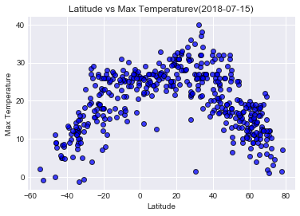
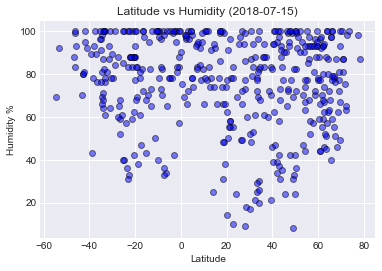
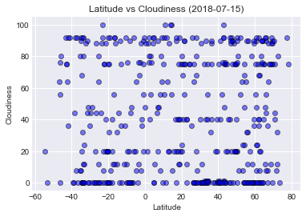
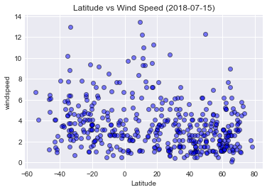

# Weather Analysis


#### Trends Observed
* Trend 1-Latitude vs. Max Temperature plot shows typical relationship between the latitude and temperature. The temperatures of the cities that are away from 0 degree latitude drop consistently. 
* Trend 2-Latitude vs. Humidity plot shows high humidity percentages for the cities between 0 degree & 20 degree latitude whereas for higher latitudes the humidity ranges from low of below 20% to 100%. 
* Trend 3-The relationship of cloudiness and windspeed in the 500 cities look steady. To show any typical trend it will be imperative to do a comparative data analysis of overall weather trends of a few sample cities over a specifc period of time.


```python
# Dependencies
import requests
import json
import pandas as pd
import numpy as np
import random
from pprint import pprint
from citipy import citipy
from config import api_key
import os
import csv
import matplotlib.pyplot as plt
from pprint import pprint
from datetime import datetime
import seaborn as sns
```


```python
# settings = {"units": "metric", "appid": api_key}
```


```python
# create empty list
cities = pd.DataFrame()
cities["Latitude"] = ""
cities["Longitude"] = ""
```

# Genarate Cities List


```python
cities["Latitude"] = [np.random.uniform(-90, 90) for x in range(1500)]
cities["Longitude"] = [np.random.uniform(-180, 180) for x in range(1500)]

for index, row in cities.iterrows():
    lat = row["Latitude"]
    lng = row["Longitude"]
    cities.set_value(index, "City", citipy.nearest_city(lat, lng).city_name)
    cities.set_value(index, "Country", citipy.nearest_city(lat, lng).country_code)

                     
                     
    


```

    C:\Anaconda3\lib\site-packages\ipykernel_launcher.py:7: FutureWarning: set_value is deprecated and will be removed in a future release. Please use .at[] or .iat[] accessors instead
      import sys
    C:\Anaconda3\lib\site-packages\ipykernel_launcher.py:8: FutureWarning: set_value is deprecated and will be removed in a future release. Please use .at[] or .iat[] accessors instead
      
    


```python
cities = cities.drop_duplicates(['City', 'Country'])
cities = cities.dropna()
                                 
cities = cities[["City", "Country"]]                        
cities = cities.iloc[:500]               
cities = cities.reset_index(drop=True)
cities.head()
```


<div>
<style scoped>
    .dataframe tbody tr th:only-of-type {
        vertical-align: middle;
    }

    .dataframe tbody tr th {
        vertical-align: top;
    }

    .dataframe thead th {
        text-align: right;
    }
</style>
<table border="1" class="dataframe">
  <thead>
    <tr style="text-align: right;">
      <th></th>
      <th>City</th>
      <th>Country</th>
    </tr>
  </thead>
  <tbody>
    <tr>
      <th>0</th>
      <td>albany</td>
      <td>au</td>
    </tr>
    <tr>
      <th>1</th>
      <td>yar-sale</td>
      <td>ru</td>
    </tr>
    <tr>
      <th>2</th>
      <td>bluff</td>
      <td>nz</td>
    </tr>
    <tr>
      <th>3</th>
      <td>tura</td>
      <td>ru</td>
    </tr>
    <tr>
      <th>4</th>
      <td>bengkulu</td>
      <td>id</td>
    </tr>
  </tbody>
</table>
</div>


# Perform API Calls


```python
cities["Cloudiness"] =""
cities["Date"] =""
cities["Humidity"] =""
cities["Lat"] =""
cities["Lng"] =""
cities["Max Temp"] =""
cities["Wind Speed"] =""
```


```python
# counter 

count = 1

# dictionary for parameters 
settings = {"units": "metric", "appid": api_key}

# base url
base_url = "http://api.openweathermap.org/data/2.5/weather?"


# Build query URL
query_url = f"{base_url}appid={settings['appid']}&units={settings['units']}&q="

print("Beginning Data Retrieval")
print("------------------------")


for index, row in cities.iterrows():
    try:
        cities_response = requests.get(query_url + row["City"] + "," + row["Country"]).json()
        pprint(f"Processing Record {count} | {row['City']}, {row['Country']}")
        print(cities_response)
        
        # row update
        count = count + 1
        
        cities.set_value(index, "Cloudiness", cities_response["clouds"]['all'])
        cities.set_value(index, "Date", cities_response["dt"])
        cities.set_value(index, "Humidity", cities_response["main"]['humidity'])
        cities.set_value(index, "Latitude", cities_response["coord"]['lat'])
        cities.set_value(index, "Longitude", cities_response["coord"]['lon'])
        cities.set_value(index, "Max Temperature", cities_response["main"]['temp_max'])
        cities.set_value(index, "Wind Speed", cities_response["wind"]['speed'])

    except:
        print(f"**Weather data does not exist for {row['City']}, {row['Country']}**")
              
print("-----------------------")
print("Data Retrieval Complete")
print("-----------------------")
              
       

        
```

    Beginning Data Retrieval
    ------------------------
    'Processing Record 1 | albany, au'
    {'coord': {'lon': 117.88, 'lat': -35.02}, 'weather': [{'id': 500, 'main': 'Rain', 'description': 'light rain', 'icon': '10n'}], 'base': 'stations', 'main': {'temp': 14.14, 'pressure': 1006.02, 'humidity': 91, 'temp_min': 14.14, 'temp_max': 14.14, 'sea_level': 1018.72, 'grnd_level': 1006.02}, 'wind': {'speed': 10.21, 'deg': 286.502}, 'rain': {'3h': 0.46}, 'clouds': {'all': 92}, 'dt': 1531693642, 'sys': {'message': 0.0032, 'country': 'AU', 'sunrise': 1531610027, 'sunset': 1531646129}, 'id': 2077963, 'name': 'Albany', 'cod': 200}
    'Processing Record 2 | yar-sale, ru'
    {'coord': {'lon': 70.83, 'lat': 66.83}, 'weather': [{'id': 800, 'main': 'Clear', 'description': 'clear sky', 'icon': '02n'}], 'base': 'stations', 'main': {'temp': 13.04, 'pressure': 1028.64, 'humidity': 78, 'temp_min': 13.04, 'temp_max': 13.04, 'sea_level': 1029.75, 'grnd_level': 1028.64}, 'wind': {'speed': 1.16, 'deg': 184.502}, 'clouds': {'all': 8}, 'dt': 1531693643, 'sys': {'message': 0.0027, 'country': 'RU', 'sunrise': 1531600208, 'sunset': 1531678201}, 'id': 1486321, 'name': 'Yar-Sale', 'cod': 200}
    

    C:\Anaconda3\lib\site-packages\ipykernel_launcher.py:28: FutureWarning: set_value is deprecated and will be removed in a future release. Please use .at[] or .iat[] accessors instead
    C:\Anaconda3\lib\site-packages\ipykernel_launcher.py:29: FutureWarning: set_value is deprecated and will be removed in a future release. Please use .at[] or .iat[] accessors instead
    C:\Anaconda3\lib\site-packages\ipykernel_launcher.py:30: FutureWarning: set_value is deprecated and will be removed in a future release. Please use .at[] or .iat[] accessors instead
    C:\Anaconda3\lib\site-packages\ipykernel_launcher.py:31: FutureWarning: set_value is deprecated and will be removed in a future release. Please use .at[] or .iat[] accessors instead
    C:\Anaconda3\lib\site-packages\ipykernel_launcher.py:32: FutureWarning: set_value is deprecated and will be removed in a future release. Please use .at[] or .iat[] accessors instead
    C:\Anaconda3\lib\site-packages\ipykernel_launcher.py:33: FutureWarning: set_value is deprecated and will be removed in a future release. Please use .at[] or .iat[] accessors instead
    C:\Anaconda3\lib\site-packages\ipykernel_launcher.py:34: FutureWarning: set_value is deprecated and will be removed in a future release. Please use .at[] or .iat[] accessors instead
    

    'Processing Record 3 | bluff, nz'
    {'coord': {'lon': 168.33, 'lat': -46.6}, 'weather': [{'id': 803, 'main': 'Clouds', 'description': 'broken clouds', 'icon': '04n'}], 'base': 'stations', 'main': {'temp': 11.09, 'pressure': 1015.75, 'humidity': 88, 'temp_min': 11.09, 'temp_max': 11.09, 'sea_level': 1017.06, 'grnd_level': 1015.75}, 'wind': {'speed': 6.06, 'deg': 44.0018}, 'clouds': {'all': 64}, 'dt': 1531693643, 'sys': {'message': 0.0035, 'country': 'NZ', 'sunrise': 1531599907, 'sunset': 1531632037}, 'id': 2206939, 'name': 'Bluff', 'cod': 200}
    'Processing Record 4 | tura, ru'
    {'coord': {'lon': 100.22, 'lat': 64.27}, 'weather': [{'id': 800, 'main': 'Clear', 'description': 'clear sky', 'icon': '01n'}], 'base': 'stations', 'main': {'temp': 10.19, 'pressure': 978.87, 'humidity': 62, 'temp_min': 10.19, 'temp_max': 10.19, 'sea_level': 1028.08, 'grnd_level': 978.87}, 'wind': {'speed': 2.86, 'deg': 19.5018}, 'clouds': {'all': 0}, 'dt': 1531693643, 'sys': {'message': 0.0033, 'country': 'RU', 'sunrise': 1531596713, 'sunset': 1531667761}, 'id': 2014833, 'name': 'Tura', 'cod': 200}
    'Processing Record 5 | bengkulu, id'
    {'cod': '404', 'message': 'city not found'}
    **Weather data does not exist for bengkulu, id**
    'Processing Record 6 | upernavik, gl'
    {'coord': {'lon': -56.15, 'lat': 72.79}, 'weather': [{'id': 803, 'main': 'Clouds', 'description': 'broken clouds', 'icon': '04d'}], 'base': 'stations', 'main': {'temp': 3.04, 'pressure': 1017.54, 'humidity': 98, 'temp_min': 3.04, 'temp_max': 3.04, 'sea_level': 1020.63, 'grnd_level': 1017.54}, 'wind': {'speed': 5.36, 'deg': 3.00177}, 'clouds': {'all': 80}, 'dt': 1531693643, 'sys': {'message': 0.0046, 'country': 'GL', 'sunrise': 0, 'sunset': 0}, 'id': 3418910, 'name': 'Upernavik', 'cod': 200}
    'Processing Record 7 | kloulklubed, pw'
    {'coord': {'lon': 134.26, 'lat': 7.04}, 'weather': [{'id': 804, 'main': 'Clouds', 'description': 'overcast clouds', 'icon': '04n'}], 'base': 'stations', 'main': {'temp': 26.31, 'pressure': 1008, 'humidity': 83, 'temp_min': 26, 'temp_max': 27}, 'visibility': 24140, 'wind': {'speed': 4.6, 'deg': 210}, 'clouds': {'all': 90}, 'dt': 1531691460, 'sys': {'type': 1, 'id': 4055, 'message': 0.0035, 'country': 'PW', 'sunrise': 1531601655, 'sunset': 1531646622}, 'id': 7671223, 'name': 'Kloulklubed', 'cod': 200}
    'Processing Record 8 | kaitangata, nz'
    {'coord': {'lon': 169.85, 'lat': -46.28}, 'weather': [{'id': 803, 'main': 'Clouds', 'description': 'broken clouds', 'icon': '04n'}], 'base': 'stations', 'main': {'temp': 8.89, 'pressure': 1001.97, 'humidity': 83, 'temp_min': 8.89, 'temp_max': 8.89, 'sea_level': 1019.09, 'grnd_level': 1001.97}, 'wind': {'speed': 6.46, 'deg': 38.0018}, 'clouds': {'all': 76}, 'dt': 1531693643, 'sys': {'message': 0.0029, 'country': 'NZ', 'sunrise': 1531599475, 'sunset': 1531631739}, 'id': 2208248, 'name': 'Kaitangata', 'cod': 200}
    'Processing Record 9 | hobart, au'
    {'coord': {'lon': 147.33, 'lat': -42.88}, 'weather': [{'id': 803, 'main': 'Clouds', 'description': 'broken clouds', 'icon': '04n'}], 'base': 'stations', 'main': {'temp': 5, 'pressure': 1003, 'humidity': 80, 'temp_min': 5, 'temp_max': 5}, 'visibility': 10000, 'wind': {'speed': 4.1, 'deg': 320}, 'clouds': {'all': 75}, 'dt': 1531692000, 'sys': {'type': 1, 'id': 8195, 'message': 0.0036, 'country': 'AU', 'sunrise': 1531604218, 'sunset': 1531637805}, 'id': 2163355, 'name': 'Hobart', 'cod': 200}
    'Processing Record 10 | barentsburg, sj'
    {'cod': '404', 'message': 'city not found'}
    **Weather data does not exist for barentsburg, sj**
    'Processing Record 11 | yellowknife, ca'
    {'coord': {'lon': -114.38, 'lat': 62.45}, 'weather': [{'id': 801, 'main': 'Clouds', 'description': 'few clouds', 'icon': '02d'}], 'base': 'stations', 'main': {'temp': 15, 'pressure': 1016, 'humidity': 62, 'temp_min': 15, 'temp_max': 15}, 'visibility': 24140, 'wind': {'speed': 5.7, 'deg': 150}, 'clouds': {'all': 20}, 'dt': 1531692000, 'sys': {'type': 1, 'id': 3558, 'message': 0.0035, 'country': 'CA', 'sunrise': 1531649853, 'sunset': 1531717670}, 'id': 6185377, 'name': 'Yellowknife', 'cod': 200}
    'Processing Record 12 | nizhneyansk, ru'
    {'cod': '404', 'message': 'city not found'}
    **Weather data does not exist for nizhneyansk, ru**
    'Processing Record 13 | lorengau, pg'
    {'coord': {'lon': 147.27, 'lat': -2.02}, 'weather': [{'id': 804, 'main': 'Clouds', 'description': 'overcast clouds', 'icon': '04n'}], 'base': 'stations', 'main': {'temp': 27.09, 'pressure': 1020.7, 'humidity': 100, 'temp_min': 27.09, 'temp_max': 27.09, 'sea_level': 1022.86, 'grnd_level': 1020.7}, 'wind': {'speed': 2.86, 'deg': 178.002}, 'clouds': {'all': 88}, 'dt': 1531693644, 'sys': {'message': 0.0029, 'country': 'PG', 'sunrise': 1531599391, 'sunset': 1531642644}, 'id': 2092164, 'name': 'Lorengau', 'cod': 200}
    'Processing Record 14 | port alfred, za'
    {'coord': {'lon': 26.89, 'lat': -33.59}, 'weather': [{'id': 801, 'main': 'Clouds', 'description': 'few clouds', 'icon': '02n'}], 'base': 'stations', 'main': {'temp': 12.89, 'pressure': 1043.23, 'humidity': 100, 'temp_min': 12.89, 'temp_max': 12.89, 'sea_level': 1052.48, 'grnd_level': 1043.23}, 'wind': {'speed': 3.76, 'deg': 45.5018}, 'clouds': {'all': 12}, 'dt': 1531693644, 'sys': {'message': 0.0036, 'country': 'ZA', 'sunrise': 1531631659, 'sunset': 1531668174}, 'id': 964432, 'name': 'Port Alfred', 'cod': 200}
    'Processing Record 15 | east london, za'
    {'coord': {'lon': 27.91, 'lat': -33.02}, 'weather': [{'id': 801, 'main': 'Clouds', 'description': 'few clouds', 'icon': '02n'}], 'base': 'stations', 'main': {'temp': 15.04, 'pressure': 1047.77, 'humidity': 100, 'temp_min': 15.04, 'temp_max': 15.04, 'sea_level': 1052.69, 'grnd_level': 1047.77}, 'wind': {'speed': 3.06, 'deg': 45.0018}, 'clouds': {'all': 24}, 'dt': 1531693634, 'sys': {'message': 0.003, 'country': 'ZA', 'sunrise': 1531631337, 'sunset': 1531668006}, 'id': 1006984, 'name': 'East London', 'cod': 200}
    'Processing Record 16 | santa rita, py'
    {'coord': {'lon': -55.09, 'lat': -25.8}, 'weather': [{'id': 800, 'main': 'Clear', 'description': 'clear sky', 'icon': '01n'}], 'base': 'stations', 'main': {'temp': 24.88, 'pressure': 1012, 'humidity': 61, 'temp_min': 24, 'temp_max': 26}, 'visibility': 10000, 'wind': {'speed': 3.1, 'deg': 80}, 'clouds': {'all': 0}, 'dt': 1531692000, 'sys': {'type': 1, 'id': 4611, 'message': 0.0054, 'country': 'PY', 'sunrise': 1531650356, 'sunset': 1531688827}, 'id': 3436968, 'name': 'Santa Rita', 'cod': 200}
    'Processing Record 17 | hilo, us'
    {'coord': {'lon': -155.08, 'lat': 19.71}, 'weather': [{'id': 803, 'main': 'Clouds', 'description': 'broken clouds', 'icon': '04d'}], 'base': 'stations', 'main': {'temp': 24.8, 'pressure': 1017, 'humidity': 74, 'temp_min': 23, 'temp_max': 27}, 'visibility': 16093, 'wind': {'speed': 3.1, 'deg': 240}, 'clouds': {'all': 75}, 'dt': 1531691760, 'sys': {'type': 1, 'id': 818, 'message': 0.0036, 'country': 'US', 'sunrise': 1531669827, 'sunset': 1531717336}, 'id': 5855927, 'name': 'Hilo', 'cod': 200}
    'Processing Record 18 | attawapiskat, ca'
    {'cod': '404', 'message': 'city not found'}
    **Weather data does not exist for attawapiskat, ca**
    'Processing Record 19 | chokurdakh, ru'
    {'coord': {'lon': 147.9, 'lat': 70.62}, 'weather': [{'id': 802, 'main': 'Clouds', 'description': 'scattered clouds', 'icon': '03d'}], 'base': 'stations', 'main': {'temp': 10.84, 'pressure': 1020.94, 'humidity': 87, 'temp_min': 10.84, 'temp_max': 10.84, 'sea_level': 1023.02, 'grnd_level': 1020.94}, 'wind': {'speed': 3.86, 'deg': 233.502}, 'clouds': {'all': 44}, 'dt': 1531693645, 'sys': {'message': 0.0033, 'country': 'RU', 'sunrise': 0, 'sunset': 0}, 'id': 2126123, 'name': 'Chokurdakh', 'cod': 200}
    'Processing Record 20 | mataura, pf'
    {'cod': '404', 'message': 'city not found'}
    **Weather data does not exist for mataura, pf**
    'Processing Record 21 | vaini, to'
    {'coord': {'lon': -175.2, 'lat': -21.2}, 'weather': [{'id': 802, 'main': 'Clouds', 'description': 'scattered clouds', 'icon': '03d'}], 'base': 'stations', 'main': {'temp': 26, 'pressure': 1014, 'humidity': 83, 'temp_min': 26, 'temp_max': 26}, 'visibility': 10000, 'wind': {'speed': 4.6, 'deg': 60}, 'clouds': {'all': 40}, 'dt': 1531692000, 'sys': {'type': 1, 'id': 8323, 'message': 0.0035, 'country': 'TO', 'sunrise': 1531678667, 'sunset': 1531718171}, 'id': 4032243, 'name': 'Vaini', 'cod': 200}
    'Processing Record 22 | bratsk, ru'
    {'coord': {'lon': 101.63, 'lat': 56.15}, 'weather': [{'id': 802, 'main': 'Clouds', 'description': 'scattered clouds', 'icon': '03n'}], 'base': 'stations', 'main': {'temp': 9, 'pressure': 1009, 'humidity': 87, 'temp_min': 9, 'temp_max': 9}, 'visibility': 10000, 'wind': {'speed': 3, 'deg': 10}, 'clouds': {'all': 32}, 'dt': 1531692000, 'sys': {'type': 1, 'id': 7253, 'message': 0.0029, 'country': 'RU', 'sunrise': 1531601290, 'sunset': 1531662592}, 'id': 2051523, 'name': 'Bratsk', 'cod': 200}
    'Processing Record 23 | iquique, cl'
    {'coord': {'lon': -70.14, 'lat': -20.22}, 'weather': [{'id': 803, 'main': 'Clouds', 'description': 'broken clouds', 'icon': '04d'}], 'base': 'stations', 'main': {'temp': 16, 'pressure': 1013, 'humidity': 77, 'temp_min': 16, 'temp_max': 16}, 'visibility': 10000, 'wind': {'speed': 3.1, 'deg': 240}, 'clouds': {'all': 75}, 'dt': 1531692000, 'sys': {'type': 1, 'id': 4644, 'message': 0.0038, 'country': 'CL', 'sunrise': 1531653352, 'sunset': 1531693054}, 'id': 3887127, 'name': 'Iquique', 'cod': 200}
    'Processing Record 24 | mananjary, mg'
    {'coord': {'lon': 46.8, 'lat': -19.16}, 'weather': [{'id': 800, 'main': 'Clear', 'description': 'clear sky', 'icon': '01n'}], 'base': 'stations', 'main': {'temp': 7.84, 'pressure': 880.38, 'humidity': 69, 'temp_min': 7.84, 'temp_max': 7.84, 'sea_level': 1033.72, 'grnd_level': 880.38}, 'wind': {'speed': 2.01, 'deg': 192.002}, 'clouds': {'all': 0}, 'dt': 1531693645, 'sys': {'message': 0.0042, 'country': 'MG', 'sunrise': 1531625178, 'sunset': 1531665092}, 'id': 1056151, 'name': 'Mananjary', 'cod': 200}
    'Processing Record 25 | lagoa, pt'
    {'coord': {'lon': -8.45, 'lat': 37.14}, 'weather': [{'id': 800, 'main': 'Clear', 'description': 'clear sky', 'icon': '01n'}], 'base': 'stations', 'main': {'temp': 19, 'pressure': 1021, 'humidity': 88, 'temp_min': 19, 'temp_max': 19}, 'visibility': 10000, 'wind': {'speed': 4.6, 'deg': 270}, 'clouds': {'all': 0}, 'dt': 1531692000, 'sys': {'type': 1, 'id': 5948, 'message': 0.004, 'country': 'PT', 'sunrise': 1531632369, 'sunset': 1531684393}, 'id': 2267254, 'name': 'Lagoa', 'cod': 200}
    'Processing Record 26 | yerofey pavlovich, ru'
    {'coord': {'lon': 121.97, 'lat': 53.97}, 'weather': [{'id': 800, 'main': 'Clear', 'description': 'clear sky', 'icon': '01n'}], 'base': 'stations', 'main': {'temp': 12.99, 'pressure': 942.96, 'humidity': 90, 'temp_min': 12.99, 'temp_max': 12.99, 'sea_level': 1021.03, 'grnd_level': 942.96}, 'wind': {'speed': 1.06, 'deg': 319.002}, 'clouds': {'all': 0}, 'dt': 1531693646, 'sys': {'message': 0.0032, 'country': 'RU', 'sunrise': 1531597206, 'sunset': 1531656921}, 'id': 2012938, 'name': 'Yerofey Pavlovich', 'cod': 200}
    'Processing Record 27 | hermanus, za'
    {'coord': {'lon': 19.24, 'lat': -34.42}, 'weather': [{'id': 800, 'main': 'Clear', 'description': 'clear sky', 'icon': '01n'}], 'base': 'stations', 'main': {'temp': 7.24, 'pressure': 1006.02, 'humidity': 69, 'temp_min': 7.24, 'temp_max': 7.24, 'sea_level': 1047.09, 'grnd_level': 1006.02}, 'wind': {'speed': 3.06, 'deg': 82.5018}, 'clouds': {'all': 0}, 'dt': 1531693646, 'sys': {'message': 0.0041, 'country': 'ZA', 'sunrise': 1531633609, 'sunset': 1531669897}, 'id': 3366880, 'name': 'Hermanus', 'cod': 200}
    'Processing Record 28 | zhigansk, ru'
    {'coord': {'lon': 123.37, 'lat': 66.77}, 'weather': [{'id': 800, 'main': 'Clear', 'description': 'clear sky', 'icon': '01n'}], 'base': 'stations', 'main': {'temp': 12.54, 'pressure': 1016.4, 'humidity': 55, 'temp_min': 12.54, 'temp_max': 12.54, 'sea_level': 1024.4, 'grnd_level': 1016.4}, 'wind': {'speed': 5.16, 'deg': 354.502}, 'clouds': {'all': 0}, 'dt': 1531693646, 'sys': {'message': 0.0034, 'country': 'RU', 'sunrise': 1531587675, 'sunset': 1531665522}, 'id': 2012530, 'name': 'Zhigansk', 'cod': 200}
    'Processing Record 29 | tsihombe, mg'
    {'cod': '404', 'message': 'city not found'}
    **Weather data does not exist for tsihombe, mg**
    'Processing Record 30 | fukagawa, jp'
    {'coord': {'lon': 142.05, 'lat': 43.72}, 'weather': [{'id': 803, 'main': 'Clouds', 'description': 'broken clouds', 'icon': '04n'}], 'base': 'stations', 'main': {'temp': 17, 'pressure': 1008, 'humidity': 93, 'temp_min': 17, 'temp_max': 17}, 'visibility': 10000, 'wind': {'speed': 1}, 'clouds': {'all': 75}, 'dt': 1531690800, 'sys': {'type': 1, 'id': 7540, 'message': 0.0122, 'country': 'JP', 'sunrise': 1531595051, 'sunset': 1531649459}, 'id': 2130332, 'name': 'Fukagawa', 'cod': 200}
    'Processing Record 31 | verkhnevilyuysk, ru'
    {'coord': {'lon': 120.31, 'lat': 63.45}, 'weather': [{'id': 803, 'main': 'Clouds', 'description': 'broken clouds', 'icon': '04n'}], 'base': 'stations', 'main': {'temp': 14.09, 'pressure': 1007.24, 'humidity': 51, 'temp_min': 14.09, 'temp_max': 14.09, 'sea_level': 1023.42, 'grnd_level': 1007.24}, 'wind': {'speed': 2.86, 'deg': 37.0018}, 'clouds': {'all': 80}, 'dt': 1531693646, 'sys': {'message': 0.0033, 'country': 'RU', 'sunrise': 1531592636, 'sunset': 1531662213}, 'id': 2013639, 'name': 'Verkhnevilyuysk', 'cod': 200}
    'Processing Record 32 | bredasdorp, za'
    {'coord': {'lon': 20.04, 'lat': -34.53}, 'weather': [{'id': 800, 'main': 'Clear', 'description': 'clear sky', 'icon': '01n'}], 'base': 'stations', 'main': {'temp': 11, 'pressure': 1034, 'humidity': 81, 'temp_min': 11, 'temp_max': 11}, 'wind': {'speed': 2.6, 'deg': 130}, 'clouds': {'all': 0}, 'dt': 1531692000, 'sys': {'type': 1, 'id': 6591, 'message': 0.0038, 'country': 'ZA', 'sunrise': 1531633432, 'sunset': 1531669690}, 'id': 1015776, 'name': 'Bredasdorp', 'cod': 200}
    'Processing Record 33 | santiago de cuba, cu'
    {'coord': {'lon': -75.83, 'lat': 20.03}, 'weather': [{'id': 801, 'main': 'Clouds', 'description': 'few clouds', 'icon': '02d'}], 'base': 'stations', 'main': {'temp': 30.56, 'pressure': 1016, 'humidity': 62, 'temp_min': 30, 'temp_max': 31}, 'visibility': 8000, 'wind': {'speed': 3.1, 'deg': 210}, 'clouds': {'all': 20}, 'dt': 1531691760, 'sys': {'type': 1, 'id': 4093, 'message': 0.004, 'country': 'CU', 'sunrise': 1531650767, 'sunset': 1531698353}, 'id': 3536729, 'name': 'Santiago de Cuba', 'cod': 200}
    'Processing Record 34 | juifang, tw'
    {'cod': '404', 'message': 'city not found'}
    **Weather data does not exist for juifang, tw**
    'Processing Record 35 | saint-philippe, re'
    {'coord': {'lon': 55.77, 'lat': -21.36}, 'weather': [{'id': 801, 'main': 'Clouds', 'description': 'few clouds', 'icon': '02n'}], 'base': 'stations', 'main': {'temp': 16.94, 'pressure': 1018, 'humidity': 59, 'temp_min': 16, 'temp_max': 18}, 'visibility': 10000, 'wind': {'speed': 3.1, 'deg': 20}, 'clouds': {'all': 20}, 'dt': 1531692000, 'sys': {'type': 1, 'id': 6792, 'message': 0.0049, 'country': 'RE', 'sunrise': 1531623259, 'sunset': 1531662706}, 'id': 935215, 'name': 'Saint-Philippe', 'cod': 200}
    'Processing Record 36 | camacha, pt'
    {'coord': {'lon': -16.33, 'lat': 33.08}, 'weather': [{'id': 802, 'main': 'Clouds', 'description': 'scattered clouds', 'icon': '03n'}], 'base': 'stations', 'main': {'temp': 20.57, 'pressure': 1026, 'humidity': 72, 'temp_min': 20, 'temp_max': 21}, 'visibility': 10000, 'wind': {'speed': 4.6, 'deg': 10}, 'clouds': {'all': 40}, 'dt': 1531692000, 'sys': {'type': 1, 'id': 5960, 'message': 0.0046, 'country': 'PT', 'sunrise': 1531634872, 'sunset': 1531685677}, 'id': 2270385, 'name': 'Camacha', 'cod': 200}
    'Processing Record 37 | viru, pe'
    {'coord': {'lon': -78.75, 'lat': -8.42}, 'weather': [{'id': 804, 'main': 'Clouds', 'description': 'overcast clouds', 'icon': '04d'}], 'base': 'stations', 'main': {'temp': 18, 'pressure': 1011, 'humidity': 82, 'temp_min': 18, 'temp_max': 18}, 'visibility': 10000, 'wind': {'speed': 3.6, 'deg': 140}, 'clouds': {'all': 90}, 'dt': 1531692000, 'sys': {'type': 1, 'id': 4404, 'message': 0.0051, 'country': 'PE', 'sunrise': 1531654242, 'sunset': 1531696292}, 'id': 3690875, 'name': 'Viru', 'cod': 200}
    'Processing Record 38 | inderborskiy, kz'
    {'cod': '404', 'message': 'city not found'}
    **Weather data does not exist for inderborskiy, kz**
    'Processing Record 39 | mirador, br'
    {'coord': {'lon': -44.36, 'lat': -6.37}, 'weather': [{'id': 800, 'main': 'Clear', 'description': 'clear sky', 'icon': '01n'}], 'base': 'stations', 'main': {'temp': 30.04, 'pressure': 988.11, 'humidity': 34, 'temp_min': 30.04, 'temp_max': 30.04, 'sea_level': 1025.13, 'grnd_level': 988.11}, 'wind': {'speed': 2.66, 'deg': 110.002}, 'clouds': {'all': 0}, 'dt': 1531693648, 'sys': {'message': 0.004, 'country': 'BR', 'sunrise': 1531645794, 'sunset': 1531688231}, 'id': 3394813, 'name': 'Mirador', 'cod': 200}
    'Processing Record 40 | ushuaia, ar'
    {'coord': {'lon': -68.31, 'lat': -54.81}, 'weather': [{'id': 801, 'main': 'Clouds', 'description': 'few clouds', 'icon': '02n'}], 'base': 'stations', 'main': {'temp': 2, 'pressure': 1019, 'humidity': 69, 'temp_min': 2, 'temp_max': 2}, 'visibility': 10000, 'wind': {'speed': 6.7, 'deg': 250}, 'clouds': {'all': 20}, 'dt': 1531688400, 'sys': {'type': 1, 'id': 4754, 'message': 0.0038, 'country': 'AR', 'sunrise': 1531658784, 'sunset': 1531686760}, 'id': 3833367, 'name': 'Ushuaia', 'cod': 200}
    'Processing Record 41 | manama, bh'
    {'coord': {'lon': 50.58, 'lat': 26.22}, 'weather': [{'id': 800, 'main': 'Clear', 'description': 'clear sky', 'icon': '01n'}], 'base': 'stations', 'main': {'temp': 33.46, 'pressure': 994, 'humidity': 49, 'temp_min': 33, 'temp_max': 34}, 'visibility': 10000, 'wind': {'speed': 4.1, 'deg': 300}, 'clouds': {'all': 0}, 'dt': 1531692000, 'sys': {'type': 1, 'id': 6974, 'message': 0.0076, 'country': 'BH', 'sunrise': 1531619708, 'sunset': 1531668728}, 'id': 290340, 'name': 'Manama', 'cod': 200}
    'Processing Record 42 | rangpur, bd'
    {'coord': {'lon': 89.24, 'lat': 25.76}, 'weather': [{'id': 500, 'main': 'Rain', 'description': 'light rain', 'icon': '10n'}], 'base': 'stations', 'main': {'temp': 25.14, 'pressure': 1008.78, 'humidity': 97, 'temp_min': 25.14, 'temp_max': 25.14, 'sea_level': 1012.16, 'grnd_level': 1008.78}, 'wind': {'speed': 3.96, 'deg': 98.0018}, 'rain': {'3h': 0.135}, 'clouds': {'all': 92}, 'dt': 1531693648, 'sys': {'message': 0.0058, 'country': 'BD', 'sunrise': 1531610482, 'sunset': 1531659396}, 'id': 1185188, 'name': 'Rangpur', 'cod': 200}
    'Processing Record 43 | jamestown, sh'
    {'coord': {'lon': -5.72, 'lat': -15.94}, 'weather': [{'id': 804, 'main': 'Clouds', 'description': 'overcast clouds', 'icon': '04n'}], 'base': 'stations', 'main': {'temp': 21.44, 'pressure': 1035.37, 'humidity': 97, 'temp_min': 21.44, 'temp_max': 21.44, 'sea_level': 1035.38, 'grnd_level': 1035.37}, 'wind': {'speed': 9.16, 'deg': 113.502}, 'clouds': {'all': 88}, 'dt': 1531693648, 'sys': {'message': 0.0044, 'country': 'SH', 'sunrise': 1531637451, 'sunset': 1531678029}, 'id': 3370903, 'name': 'Jamestown', 'cod': 200}
    'Processing Record 44 | kupang, id'
    {'coord': {'lon': 123.6, 'lat': -10.16}, 'weather': [{'id': 801, 'main': 'Clouds', 'description': 'few clouds', 'icon': '02n'}], 'base': 'stations', 'main': {'temp': 22.74, 'pressure': 1014.46, 'humidity': 100, 'temp_min': 22.74, 'temp_max': 22.74, 'sea_level': 1024.96, 'grnd_level': 1014.46}, 'wind': {'speed': 4.11, 'deg': 114.002}, 'clouds': {'all': 12}, 'dt': 1531693649, 'sys': {'message': 0.0041, 'country': 'ID', 'sunrise': 1531605846, 'sunset': 1531647554}, 'id': 2057087, 'name': 'Kupang', 'cod': 200}
    'Processing Record 45 | mahebourg, mu'
    {'coord': {'lon': 57.7, 'lat': -20.41}, 'weather': [{'id': 801, 'main': 'Clouds', 'description': 'few clouds', 'icon': '02n'}], 'base': 'stations', 'main': {'temp': 18, 'pressure': 1018, 'humidity': 88, 'temp_min': 18, 'temp_max': 18}, 'visibility': 10000, 'wind': {'speed': 3.6, 'deg': 330}, 'clouds': {'all': 20}, 'dt': 1531692000, 'sys': {'type': 1, 'id': 6729, 'message': 0.0042, 'country': 'MU', 'sunrise': 1531622694, 'sunset': 1531662344}, 'id': 934322, 'name': 'Mahebourg', 'cod': 200}
    'Processing Record 46 | casper, us'
    {'coord': {'lon': -106.31, 'lat': 42.87}, 'weather': [{'id': 800, 'main': 'Clear', 'description': 'clear sky', 'icon': '01d'}], 'base': 'stations', 'main': {'temp': 28, 'pressure': 1022, 'humidity': 37, 'temp_min': 28, 'temp_max': 28}, 'visibility': 16093, 'wind': {'speed': 2.6}, 'clouds': {'all': 1}, 'dt': 1531691580, 'sys': {'type': 1, 'id': 3071, 'message': 0.0035, 'country': 'US', 'sunrise': 1531654862, 'sunset': 1531708870}, 'id': 5820705, 'name': 'Casper', 'cod': 200}
    'Processing Record 47 | butaritari, ki'
    {'coord': {'lon': 172.79, 'lat': 3.07}, 'weather': [{'id': 501, 'main': 'Rain', 'description': 'moderate rain', 'icon': '10n'}], 'base': 'stations', 'main': {'temp': 26.19, 'pressure': 1022.32, 'humidity': 100, 'temp_min': 26.19, 'temp_max': 26.19, 'sea_level': 1022.41, 'grnd_level': 1022.32}, 'wind': {'speed': 2.36, 'deg': 73.5018}, 'rain': {'3h': 5.035}, 'clouds': {'all': 80}, 'dt': 1531693649, 'sys': {'message': 0.0043, 'country': 'KI', 'sunrise': 1531592785, 'sunset': 1531636997}, 'id': 2110227, 'name': 'Butaritari', 'cod': 200}
    'Processing Record 48 | thompson, ca'
    {'coord': {'lon': -97.86, 'lat': 55.74}, 'weather': [{'id': 500, 'main': 'Rain', 'description': 'light rain', 'icon': '10d'}, {'id': 701, 'main': 'Mist', 'description': 'mist', 'icon': '50d'}], 'base': 'stations', 'main': {'temp': 13, 'pressure': 1001, 'humidity': 93, 'temp_min': 13, 'temp_max': 13}, 'visibility': 8047, 'wind': {'speed': 1}, 'clouds': {'all': 90}, 'dt': 1531692000, 'sys': {'type': 1, 'id': 3406, 'message': 0.0032, 'country': 'CA', 'sunrise': 1531649378, 'sunset': 1531710267}, 'id': 6165406, 'name': 'Thompson', 'cod': 200}
    'Processing Record 49 | carnarvon, au'
    {'coord': {'lon': 113.63, 'lat': -24.87}, 'weather': [{'id': 800, 'main': 'Clear', 'description': 'clear sky', 'icon': '01n'}], 'base': 'stations', 'main': {'temp': 15.59, 'pressure': 1030.34, 'humidity': 100, 'temp_min': 15.59, 'temp_max': 15.59, 'sea_level': 1031.69, 'grnd_level': 1030.34}, 'wind': {'speed': 4.91, 'deg': 143.502}, 'clouds': {'all': 0}, 'dt': 1531693649, 'sys': {'message': 0.0038, 'country': 'AU', 'sunrise': 1531609764, 'sunset': 1531648428}, 'id': 2074865, 'name': 'Carnarvon', 'cod': 200}
    'Processing Record 50 | umzimvubu, za'
    {'cod': '404', 'message': 'city not found'}
    **Weather data does not exist for umzimvubu, za**
    'Processing Record 51 | new norfolk, au'
    {'coord': {'lon': 147.06, 'lat': -42.78}, 'weather': [{'id': 803, 'main': 'Clouds', 'description': 'broken clouds', 'icon': '04n'}], 'base': 'stations', 'main': {'temp': 5, 'pressure': 1003, 'humidity': 80, 'temp_min': 5, 'temp_max': 5}, 'visibility': 10000, 'wind': {'speed': 4.1, 'deg': 320}, 'clouds': {'all': 75}, 'dt': 1531692000, 'sys': {'type': 1, 'id': 8195, 'message': 0.0044, 'country': 'AU', 'sunrise': 1531604264, 'sunset': 1531637888}, 'id': 2155415, 'name': 'New Norfolk', 'cod': 200}
    'Processing Record 52 | zelenoborskiy, ru'
    {'coord': {'lon': 32.36, 'lat': 66.84}, 'weather': [{'id': 500, 'main': 'Rain', 'description': 'light rain', 'icon': '10n'}], 'base': 'stations', 'main': {'temp': 16.74, 'pressure': 1018.18, 'humidity': 79, 'temp_min': 16.74, 'temp_max': 16.74, 'sea_level': 1025.29, 'grnd_level': 1018.18}, 'wind': {'speed': 0.96, 'deg': 168.502}, 'rain': {'3h': 0.2075}, 'clouds': {'all': 36}, 'dt': 1531693650, 'sys': {'message': 0.0105, 'country': 'RU', 'sunrise': 1531609458, 'sunset': 1531687418}, 'id': 463838, 'name': 'Zelenoborskiy', 'cod': 200}
    'Processing Record 53 | bow island, ca'
    {'coord': {'lon': -111.38, 'lat': 49.87}, 'weather': [{'id': 802, 'main': 'Clouds', 'description': 'scattered clouds', 'icon': '03d'}], 'base': 'stations', 'main': {'temp': 28, 'pressure': 1017, 'humidity': 24, 'temp_min': 28, 'temp_max': 28}, 'visibility': 48279, 'wind': {'speed': 3.6}, 'clouds': {'all': 40}, 'dt': 1531692000, 'sys': {'type': 1, 'id': 3188, 'message': 0.0034, 'country': 'CA', 'sunrise': 1531654493, 'sunset': 1531711660}, 'id': 5906757, 'name': 'Bow Island', 'cod': 200}
    'Processing Record 54 | saskylakh, ru'
    {'coord': {'lon': 114.09, 'lat': 71.97}, 'weather': [{'id': 802, 'main': 'Clouds', 'description': 'scattered clouds', 'icon': '03d'}], 'base': 'stations', 'main': {'temp': 7.49, 'pressure': 1015.35, 'humidity': 63, 'temp_min': 7.49, 'temp_max': 7.49, 'sea_level': 1026.91, 'grnd_level': 1015.35}, 'wind': {'speed': 4.46, 'deg': 205.002}, 'clouds': {'all': 32}, 'dt': 1531693650, 'sys': {'message': 0.0032, 'country': 'RU', 'sunrise': 0, 'sunset': 0}, 'id': 2017155, 'name': 'Saskylakh', 'cod': 200}
    'Processing Record 55 | axim, gh'
    {'coord': {'lon': -2.24, 'lat': 4.87}, 'weather': [{'id': 804, 'main': 'Clouds', 'description': 'overcast clouds', 'icon': '04n'}], 'base': 'stations', 'main': {'temp': 25.24, 'pressure': 1025.64, 'humidity': 98, 'temp_min': 25.24, 'temp_max': 25.24, 'sea_level': 1027.92, 'grnd_level': 1025.64}, 'wind': {'speed': 5.26, 'deg': 193.002}, 'clouds': {'all': 92}, 'dt': 1531693650, 'sys': {'message': 0.0041, 'country': 'GH', 'sunrise': 1531634626, 'sunset': 1531679175}, 'id': 2303611, 'name': 'Axim', 'cod': 200}
    'Processing Record 56 | mount gambier, au'
    {'coord': {'lon': 140.78, 'lat': -37.83}, 'weather': [{'id': 500, 'main': 'Rain', 'description': 'light rain', 'icon': '10n'}], 'base': 'stations', 'main': {'temp': 9.69, 'pressure': 1007, 'humidity': 93, 'temp_min': 9.69, 'temp_max': 9.69, 'sea_level': 1015.44, 'grnd_level': 1007}, 'wind': {'speed': 3.56, 'deg': 317.502}, 'rain': {'3h': 2.05}, 'clouds': {'all': 92}, 'dt': 1531693650, 'sys': {'message': 0.0272, 'country': 'AU', 'sunrise': 1531604947, 'sunset': 1531640217}, 'id': 2156643, 'name': 'Mount Gambier', 'cod': 200}
    'Processing Record 57 | narsaq, gl'
    {'coord': {'lon': -46.05, 'lat': 60.91}, 'weather': [{'id': 801, 'main': 'Clouds', 'description': 'few clouds', 'icon': '02d'}], 'base': 'stations', 'main': {'temp': 15, 'pressure': 1006, 'humidity': 44, 'temp_min': 15, 'temp_max': 15}, 'wind': {'speed': 3.1, 'deg': 40}, 'clouds': {'all': 24}, 'dt': 1531691400, 'sys': {'type': 1, 'id': 4791, 'message': 0.0042, 'country': 'GL', 'sunrise': 1531634452, 'sunset': 1531700289}, 'id': 3421719, 'name': 'Narsaq', 'cod': 200}
    'Processing Record 58 | nikolskoye, ru'
    {'coord': {'lon': 30.79, 'lat': 59.7}, 'weather': [{'id': 800, 'main': 'Clear', 'description': 'clear sky', 'icon': '01n'}], 'base': 'stations', 'main': {'temp': 18, 'pressure': 1013, 'humidity': 77, 'temp_min': 18, 'temp_max': 18}, 'visibility': 10000, 'wind': {'speed': 1.16, 'deg': 62.0018}, 'clouds': {'all': 0}, 'dt': 1531692000, 'sys': {'type': 1, 'id': 7267, 'message': 0.0043, 'country': 'RU', 'sunrise': 1531616676, 'sunset': 1531681191}, 'id': 546105, 'name': 'Nikolskoye', 'cod': 200}
    'Processing Record 59 | saldanha, za'
    {'coord': {'lon': 17.94, 'lat': -33.01}, 'weather': [{'id': 801, 'main': 'Clouds', 'description': 'few clouds', 'icon': '02n'}], 'base': 'stations', 'main': {'temp': 10, 'pressure': 1028, 'humidity': 61, 'temp_min': 10, 'temp_max': 10}, 'wind': {'speed': 3.1, 'deg': 160}, 'clouds': {'all': 12}, 'dt': 1531692000, 'sys': {'type': 1, 'id': 6575, 'message': 0.0032, 'country': 'ZA', 'sunrise': 1531633728, 'sunset': 1531670402}, 'id': 3361934, 'name': 'Saldanha', 'cod': 200}
    'Processing Record 60 | shatrovo, ru'
    {'coord': {'lon': 61.75, 'lat': 54.95}, 'weather': [{'id': 800, 'main': 'Clear', 'description': 'clear sky', 'icon': '01n'}], 'base': 'stations', 'main': {'temp': 16, 'pressure': 1014, 'humidity': 77, 'temp_min': 16, 'temp_max': 16}, 'visibility': 10000, 'wind': {'speed': 2.86, 'deg': 67.0018}, 'clouds': {'all': 0}, 'dt': 1531690200, 'sys': {'type': 1, 'id': 7306, 'message': 0.0043, 'country': 'RU', 'sunrise': 1531611327, 'sunset': 1531671703}, 'id': 1493511, 'name': 'Shatrovo', 'cod': 200}
    'Processing Record 61 | rikitea, pf'
    {'coord': {'lon': -134.97, 'lat': -23.12}, 'weather': [{'id': 501, 'main': 'Rain', 'description': 'moderate rain', 'icon': '10d'}], 'base': 'stations', 'main': {'temp': 19.19, 'pressure': 1030.42, 'humidity': 100, 'temp_min': 19.19, 'temp_max': 19.19, 'sea_level': 1030.39, 'grnd_level': 1030.42}, 'wind': {'speed': 2.86, 'deg': 174.002}, 'rain': {'3h': 6.5375}, 'clouds': {'all': 100}, 'dt': 1531693651, 'sys': {'message': 0.0034, 'country': 'PF', 'sunrise': 1531669222, 'sunset': 1531708305}, 'id': 4030556, 'name': 'Rikitea', 'cod': 200}
    'Processing Record 62 | aldan, ru'
    {'coord': {'lon': 125.39, 'lat': 58.61}, 'weather': [{'id': 801, 'main': 'Clouds', 'description': 'few clouds', 'icon': '02n'}], 'base': 'stations', 'main': {'temp': 12.74, 'pressure': 955.2, 'humidity': 96, 'temp_min': 12.74, 'temp_max': 12.74, 'sea_level': 1021.48, 'grnd_level': 955.2}, 'wind': {'speed': 1.46, 'deg': 239.502}, 'clouds': {'all': 12}, 'dt': 1531693651, 'sys': {'message': 0.0725, 'country': 'RU', 'sunrise': 1531594500, 'sunset': 1531657963}, 'id': 2027968, 'name': 'Aldan', 'cod': 200}
    'Processing Record 63 | severo-kurilsk, ru'
    {'coord': {'lon': 156.12, 'lat': 50.68}, 'weather': [{'id': 803, 'main': 'Clouds', 'description': 'broken clouds', 'icon': '04n'}], 'base': 'stations', 'main': {'temp': 10.49, 'pressure': 1015.1, 'humidity': 92, 'temp_min': 10.49, 'temp_max': 10.49, 'sea_level': 1028.17, 'grnd_level': 1015.1}, 'wind': {'speed': 2.81, 'deg': 12.0018}, 'clouds': {'all': 80}, 'dt': 1531693651, 'sys': {'message': 0.0143, 'country': 'RU', 'sunrise': 1531590020, 'sunset': 1531647723}, 'id': 2121385, 'name': 'Severo-Kurilsk', 'cod': 200}
    'Processing Record 64 | corrente, br'
    {'coord': {'lon': -44.68, 'lat': -17.45}, 'weather': [{'id': 801, 'main': 'Clouds', 'description': 'few clouds', 'icon': '02n'}], 'base': 'stations', 'main': {'temp': 22.24, 'pressure': 947.34, 'humidity': 47, 'temp_min': 22.24, 'temp_max': 22.24, 'sea_level': 1031.12, 'grnd_level': 947.34}, 'wind': {'speed': 3.16, 'deg': 93.5018}, 'clouds': {'all': 12}, 'dt': 1531693652, 'sys': {'message': 0.0042, 'country': 'BR', 'sunrise': 1531646954, 'sunset': 1531687229}, 'id': 3445459, 'name': 'Corrente', 'cod': 200}
    'Processing Record 65 | encinitas, us'
    {'coord': {'lon': -117.29, 'lat': 33.04}, 'weather': [{'id': 800, 'main': 'Clear', 'description': 'clear sky', 'icon': '01d'}], 'base': 'stations', 'main': {'temp': 26.34, 'pressure': 1014, 'humidity': 78, 'temp_min': 22, 'temp_max': 32}, 'visibility': 16093, 'wind': {'speed': 3.6, 'deg': 210}, 'clouds': {'all': 1}, 'dt': 1531691760, 'sys': {'type': 1, 'id': 369, 'message': 0.0049, 'country': 'US', 'sunrise': 1531659119, 'sunset': 1531709894}, 'id': 5346646, 'name': 'Encinitas', 'cod': 200}
    'Processing Record 66 | kaniama, cd'
    {'coord': {'lon': 24.18, 'lat': -7.57}, 'weather': [{'id': 800, 'main': 'Clear', 'description': 'clear sky', 'icon': '01n'}], 'base': 'stations', 'main': {'temp': 20.99, 'pressure': 923.83, 'humidity': 33, 'temp_min': 20.99, 'temp_max': 20.99, 'sea_level': 1027.31, 'grnd_level': 923.83}, 'wind': {'speed': 2.66, 'deg': 129.002}, 'clouds': {'all': 0}, 'dt': 1531693652, 'sys': {'message': 0.0035, 'country': 'CD', 'sunrise': 1531629458, 'sunset': 1531671666}, 'id': 214389, 'name': 'Kaniama', 'cod': 200}
    'Processing Record 67 | abha, sa'
    {'coord': {'lon': 42.5, 'lat': 18.22}, 'weather': [{'id': 761, 'main': 'Dust', 'description': 'dust', 'icon': '50n'}], 'base': 'stations', 'main': {'temp': 24.48, 'pressure': 1021, 'humidity': 31, 'temp_min': 24, 'temp_max': 25}, 'visibility': 3000, 'wind': {'speed': 2.1, 'deg': 220}, 'clouds': {'all': 40}, 'dt': 1531692000, 'sys': {'type': 1, 'id': 6975, 'message': 0.0084, 'country': 'SA', 'sunrise': 1531622556, 'sunset': 1531669763}, 'id': 110690, 'name': 'Abha', 'cod': 200}
    'Processing Record 68 | makakilo city, us'
    {'coord': {'lon': -158.09, 'lat': 21.35}, 'weather': [{'id': 804, 'main': 'Clouds', 'description': 'overcast clouds', 'icon': '04d'}], 'base': 'stations', 'main': {'temp': 29.49, 'pressure': 1016, 'humidity': 58, 'temp_min': 28, 'temp_max': 31}, 'visibility': 16093, 'wind': {'speed': 3.6, 'deg': 110}, 'clouds': {'all': 90}, 'dt': 1531691820, 'sys': {'type': 1, 'id': 830, 'message': 0.0041, 'country': 'US', 'sunrise': 1531670369, 'sunset': 1531718237}, 'id': 5850554, 'name': 'Makakilo City', 'cod': 200}
    'Processing Record 69 | punta arenas, cl'
    {'coord': {'lon': -70.91, 'lat': -53.16}, 'weather': [{'id': 800, 'main': 'Clear', 'description': 'clear sky', 'icon': '01n'}], 'base': 'stations', 'main': {'temp': -1, 'pressure': 1020, 'humidity': 92, 'temp_min': -1, 'temp_max': -1}, 'visibility': 10000, 'wind': {'speed': 4.1, 'deg': 260}, 'clouds': {'all': 0}, 'dt': 1531692000, 'sys': {'type': 1, 'id': 4642, 'message': 0.0038, 'country': 'CL', 'sunrise': 1531658904, 'sunset': 1531687887}, 'id': 3874787, 'name': 'Punta Arenas', 'cod': 200}
    'Processing Record 70 | taolanaro, mg'
    {'cod': '404', 'message': 'city not found'}
    **Weather data does not exist for taolanaro, mg**
    'Processing Record 71 | adrar, dz'
    {'coord': {'lon': -0.29, 'lat': 27.87}, 'weather': [{'id': 800, 'main': 'Clear', 'description': 'clear sky', 'icon': '01n'}], 'base': 'stations', 'main': {'temp': 36, 'pressure': 1012, 'humidity': 9, 'temp_min': 36, 'temp_max': 36}, 'visibility': 8000, 'wind': {'speed': 5.1, 'deg': 70}, 'clouds': {'all': 0}, 'dt': 1531692000, 'sys': {'type': 1, 'id': 6220, 'message': 0.0054, 'country': 'DZ', 'sunrise': 1531631717, 'sunset': 1531681137}, 'id': 2508813, 'name': 'Adrar', 'cod': 200}
    'Processing Record 72 | bandarbeyla, so'
    {'coord': {'lon': 50.81, 'lat': 9.49}, 'weather': [{'id': 800, 'main': 'Clear', 'description': 'clear sky', 'icon': '01n'}], 'base': 'stations', 'main': {'temp': 26.09, 'pressure': 1016.64, 'humidity': 82, 'temp_min': 26.09, 'temp_max': 26.09, 'sea_level': 1021.56, 'grnd_level': 1016.64}, 'wind': {'speed': 13.46, 'deg': 201.002}, 'clouds': {'all': 0}, 'dt': 1531693653, 'sys': {'message': 0.0038, 'country': 'SO', 'sunrise': 1531621448, 'sunset': 1531666886}, 'id': 64814, 'name': 'Bandarbeyla', 'cod': 200}
    'Processing Record 73 | okhotsk, ru'
    {'coord': {'lon': 143.24, 'lat': 59.36}, 'weather': [{'id': 500, 'main': 'Rain', 'description': 'light rain', 'icon': '10n'}], 'base': 'stations', 'main': {'temp': 11.44, 'pressure': 1022.56, 'humidity': 100, 'temp_min': 11.44, 'temp_max': 11.44, 'sea_level': 1029.02, 'grnd_level': 1022.56}, 'wind': {'speed': 2.11, 'deg': 107.002}, 'rain': {'3h': 0.8025}, 'clouds': {'all': 88}, 'dt': 1531693653, 'sys': {'message': 0.006, 'country': 'RU', 'sunrise': 1531589833, 'sunset': 1531654057}, 'id': 2122605, 'name': 'Okhotsk', 'cod': 200}
    'Processing Record 74 | gidam, in'
    {'coord': {'lon': 81.4, 'lat': 18.98}, 'weather': [{'id': 501, 'main': 'Rain', 'description': 'moderate rain', 'icon': '10n'}], 'base': 'stations', 'main': {'temp': 21.49, 'pressure': 947.01, 'humidity': 99, 'temp_min': 21.49, 'temp_max': 21.49, 'sea_level': 1010.29, 'grnd_level': 947.01}, 'wind': {'speed': 2.86, 'deg': 259.002}, 'rain': {'3h': 5.11}, 'clouds': {'all': 92}, 'dt': 1531693653, 'sys': {'message': 0.0036, 'country': 'IN', 'sunrise': 1531613136, 'sunset': 1531660509}, 'id': 1271215, 'name': 'Gidam', 'cod': 200}
    'Processing Record 75 | barrow, us'
    {'coord': {'lon': -90.4, 'lat': 39.51}, 'weather': [{'id': 802, 'main': 'Clouds', 'description': 'scattered clouds', 'icon': '03d'}], 'base': 'stations', 'main': {'temp': 30.71, 'pressure': 1014, 'humidity': 70, 'temp_min': 29, 'temp_max': 32}, 'visibility': 16093, 'wind': {'speed': 2.66, 'deg': 172.502}, 'clouds': {'all': 40}, 'dt': 1531691700, 'sys': {'type': 1, 'id': 978, 'message': 0.0055, 'country': 'US', 'sunrise': 1531651655, 'sunset': 1531704444}, 'id': 4252975, 'name': 'Barrow', 'cod': 200}
    'Processing Record 76 | dunedin, nz'
    {'coord': {'lon': 170.5, 'lat': -45.87}, 'weather': [{'id': 803, 'main': 'Clouds', 'description': 'broken clouds', 'icon': '04n'}], 'base': 'stations', 'main': {'temp': 7.74, 'pressure': 980, 'humidity': 93, 'temp_min': 7.74, 'temp_max': 7.74, 'sea_level': 1020.26, 'grnd_level': 980}, 'wind': {'speed': 6.11, 'deg': 34.0018}, 'clouds': {'all': 80}, 'dt': 1531693403, 'sys': {'message': 0.0037, 'country': 'NZ', 'sunrise': 1531599235, 'sunset': 1531631667}, 'id': 2191562, 'name': 'Dunedin', 'cod': 200}
    'Processing Record 77 | bambous virieux, mu'
    {'coord': {'lon': 57.76, 'lat': -20.34}, 'weather': [{'id': 801, 'main': 'Clouds', 'description': 'few clouds', 'icon': '02n'}], 'base': 'stations', 'main': {'temp': 18, 'pressure': 1018, 'humidity': 88, 'temp_min': 18, 'temp_max': 18}, 'visibility': 10000, 'wind': {'speed': 3.6, 'deg': 330}, 'clouds': {'all': 20}, 'dt': 1531692000, 'sys': {'type': 1, 'id': 6729, 'message': 0.003, 'country': 'MU', 'sunrise': 1531622673, 'sunset': 1531662337}, 'id': 1106677, 'name': 'Bambous Virieux', 'cod': 200}
    'Processing Record 78 | cayenne, gf'
    {'coord': {'lon': -52.33, 'lat': 4.94}, 'weather': [{'id': 800, 'main': 'Clear', 'description': 'clear sky', 'icon': '01n'}], 'base': 'stations', 'main': {'temp': 27, 'pressure': 1013, 'humidity': 78, 'temp_min': 27, 'temp_max': 27}, 'visibility': 10000, 'wind': {'speed': 2.1, 'deg': 90}, 'clouds': {'all': 0}, 'dt': 1531692000, 'sys': {'type': 1, 'id': 4338, 'message': 0.0055, 'country': 'GF', 'sunrise': 1531646643, 'sunset': 1531691204}, 'id': 3382160, 'name': 'Cayenne', 'cod': 200}
    'Processing Record 79 | kapaa, us'
    {'coord': {'lon': -159.32, 'lat': 22.08}, 'weather': [{'id': 803, 'main': 'Clouds', 'description': 'broken clouds', 'icon': '04d'}], 'base': 'stations', 'main': {'temp': 28.07, 'pressure': 1017, 'humidity': 78, 'temp_min': 27, 'temp_max': 29}, 'visibility': 16093, 'wind': {'speed': 6.2, 'deg': 70}, 'clouds': {'all': 75}, 'dt': 1531691760, 'sys': {'type': 1, 'id': 833, 'message': 0.0193, 'country': 'US', 'sunrise': 1531670583, 'sunset': 1531718613}, 'id': 5848280, 'name': 'Kapaa', 'cod': 200}
    'Processing Record 80 | pangnirtung, ca'
    {'coord': {'lon': -65.72, 'lat': 66.15}, 'weather': [{'id': 500, 'main': 'Rain', 'description': 'light rain', 'icon': '10d'}], 'base': 'stations', 'main': {'temp': 8.09, 'pressure': 991.43, 'humidity': 100, 'temp_min': 8.09, 'temp_max': 8.09, 'sea_level': 1009.97, 'grnd_level': 991.43}, 'wind': {'speed': 0.26, 'deg': 351.502}, 'rain': {'3h': 0.34}, 'clouds': {'all': 92}, 'dt': 1531693654, 'sys': {'message': 0.0039, 'country': 'CA', 'sunrise': 1531634341, 'sunset': 1531709702}, 'id': 6096551, 'name': 'Pangnirtung', 'cod': 200}
    'Processing Record 81 | port elizabeth, za'
    {'coord': {'lon': 25.57, 'lat': -33.92}, 'weather': [{'id': 800, 'main': 'Clear', 'description': 'clear sky', 'icon': '01n'}], 'base': 'stations', 'main': {'temp': 9, 'pressure': 1037, 'humidity': 87, 'temp_min': 9, 'temp_max': 9}, 'visibility': 10000, 'wind': {'speed': 1.5, 'deg': 260}, 'clouds': {'all': 0}, 'dt': 1531692060, 'sys': {'type': 1, 'id': 6596, 'message': 0.0028, 'country': 'ZA', 'sunrise': 1531632021, 'sunset': 1531668446}, 'id': 964420, 'name': 'Port Elizabeth', 'cod': 200}
    'Processing Record 82 | illoqqortoormiut, gl'
    {'cod': '404', 'message': 'city not found'}
    **Weather data does not exist for illoqqortoormiut, gl**
    'Processing Record 83 | hithadhoo, mv'
    {'coord': {'lon': 73.08, 'lat': -0.6}, 'weather': [{'id': 501, 'main': 'Rain', 'description': 'moderate rain', 'icon': '10n'}], 'base': 'stations', 'main': {'temp': 24.69, 'pressure': 1022.89, 'humidity': 100, 'temp_min': 24.69, 'temp_max': 24.69, 'sea_level': 1022.69, 'grnd_level': 1022.89}, 'wind': {'speed': 2.56, 'deg': 336.002}, 'rain': {'3h': 5.7725}, 'clouds': {'all': 92}, 'dt': 1531693654, 'sys': {'message': 0.0034, 'country': 'MV', 'sunrise': 1531617064, 'sunset': 1531660584}, 'id': 1282256, 'name': 'Hithadhoo', 'cod': 200}
    'Processing Record 84 | bella vista, py'
    {'coord': {'lon': -55.58, 'lat': -27.04}, 'weather': [{'id': 801, 'main': 'Clouds', 'description': 'few clouds', 'icon': '02n'}], 'base': 'stations', 'main': {'temp': 26.27, 'pressure': 1011, 'humidity': 65, 'temp_min': 25, 'temp_max': 27}, 'visibility': 10000, 'wind': {'speed': 1.5, 'deg': 90}, 'clouds': {'all': 20}, 'dt': 1531692000, 'sys': {'type': 1, 'id': 4727, 'message': 0.0033, 'country': 'PY', 'sunrise': 1531650618, 'sunset': 1531688801}, 'id': 3439352, 'name': 'Bella Vista', 'cod': 200}
    'Processing Record 85 | cazaje, ao'
    {'cod': '404', 'message': 'city not found'}
    **Weather data does not exist for cazaje, ao**
    'Processing Record 86 | bathsheba, bb'
    {'coord': {'lon': -59.52, 'lat': 13.22}, 'weather': [{'id': 801, 'main': 'Clouds', 'description': 'few clouds', 'icon': '02d'}], 'base': 'stations', 'main': {'temp': 27, 'pressure': 1014, 'humidity': 78, 'temp_min': 27, 'temp_max': 27}, 'visibility': 10000, 'wind': {'speed': 7.2, 'deg': 110}, 'clouds': {'all': 20}, 'dt': 1531692000, 'sys': {'type': 1, 'id': 4160, 'message': 0.0034, 'country': 'BB', 'sunrise': 1531647563, 'sunset': 1531693731}, 'id': 3374083, 'name': 'Bathsheba', 'cod': 200}
    'Processing Record 87 | margate, za'
    {'coord': {'lon': 30.37, 'lat': -30.86}, 'weather': [{'id': 802, 'main': 'Clouds', 'description': 'scattered clouds', 'icon': '03n'}], 'base': 'stations', 'main': {'temp': 13.79, 'pressure': 1037.15, 'humidity': 100, 'temp_min': 13.79, 'temp_max': 13.79, 'sea_level': 1052.93, 'grnd_level': 1037.15}, 'wind': {'speed': 2.81, 'deg': 250.502}, 'clouds': {'all': 48}, 'dt': 1531693655, 'sys': {'message': 0.0035, 'country': 'ZA', 'sunrise': 1531630464, 'sunset': 1531667698}, 'id': 978895, 'name': 'Margate', 'cod': 200}
    'Processing Record 88 | joshimath, in'
    {'coord': {'lon': 79.57, 'lat': 30.57}, 'weather': [{'id': 804, 'main': 'Clouds', 'description': 'overcast clouds', 'icon': '04n'}], 'base': 'stations', 'main': {'temp': 1.39, 'pressure': 603.24, 'humidity': 100, 'temp_min': 1.39, 'temp_max': 1.39, 'sea_level': 1014.38, 'grnd_level': 603.24}, 'wind': {'speed': 0.41, 'deg': 64.0018}, 'clouds': {'all': 88}, 'dt': 1531693655, 'sys': {'message': 0.0033, 'country': 'IN', 'sunrise': 1531612193, 'sunset': 1531662323}, 'id': 1268814, 'name': 'Joshimath', 'cod': 200}
    'Processing Record 89 | kindu, cd'
    {'coord': {'lon': 25.92, 'lat': -2.95}, 'weather': [{'id': 803, 'main': 'Clouds', 'description': 'broken clouds', 'icon': '04n'}], 'base': 'stations', 'main': {'temp': 27.54, 'pressure': 960.87, 'humidity': 42, 'temp_min': 27.54, 'temp_max': 27.54, 'sea_level': 1023.99, 'grnd_level': 960.87}, 'wind': {'speed': 1.21, 'deg': 223.002}, 'clouds': {'all': 68}, 'dt': 1531693655, 'sys': {'message': 0.0048, 'country': 'CD', 'sunrise': 1531628604, 'sunset': 1531671683}, 'id': 212902, 'name': 'Kindu', 'cod': 200}
    'Processing Record 90 | qaanaaq, gl'
    {'coord': {'lon': -69.36, 'lat': 77.48}, 'weather': [{'id': 804, 'main': 'Clouds', 'description': 'overcast clouds', 'icon': '04d'}], 'base': 'stations', 'main': {'temp': 1.34, 'pressure': 988.92, 'humidity': 98, 'temp_min': 1.34, 'temp_max': 1.34, 'sea_level': 1020.55, 'grnd_level': 988.92}, 'wind': {'speed': 2.11, 'deg': 180.002}, 'clouds': {'all': 92}, 'dt': 1531693655, 'sys': {'message': 0.0036, 'country': 'GL', 'sunrise': 0, 'sunset': 0}, 'id': 3831208, 'name': 'Qaanaaq', 'cod': 200}
    'Processing Record 91 | sao lourenco do sul, br'
    {'coord': {'lon': -51.98, 'lat': -31.37}, 'weather': [{'id': 804, 'main': 'Clouds', 'description': 'overcast clouds', 'icon': '04n'}], 'base': 'stations', 'main': {'temp': 16, 'pressure': 1015, 'humidity': 87, 'temp_min': 16, 'temp_max': 16}, 'visibility': 10000, 'wind': {'speed': 4.6, 'deg': 190}, 'clouds': {'all': 90}, 'dt': 1531691100, 'sys': {'type': 1, 'id': 4554, 'message': 0.004, 'country': 'BR', 'sunrise': 1531650288, 'sunset': 1531687404}, 'id': 3448596, 'name': 'Sao Lourenco do Sul', 'cod': 200}
    'Processing Record 92 | kang, bw'
    {'coord': {'lon': 22.79, 'lat': -23.67}, 'weather': [{'id': 804, 'main': 'Clouds', 'description': 'overcast clouds', 'icon': '04n'}], 'base': 'stations', 'main': {'temp': 17.84, 'pressure': 912.56, 'humidity': 36, 'temp_min': 17.84, 'temp_max': 17.84, 'sea_level': 1041.26, 'grnd_level': 912.56}, 'wind': {'speed': 6.31, 'deg': 59.0018}, 'clouds': {'all': 88}, 'dt': 1531693656, 'sys': {'message': 0.0092, 'country': 'BW', 'sunrise': 1531631427, 'sunset': 1531670371}, 'id': 933692, 'name': 'Kang', 'cod': 200}
    'Processing Record 93 | oranjestad, aw'
    {'coord': {'lon': -70.03, 'lat': 12.52}, 'weather': [{'id': 801, 'main': 'Clouds', 'description': 'few clouds', 'icon': '02d'}], 'base': 'stations', 'main': {'temp': 29, 'pressure': 1012, 'humidity': 74, 'temp_min': 29, 'temp_max': 29}, 'visibility': 10000, 'wind': {'speed': 9.3, 'deg': 80}, 'clouds': {'all': 20}, 'dt': 1531692000, 'sys': {'type': 1, 'id': 4150, 'message': 0.0049, 'country': 'AW', 'sunrise': 1531650156, 'sunset': 1531696184}, 'id': 3577154, 'name': 'Oranjestad', 'cod': 200}
    'Processing Record 94 | pevek, ru'
    {'coord': {'lon': 170.27, 'lat': 69.7}, 'weather': [{'id': 804, 'main': 'Clouds', 'description': 'overcast clouds', 'icon': '04d'}], 'base': 'stations', 'main': {'temp': 1.84, 'pressure': 1021.43, 'humidity': 100, 'temp_min': 1.84, 'temp_max': 1.84, 'sea_level': 1028.57, 'grnd_level': 1021.43}, 'wind': {'speed': 3.76, 'deg': 299.502}, 'clouds': {'all': 88}, 'dt': 1531693656, 'sys': {'message': 0.0085, 'country': 'RU', 'sunrise': 0, 'sunset': 0}, 'id': 2122090, 'name': 'Pevek', 'cod': 200}
    'Processing Record 95 | alofi, nu'
    {'coord': {'lon': -169.92, 'lat': -19.06}, 'weather': [{'id': 804, 'main': 'Clouds', 'description': 'overcast clouds', 'icon': '04d'}], 'base': 'stations', 'main': {'temp': 26, 'pressure': 1015, 'humidity': 83, 'temp_min': 26, 'temp_max': 26}, 'wind': {'speed': 5.7, 'deg': 100}, 'clouds': {'all': 92}, 'dt': 1531692000, 'sys': {'type': 1, 'id': 8341, 'message': 0.0038, 'country': 'NU', 'sunrise': 1531677174, 'sunset': 1531717128}, 'id': 4036284, 'name': 'Alofi', 'cod': 200}
    'Processing Record 96 | victoria, sc'
    {'coord': {'lon': 55.45, 'lat': -4.62}, 'weather': [{'id': 803, 'main': 'Clouds', 'description': 'broken clouds', 'icon': '04n'}], 'base': 'stations', 'main': {'temp': 25, 'pressure': 1013, 'humidity': 78, 'temp_min': 25, 'temp_max': 25}, 'wind': {'speed': 2.6, 'deg': 140}, 'clouds': {'all': 64}, 'dt': 1531692000, 'sys': {'type': 1, 'id': 6865, 'message': 0.0032, 'country': 'SC', 'sunrise': 1531621674, 'sunset': 1531664439}, 'id': 241131, 'name': 'Victoria', 'cod': 200}
    'Processing Record 97 | necochea, ar'
    {'coord': {'lon': -58.74, 'lat': -38.55}, 'weather': [{'id': 802, 'main': 'Clouds', 'description': 'scattered clouds', 'icon': '03n'}], 'base': 'stations', 'main': {'temp': 8.84, 'pressure': 1028.4, 'humidity': 78, 'temp_min': 8.84, 'temp_max': 8.84, 'sea_level': 1034.33, 'grnd_level': 1028.4}, 'wind': {'speed': 3.46, 'deg': 199.502}, 'clouds': {'all': 44}, 'dt': 1531693656, 'sys': {'message': 0.01, 'country': 'AR', 'sunrise': 1531652926, 'sunset': 1531688015}, 'id': 3430443, 'name': 'Necochea', 'cod': 200}
    'Processing Record 98 | oskemen, kz'
    {'coord': {'lon': 82.61, 'lat': 49.96}, 'weather': [{'id': 803, 'main': 'Clouds', 'description': 'broken clouds', 'icon': '04n'}], 'base': 'stations', 'main': {'temp': 17, 'pressure': 1000, 'humidity': 100, 'temp_min': 17, 'temp_max': 17}, 'visibility': 10000, 'wind': {'speed': 2, 'deg': 170}, 'clouds': {'all': 75}, 'dt': 1531692000, 'sys': {'type': 1, 'id': 7227, 'message': 0.0035, 'country': 'KZ', 'sunrise': 1531607875, 'sunset': 1531665157}, 'id': 1520316, 'name': 'Oskemen', 'cod': 200}
    'Processing Record 99 | samusu, ws'
    {'cod': '404', 'message': 'city not found'}
    **Weather data does not exist for samusu, ws**
    'Processing Record 100 | provideniya, ru'
    {'coord': {'lon': -173.23, 'lat': 64.42}, 'weather': [{'id': 804, 'main': 'Clouds', 'description': 'overcast clouds', 'icon': '04d'}], 'base': 'stations', 'main': {'temp': 9, 'pressure': 1007, 'humidity': 87, 'temp_min': 9, 'temp_max': 9}, 'visibility': 10000, 'wind': {'speed': 3, 'deg': 20}, 'clouds': {'all': 90}, 'dt': 1531692000, 'sys': {'type': 1, 'id': 7239, 'message': 0.0043, 'country': 'RU', 'sunrise': 1531662333, 'sunset': 1531733399}, 'id': 4031574, 'name': 'Provideniya', 'cod': 200}
    'Processing Record 101 | busselton, au'
    {'coord': {'lon': 115.35, 'lat': -33.64}, 'weather': [{'id': 803, 'main': 'Clouds', 'description': 'broken clouds', 'icon': '04n'}], 'base': 'stations', 'main': {'temp': 16.89, 'pressure': 1022.24, 'humidity': 100, 'temp_min': 16.89, 'temp_max': 16.89, 'sea_level': 1023.26, 'grnd_level': 1022.24}, 'wind': {'speed': 12.96, 'deg': 272.002}, 'clouds': {'all': 80}, 'dt': 1531693657, 'sys': {'message': 0.0033, 'country': 'AU', 'sunrise': 1531610442, 'sunset': 1531646928}, 'id': 2075265, 'name': 'Busselton', 'cod': 200}
    'Processing Record 102 | cherskiy, ru'
    {'coord': {'lon': 161.3, 'lat': 68.75}, 'weather': [{'id': 801, 'main': 'Clouds', 'description': 'few clouds', 'icon': '02d'}], 'base': 'stations', 'main': {'temp': 8.34, 'pressure': 1018.67, 'humidity': 62, 'temp_min': 8.34, 'temp_max': 8.34, 'sea_level': 1026.58, 'grnd_level': 1018.67}, 'wind': {'speed': 1.26, 'deg': 112.502}, 'clouds': {'all': 12}, 'dt': 1531693657, 'sys': {'message': 0.0032, 'country': 'RU', 'sunrise': 0, 'sunset': 0}, 'id': 2126199, 'name': 'Cherskiy', 'cod': 200}
    'Processing Record 103 | mount isa, au'
    {'coord': {'lon': 139.49, 'lat': -20.73}, 'weather': [{'id': 800, 'main': 'Clear', 'description': 'clear sky', 'icon': '01n'}], 'base': 'stations', 'main': {'temp': 7, 'pressure': 1018, 'humidity': 42, 'temp_min': 7, 'temp_max': 7}, 'visibility': 7000, 'wind': {'speed': 1.5, 'deg': 170}, 'clouds': {'all': 0}, 'dt': 1531692000, 'sys': {'type': 1, 'id': 8171, 'message': 0.0038, 'country': 'AU', 'sunrise': 1531603101, 'sunset': 1531642675}, 'id': 2065594, 'name': 'Mount Isa', 'cod': 200}
    'Processing Record 104 | ponta do sol, cv'
    {'coord': {'lon': -25.09, 'lat': 17.2}, 'weather': [{'id': 800, 'main': 'Clear', 'description': 'clear sky', 'icon': '01n'}], 'base': 'stations', 'main': {'temp': 23.79, 'pressure': 1027.51, 'humidity': 99, 'temp_min': 23.79, 'temp_max': 23.79, 'sea_level': 1030.96, 'grnd_level': 1027.51}, 'wind': {'speed': 7.21, 'deg': 59.0018}, 'clouds': {'all': 0}, 'dt': 1531693657, 'sys': {'message': 0.0033, 'country': 'CV', 'sunrise': 1531638889, 'sunset': 1531685875}, 'id': 3374346, 'name': 'Ponta do Sol', 'cod': 200}
    'Processing Record 105 | izmit, tr'
    {'coord': {'lon': 29.93, 'lat': 40.76}, 'weather': [{'id': 800, 'main': 'Clear', 'description': 'clear sky', 'icon': '01n'}], 'base': 'stations', 'main': {'temp': 18.41, 'pressure': 1011, 'humidity': 100, 'temp_min': 16, 'temp_max': 22}, 'visibility': 10000, 'wind': {'speed': 0.86, 'deg': 311.502}, 'clouds': {'all': 0}, 'dt': 1531691400, 'sys': {'type': 1, 'id': 6056, 'message': 0.0041, 'country': 'TR', 'sunrise': 1531622540, 'sunset': 1531675795}, 'id': 742865, 'name': 'İzmit', 'cod': 200}
    'Processing Record 106 | kaeo, nz'
    {'coord': {'lon': 173.78, 'lat': -35.1}, 'weather': [{'id': 500, 'main': 'Rain', 'description': 'light rain', 'icon': '10n'}], 'base': 'stations', 'main': {'temp': 11.89, 'pressure': 1013.56, 'humidity': 96, 'temp_min': 11.89, 'temp_max': 11.89, 'sea_level': 1028.65, 'grnd_level': 1013.56}, 'wind': {'speed': 4.46, 'deg': 290.502}, 'rain': {'3h': 0.1525}, 'clouds': {'all': 8}, 'dt': 1531693658, 'sys': {'message': 0.0042, 'country': 'NZ', 'sunrise': 1531596626, 'sunset': 1531632696}, 'id': 2189343, 'name': 'Kaeo', 'cod': 200}
    'Processing Record 107 | lensk, ru'
    {'coord': {'lon': 114.91, 'lat': 60.71}, 'weather': [{'id': 800, 'main': 'Clear', 'description': 'clear sky', 'icon': '02n'}], 'base': 'stations', 'main': {'temp': 12.84, 'pressure': 975.95, 'humidity': 96, 'temp_min': 12.84, 'temp_max': 12.84, 'sea_level': 1019.69, 'grnd_level': 975.95}, 'wind': {'speed': 1.06, 'deg': 62.0018}, 'clouds': {'all': 8}, 'dt': 1531693658, 'sys': {'message': 0.0034, 'country': 'RU', 'sunrise': 1531595887, 'sunset': 1531661591}, 'id': 2020838, 'name': 'Lensk', 'cod': 200}
    'Processing Record 108 | kupino, ru'
    {'coord': {'lon': 77.31, 'lat': 54.36}, 'weather': [{'id': 801, 'main': 'Clouds', 'description': 'few clouds', 'icon': '02n'}], 'base': 'stations', 'main': {'temp': 20.14, 'pressure': 1009.92, 'humidity': 74, 'temp_min': 20.14, 'temp_max': 20.14, 'sea_level': 1022.53, 'grnd_level': 1009.92}, 'wind': {'speed': 6.96, 'deg': 50.0018}, 'clouds': {'all': 24}, 'dt': 1531693658, 'sys': {'message': 0.0042, 'country': 'RU', 'sunrise': 1531607800, 'sunset': 1531667764}, 'id': 1501365, 'name': 'Kupino', 'cod': 200}
    'Processing Record 109 | vanimo, pg'
    {'coord': {'lon': 141.3, 'lat': -2.67}, 'weather': [{'id': 803, 'main': 'Clouds', 'description': 'broken clouds', 'icon': '04n'}], 'base': 'stations', 'main': {'temp': 28.19, 'pressure': 1021.99, 'humidity': 100, 'temp_min': 28.19, 'temp_max': 28.19, 'sea_level': 1022.09, 'grnd_level': 1021.99}, 'wind': {'speed': 4.01, 'deg': 126.502}, 'clouds': {'all': 76}, 'dt': 1531693658, 'sys': {'message': 0.0047, 'country': 'PG', 'sunrise': 1531600885, 'sunset': 1531644016}, 'id': 2084442, 'name': 'Vanimo', 'cod': 200}
    'Processing Record 110 | vaitupu, wf'
    {'cod': '404', 'message': 'city not found'}
    **Weather data does not exist for vaitupu, wf**
    'Processing Record 111 | tucuma, br'
    {'cod': '404', 'message': 'city not found'}
    **Weather data does not exist for tucuma, br**
    'Processing Record 112 | padang, id'
    {'coord': {'lon': 100.36, 'lat': -0.92}, 'weather': [{'id': 801, 'main': 'Clouds', 'description': 'few clouds', 'icon': '02n'}], 'base': 'stations', 'main': {'temp': 27.64, 'pressure': 1016.4, 'humidity': 100, 'temp_min': 27.64, 'temp_max': 27.64, 'sea_level': 1021.88, 'grnd_level': 1016.4}, 'wind': {'speed': 3.66, 'deg': 141.502}, 'clouds': {'all': 20}, 'dt': 1531693659, 'sys': {'message': 0.0058, 'country': 'ID', 'sunrise': 1531610547, 'sunset': 1531654006}, 'id': 1633419, 'name': 'Padang', 'cod': 200}
    'Processing Record 113 | presidencia roque saenz pena, ar'
    {'coord': {'lon': -60.44, 'lat': -26.79}, 'weather': [{'id': 804, 'main': 'Clouds', 'description': 'overcast clouds', 'icon': '04n'}], 'base': 'stations', 'main': {'temp': 28.44, 'pressure': 1011.94, 'humidity': 52, 'temp_min': 28.44, 'temp_max': 28.44, 'sea_level': 1022.25, 'grnd_level': 1011.94}, 'wind': {'speed': 2.31, 'deg': 19.5018}, 'clouds': {'all': 88}, 'dt': 1531693659, 'sys': {'message': 0.0035, 'country': 'AR', 'sunrise': 1531651755, 'sunset': 1531689997}, 'id': 3840300, 'name': 'Presidencia Roque Saenz Pena', 'cod': 200}
    'Processing Record 114 | carndonagh, ie'
    {'coord': {'lon': -7.27, 'lat': 55.25}, 'weather': [{'id': 500, 'main': 'Rain', 'description': 'light rain', 'icon': '10n'}], 'base': 'stations', 'main': {'temp': 15.04, 'pressure': 1016.89, 'humidity': 100, 'temp_min': 15.04, 'temp_max': 15.04, 'sea_level': 1024.15, 'grnd_level': 1016.89}, 'wind': {'speed': 2.66, 'deg': 253.502}, 'rain': {'3h': 1.045}, 'clouds': {'all': 64}, 'dt': 1531693659, 'sys': {'message': 0.0034, 'country': 'IE', 'sunrise': 1531627798, 'sunset': 1531688362}, 'id': 2965761, 'name': 'Carndonagh', 'cod': 200}
    'Processing Record 115 | arraial do cabo, br'
    {'coord': {'lon': -42.02, 'lat': -22.97}, 'weather': [{'id': 800, 'main': 'Clear', 'description': 'clear sky', 'icon': '01n'}], 'base': 'stations', 'main': {'temp': 25.09, 'pressure': 1019, 'humidity': 83, 'temp_min': 22, 'temp_max': 27}, 'visibility': 10000, 'wind': {'speed': 4.1, 'deg': 50}, 'clouds': {'all': 0}, 'dt': 1531692000, 'sys': {'type': 1, 'id': 4491, 'message': 0.0035, 'country': 'BR', 'sunrise': 1531646901, 'sunset': 1531686007}, 'id': 3471451, 'name': 'Arraial do Cabo', 'cod': 200}
    'Processing Record 116 | tuktoyaktuk, ca'
    {'coord': {'lon': -133.03, 'lat': 69.44}, 'weather': [{'id': 803, 'main': 'Clouds', 'description': 'broken clouds', 'icon': '04d'}], 'base': 'stations', 'main': {'temp': 21, 'pressure': 1003, 'humidity': 49, 'temp_min': 21, 'temp_max': 21}, 'visibility': 24140, 'wind': {'speed': 4.6, 'deg': 150}, 'clouds': {'all': 75}, 'dt': 1531692000, 'sys': {'type': 1, 'id': 3555, 'message': 0.0039, 'country': 'CA', 'sunrise': 0, 'sunset': 0}, 'id': 6170031, 'name': 'Tuktoyaktuk', 'cod': 200}
    'Processing Record 117 | georgetown, sh'
    {'coord': {'lon': -14.42, 'lat': -7.93}, 'weather': [{'id': 802, 'main': 'Clouds', 'description': 'scattered clouds', 'icon': '03n'}], 'base': 'stations', 'main': {'temp': 25.39, 'pressure': 1030.59, 'humidity': 100, 'temp_min': 25.39, 'temp_max': 25.39, 'sea_level': 1030.64, 'grnd_level': 1030.59}, 'wind': {'speed': 6.81, 'deg': 121.502}, 'clouds': {'all': 44}, 'dt': 1531693660, 'sys': {'message': 0.0037, 'country': 'SH', 'sunrise': 1531638757, 'sunset': 1531680897}, 'id': 2411397, 'name': 'Georgetown', 'cod': 200}
    'Processing Record 118 | berdigestyakh, ru'
    {'coord': {'lon': 126.7, 'lat': 62.1}, 'weather': [{'id': 804, 'main': 'Clouds', 'description': 'overcast clouds', 'icon': '04n'}], 'base': 'stations', 'main': {'temp': 14.64, 'pressure': 988.52, 'humidity': 59, 'temp_min': 14.64, 'temp_max': 14.64, 'sea_level': 1019.33, 'grnd_level': 988.52}, 'wind': {'speed': 2.51, 'deg': 340.502}, 'clouds': {'all': 92}, 'dt': 1531693660, 'sys': {'message': 0.0051, 'country': 'RU', 'sunrise': 1531592149, 'sunset': 1531659654}, 'id': 2026861, 'name': 'Berdigestyakh', 'cod': 200}
    'Processing Record 119 | hervey bay, au'
    {'coord': {'lon': 152.85, 'lat': -25.3}, 'weather': [{'id': 803, 'main': 'Clouds', 'description': 'broken clouds', 'icon': '04n'}], 'base': 'stations', 'main': {'temp': 15.59, 'pressure': 1029.78, 'humidity': 100, 'temp_min': 15.59, 'temp_max': 15.59, 'sea_level': 1031.2, 'grnd_level': 1029.78}, 'wind': {'speed': 2.96, 'deg': 248.502}, 'clouds': {'all': 80}, 'dt': 1531693660, 'sys': {'message': 0.0045, 'country': 'AU', 'sunrise': 1531600402, 'sunset': 1531638963}, 'id': 2146219, 'name': 'Hervey Bay', 'cod': 200}
    'Processing Record 120 | tazovskiy, ru'
    {'coord': {'lon': 78.7, 'lat': 67.47}, 'weather': [{'id': 803, 'main': 'Clouds', 'description': 'broken clouds', 'icon': '04n'}], 'base': 'stations', 'main': {'temp': 18.99, 'pressure': 1027.67, 'humidity': 51, 'temp_min': 18.99, 'temp_max': 18.99, 'sea_level': 1031.08, 'grnd_level': 1027.67}, 'wind': {'speed': 4.86, 'deg': 217.502}, 'clouds': {'all': 64}, 'dt': 1531693660, 'sys': {'message': 0.0048, 'country': 'RU', 'sunrise': 1531596449, 'sunset': 1531677921}, 'id': 1489853, 'name': 'Tazovskiy', 'cod': 200}
    'Processing Record 121 | castro, cl'
    {'coord': {'lon': -73.76, 'lat': -42.48}, 'weather': [{'id': 803, 'main': 'Clouds', 'description': 'broken clouds', 'icon': '04n'}], 'base': 'stations', 'main': {'temp': 8.39, 'pressure': 1019.32, 'humidity': 81, 'temp_min': 8.39, 'temp_max': 8.39, 'sea_level': 1034.29, 'grnd_level': 1019.32}, 'wind': {'speed': 1.41, 'deg': 344.002}, 'clouds': {'all': 64}, 'dt': 1531693660, 'sys': {'message': 0.0049, 'country': 'CL', 'sunrise': 1531657184, 'sunset': 1531690969}, 'id': 3896218, 'name': 'Castro', 'cod': 200}
    'Processing Record 122 | constitucion, mx'
    {'coord': {'lon': -104.67, 'lat': 23.99}, 'weather': [{'id': 803, 'main': 'Clouds', 'description': 'broken clouds', 'icon': '04d'}], 'base': 'stations', 'main': {'temp': 28, 'pressure': 1022, 'humidity': 24, 'temp_min': 28, 'temp_max': 28}, 'visibility': 19312, 'wind': {'speed': 3.6, 'deg': 120}, 'clouds': {'all': 75}, 'dt': 1531690860, 'sys': {'type': 1, 'id': 3983, 'message': 0.0046, 'country': 'MX', 'sunrise': 1531657245, 'sunset': 1531705717}, 'id': 4011743, 'name': 'Constitucion', 'cod': 200}
    'Processing Record 123 | port-gentil, ga'
    {'coord': {'lon': 8.78, 'lat': -0.72}, 'weather': [{'id': 804, 'main': 'Clouds', 'description': 'overcast clouds', 'icon': '04n'}], 'base': 'stations', 'main': {'temp': 24, 'pressure': 1015, 'humidity': 83, 'temp_min': 24, 'temp_max': 24}, 'visibility': 8000, 'wind': {'speed': 5.1, 'deg': 180}, 'clouds': {'all': 90}, 'dt': 1531692000, 'sys': {'type': 1, 'id': 6834, 'message': 0.0041, 'country': 'GA', 'sunrise': 1531632508, 'sunset': 1531676006}, 'id': 2396518, 'name': 'Port-Gentil', 'cod': 200}
    'Processing Record 124 | ewa beach, us'
    {'coord': {'lon': -158.01, 'lat': 21.32}, 'weather': [{'id': 804, 'main': 'Clouds', 'description': 'overcast clouds', 'icon': '04d'}], 'base': 'stations', 'main': {'temp': 29.49, 'pressure': 1016, 'humidity': 58, 'temp_min': 28, 'temp_max': 31}, 'visibility': 16093, 'wind': {'speed': 3.6, 'deg': 110}, 'clouds': {'all': 90}, 'dt': 1531691820, 'sys': {'type': 1, 'id': 830, 'message': 0.0033, 'country': 'US', 'sunrise': 1531670353, 'sunset': 1531718214}, 'id': 5855051, 'name': 'Ewa Beach', 'cod': 200}
    'Processing Record 125 | zirgan, ru'
    {'coord': {'lon': 55.92, 'lat': 53.22}, 'weather': [{'id': 800, 'main': 'Clear', 'description': 'clear sky', 'icon': '02n'}], 'base': 'stations', 'main': {'temp': 20.24, 'pressure': 998, 'humidity': 70, 'temp_min': 20.24, 'temp_max': 20.24, 'sea_level': 1023.91, 'grnd_level': 998}, 'wind': {'speed': 3.46, 'deg': 101.002}, 'clouds': {'all': 8}, 'dt': 1531693661, 'sys': {'message': 0.0045, 'country': 'RU', 'sunrise': 1531613323, 'sunset': 1531672512}, 'id': 462467, 'name': 'Zirgan', 'cod': 200}
    'Processing Record 126 | sao filipe, cv'
    {'coord': {'lon': -24.5, 'lat': 14.9}, 'weather': [{'id': 800, 'main': 'Clear', 'description': 'clear sky', 'icon': '02n'}], 'base': 'stations', 'main': {'temp': 25.84, 'pressure': 1018.27, 'humidity': 92, 'temp_min': 25.84, 'temp_max': 25.84, 'sea_level': 1030.03, 'grnd_level': 1018.27}, 'wind': {'speed': 2.96, 'deg': 58.5018}, 'clouds': {'all': 8}, 'dt': 1531693661, 'sys': {'message': 0.0029, 'country': 'CV', 'sunrise': 1531638986, 'sunset': 1531685497}, 'id': 3374210, 'name': 'Sao Filipe', 'cod': 200}
    'Processing Record 127 | pontianak, id'
    {'coord': {'lon': 109.34, 'lat': -0.02}, 'weather': [{'id': 802, 'main': 'Clouds', 'description': 'scattered clouds', 'icon': '03n'}], 'base': 'stations', 'main': {'temp': 26.39, 'pressure': 1018.67, 'humidity': 90, 'temp_min': 26.39, 'temp_max': 26.39, 'sea_level': 1021.4, 'grnd_level': 1018.67}, 'wind': {'speed': 3.21, 'deg': 155.502}, 'clouds': {'all': 48}, 'dt': 1531693661, 'sys': {'message': 0.013, 'country': 'ID', 'sunrise': 1531608307, 'sunset': 1531651935}, 'id': 1630789, 'name': 'Pontianak', 'cod': 200}
    'Processing Record 128 | khatanga, ru'
    {'coord': {'lon': 102.47, 'lat': 71.98}, 'weather': [{'id': 801, 'main': 'Clouds', 'description': 'few clouds', 'icon': '02d'}], 'base': 'stations', 'main': {'temp': 10.09, 'pressure': 1020.86, 'humidity': 65, 'temp_min': 10.09, 'temp_max': 10.09, 'sea_level': 1025.45, 'grnd_level': 1020.86}, 'wind': {'speed': 5.81, 'deg': 208.502}, 'clouds': {'all': 12}, 'dt': 1531693661, 'sys': {'message': 0.0049, 'country': 'RU', 'sunrise': 0, 'sunset': 0}, 'id': 2022572, 'name': 'Khatanga', 'cod': 200}
    'Processing Record 129 | avarua, ck'
    {'coord': {'lon': -159.78, 'lat': -21.21}, 'weather': [{'id': 804, 'main': 'Clouds', 'description': 'overcast clouds', 'icon': '04d'}], 'base': 'stations', 'main': {'temp': 23.24, 'pressure': 1031.88, 'humidity': 100, 'temp_min': 23.24, 'temp_max': 23.24, 'sea_level': 1032.1, 'grnd_level': 1031.88}, 'wind': {'speed': 9.41, 'deg': 113.002}, 'clouds': {'all': 88}, 'dt': 1531693662, 'sys': {'message': 0.0035, 'country': 'CK', 'sunrise': 1531674968, 'sunset': 1531714468}, 'id': 4035715, 'name': 'Avarua', 'cod': 200}
    'Processing Record 130 | nikel, ru'
    {'coord': {'lon': 30.22, 'lat': 69.41}, 'weather': [{'id': 741, 'main': 'Fog', 'description': 'fog', 'icon': '50d'}], 'base': 'stations', 'main': {'temp': 11, 'pressure': 1012, 'humidity': 93, 'temp_min': 11, 'temp_max': 11}, 'visibility': 150, 'wind': {'speed': 3.1, 'deg': 330}, 'clouds': {'all': 90}, 'dt': 1531691400, 'sys': {'type': 1, 'id': 5304, 'message': 0.0034, 'country': 'RU', 'sunrise': 0, 'sunset': 0}, 'id': 522260, 'name': 'Nikel', 'cod': 200}
    'Processing Record 131 | klaksvik, fo'
    {'coord': {'lon': -6.59, 'lat': 62.23}, 'weather': [{'id': 802, 'main': 'Clouds', 'description': 'scattered clouds', 'icon': '03d'}], 'base': 'stations', 'main': {'temp': 11, 'pressure': 1007, 'humidity': 93, 'temp_min': 11, 'temp_max': 11}, 'visibility': 10000, 'wind': {'speed': 5.1, 'deg': 170}, 'clouds': {'all': 40}, 'dt': 1531691400, 'sys': {'type': 1, 'id': 5266, 'message': 0.0089, 'country': 'FO', 'sunrise': 1531624099, 'sunset': 1531691685}, 'id': 2618795, 'name': 'Klaksvik', 'cod': 200}
    'Processing Record 132 | matane, ca'
    {'coord': {'lon': -67.52, 'lat': 48.83}, 'weather': [{'id': 803, 'main': 'Clouds', 'description': 'broken clouds', 'icon': '04d'}], 'base': 'stations', 'main': {'temp': 20.99, 'pressure': 1012, 'humidity': 69, 'temp_min': 19, 'temp_max': 23}, 'visibility': 24140, 'wind': {'speed': 3.1, 'deg': 250}, 'clouds': {'all': 75}, 'dt': 1531692000, 'sys': {'type': 1, 'id': 3826, 'message': 0.0043, 'country': 'CA', 'sunrise': 1531644228, 'sunset': 1531700872}, 'id': 6696260, 'name': 'Matane', 'cod': 200}
    'Processing Record 133 | nanortalik, gl'
    {'coord': {'lon': -45.24, 'lat': 60.14}, 'weather': [{'id': 803, 'main': 'Clouds', 'description': 'broken clouds', 'icon': '04d'}], 'base': 'stations', 'main': {'temp': 5.44, 'pressure': 1009.92, 'humidity': 88, 'temp_min': 5.44, 'temp_max': 5.44, 'sea_level': 1021.92, 'grnd_level': 1009.92}, 'wind': {'speed': 1.86, 'deg': 266.002}, 'clouds': {'all': 56}, 'dt': 1531693662, 'sys': {'message': 0.0118, 'country': 'GL', 'sunrise': 1531634707, 'sunset': 1531699653}, 'id': 3421765, 'name': 'Nanortalik', 'cod': 200}
    'Processing Record 134 | touros, br'
    {'coord': {'lon': -35.46, 'lat': -5.2}, 'weather': [{'id': 801, 'main': 'Clouds', 'description': 'few clouds', 'icon': '02n'}], 'base': 'stations', 'main': {'temp': 26.09, 'pressure': 1024.1, 'humidity': 78, 'temp_min': 26.09, 'temp_max': 26.09, 'sea_level': 1028.29, 'grnd_level': 1024.1}, 'wind': {'speed': 7.71, 'deg': 139.002}, 'clouds': {'all': 20}, 'dt': 1531693662, 'sys': {'message': 0.0029, 'country': 'BR', 'sunrise': 1531643548, 'sunset': 1531686205}, 'id': 3386213, 'name': 'Touros', 'cod': 200}
    'Processing Record 135 | trincomalee, lk'
    {'coord': {'lon': 81.23, 'lat': 8.58}, 'weather': [{'id': 803, 'main': 'Clouds', 'description': 'broken clouds', 'icon': '04n'}], 'base': 'stations', 'main': {'temp': 26.44, 'pressure': 1012.35, 'humidity': 77, 'temp_min': 26.44, 'temp_max': 26.44, 'sea_level': 1019.45, 'grnd_level': 1012.35}, 'wind': {'speed': 8.36, 'deg': 253.502}, 'clouds': {'all': 80}, 'dt': 1531693663, 'sys': {'message': 0.0198, 'country': 'LK', 'sunrise': 1531614235, 'sunset': 1531659497}, 'id': 1226260, 'name': 'Trincomalee', 'cod': 200}
    'Processing Record 136 | katsuura, jp'
    {'coord': {'lon': 134.5, 'lat': 33.93}, 'weather': [{'id': 701, 'main': 'Mist', 'description': 'mist', 'icon': '50n'}], 'base': 'stations', 'main': {'temp': 26, 'pressure': 1013, 'humidity': 100, 'temp_min': 26, 'temp_max': 26}, 'visibility': 3500, 'wind': {'speed': 1.5, 'deg': 140}, 'clouds': {'all': 75}, 'dt': 1531690200, 'sys': {'type': 1, 'id': 7586, 'message': 0.004, 'country': 'JP', 'sunrise': 1531598535, 'sunset': 1531649610}, 'id': 1865309, 'name': 'Katsuura', 'cod': 200}
    'Processing Record 137 | shahdadkot, pk'
    {'coord': {'lon': 67.91, 'lat': 27.85}, 'weather': [{'id': 803, 'main': 'Clouds', 'description': 'broken clouds', 'icon': '04n'}], 'base': 'stations', 'main': {'temp': 30.74, 'pressure': 997.03, 'humidity': 77, 'temp_min': 30.74, 'temp_max': 30.74, 'sea_level': 1005.07, 'grnd_level': 997.03}, 'wind': {'speed': 1.21, 'deg': 21.5018}, 'clouds': {'all': 80}, 'dt': 1531693663, 'sys': {'message': 0.003, 'country': 'PK', 'sunrise': 1531615345, 'sunset': 1531664770}, 'id': 1165638, 'name': 'Shahdadkot', 'cod': 200}
    'Processing Record 138 | erzin, ru'
    {'coord': {'lon': 95.16, 'lat': 50.26}, 'weather': [{'id': 500, 'main': 'Rain', 'description': 'light rain', 'icon': '10n'}], 'base': 'stations', 'main': {'temp': 12.89, 'pressure': 846.58, 'humidity': 99, 'temp_min': 12.89, 'temp_max': 12.89, 'sea_level': 1013.49, 'grnd_level': 846.58}, 'wind': {'speed': 0.96, 'deg': 340.002}, 'rain': {'3h': 1.9675}, 'clouds': {'all': 92}, 'dt': 1531693663, 'sys': {'message': 0.003, 'country': 'RU', 'sunrise': 1531604779, 'sunset': 1531662228}, 'id': 1506938, 'name': 'Erzin', 'cod': 200}
    'Processing Record 139 | coahuayana, mx'
    {'coord': {'lon': -100.35, 'lat': 18.62}, 'weather': [{'id': 801, 'main': 'Clouds', 'description': 'few clouds', 'icon': '02d'}], 'base': 'stations', 'main': {'temp': 29.44, 'pressure': 902.43, 'humidity': 48, 'temp_min': 29.44, 'temp_max': 29.44, 'sea_level': 1022.98, 'grnd_level': 902.43}, 'wind': {'speed': 1.41, 'deg': 251.002}, 'clouds': {'all': 12}, 'dt': 1531693663, 'sys': {'message': 0.0074, 'country': 'MX', 'sunrise': 1531656805, 'sunset': 1531704085}, 'id': 3981460, 'name': 'Coahuayana', 'cod': 200}
    'Processing Record 140 | kieta, pg'
    {'coord': {'lon': 155.63, 'lat': -6.22}, 'weather': [{'id': 501, 'main': 'Rain', 'description': 'moderate rain', 'icon': '10n'}], 'base': 'stations', 'main': {'temp': 23.79, 'pressure': 1004, 'humidity': 100, 'temp_min': 23.79, 'temp_max': 23.79, 'sea_level': 1023.59, 'grnd_level': 1004}, 'wind': {'speed': 2.61, 'deg': 106.502}, 'rain': {'3h': 4.28}, 'clouds': {'all': 92}, 'dt': 1531693663, 'sys': {'message': 0.0054, 'country': 'PG', 'sunrise': 1531597782, 'sunset': 1531640242}, 'id': 2094027, 'name': 'Kieta', 'cod': 200}
    'Processing Record 141 | dujuma, so'
    {'cod': '404', 'message': 'city not found'}
    **Weather data does not exist for dujuma, so**
    'Processing Record 142 | inverness, ca'
    {'coord': {'lon': -71.52, 'lat': 46.26}, 'weather': [{'id': 802, 'main': 'Clouds', 'description': 'scattered clouds', 'icon': '03d'}], 'base': 'stations', 'main': {'temp': 26, 'pressure': 1013, 'humidity': 65, 'temp_min': 26, 'temp_max': 26}, 'visibility': 40233, 'wind': {'speed': 4.1, 'deg': 230}, 'clouds': {'all': 40}, 'dt': 1531692000, 'sys': {'type': 1, 'id': 3846, 'message': 0.0049, 'country': 'CA', 'sunrise': 1531645800, 'sunset': 1531701225}, 'id': 6945991, 'name': 'Inverness', 'cod': 200}
    'Processing Record 143 | grindavik, is'
    {'coord': {'lon': -22.43, 'lat': 63.84}, 'weather': [{'id': 301, 'main': 'Drizzle', 'description': 'drizzle', 'icon': '09d'}, {'id': 701, 'main': 'Mist', 'description': 'mist', 'icon': '50d'}], 'base': 'stations', 'main': {'temp': 10, 'pressure': 1000, 'humidity': 100, 'temp_min': 10, 'temp_max': 10}, 'visibility': 3000, 'wind': {'speed': 2.6, 'deg': 30}, 'clouds': {'all': 90}, 'dt': 1531690200, 'sys': {'type': 1, 'id': 4832, 'message': 0.0057, 'country': 'IS', 'sunrise': 1531626616, 'sunset': 1531696743}, 'id': 3416888, 'name': 'Grindavik', 'cod': 200}
    'Processing Record 144 | yichang, cn'
    {'coord': {'lon': 111.32, 'lat': 30.77}, 'weather': [{'id': 800, 'main': 'Clear', 'description': 'clear sky', 'icon': '01n'}], 'base': 'stations', 'main': {'temp': 25.64, 'pressure': 1000.27, 'humidity': 87, 'temp_min': 25.64, 'temp_max': 25.64, 'sea_level': 1017.18, 'grnd_level': 1000.27}, 'wind': {'speed': 2.11, 'deg': 179.502}, 'clouds': {'all': 0}, 'dt': 1531693664, 'sys': {'message': 0.0032, 'country': 'CN', 'sunrise': 1531604543, 'sunset': 1531654732}, 'id': 1786764, 'name': 'Yichang', 'cod': 200}
    'Processing Record 145 | noumea, nc'
    {'coord': {'lon': 166.46, 'lat': -22.28}, 'weather': [{'id': 803, 'main': 'Clouds', 'description': 'broken clouds', 'icon': '04n'}], 'base': 'stations', 'main': {'temp': 19, 'pressure': 1017, 'humidity': 88, 'temp_min': 19, 'temp_max': 19}, 'visibility': 10000, 'wind': {'speed': 1}, 'clouds': {'all': 75}, 'dt': 1531692000, 'sys': {'type': 1, 'id': 8344, 'message': 0.0053, 'country': 'NC', 'sunrise': 1531596797, 'sunset': 1531636033}, 'id': 2139521, 'name': 'Noumea', 'cod': 200}
    'Processing Record 146 | uruguaiana, br'
    {'coord': {'lon': -57.08, 'lat': -29.77}, 'weather': [{'id': 802, 'main': 'Clouds', 'description': 'scattered clouds', 'icon': '03n'}], 'base': 'stations', 'main': {'temp': 23, 'pressure': 1011, 'humidity': 78, 'temp_min': 23, 'temp_max': 23}, 'visibility': 8000, 'wind': {'speed': 2.6, 'deg': 150}, 'clouds': {'all': 44}, 'dt': 1531692000, 'sys': {'type': 1, 'id': 4594, 'message': 0.0093, 'country': 'BR', 'sunrise': 1531651309, 'sunset': 1531688831}, 'id': 3445679, 'name': 'Uruguaiana', 'cod': 200}
    'Processing Record 147 | le vauclin, mq'
    {'coord': {'lon': -60.84, 'lat': 14.55}, 'weather': [{'id': 804, 'main': 'Clouds', 'description': 'overcast clouds', 'icon': '04d'}], 'base': 'stations', 'main': {'temp': 28, 'pressure': 1014, 'humidity': 74, 'temp_min': 28, 'temp_max': 28}, 'visibility': 10000, 'wind': {'speed': 5.1, 'deg': 110}, 'clouds': {'all': 100}, 'dt': 1531692000, 'sys': {'type': 1, 'id': 4143, 'message': 0.0039, 'country': 'MQ', 'sunrise': 1531647745, 'sunset': 1531694182}, 'id': 3570392, 'name': 'Le Vauclin', 'cod': 200}
    'Processing Record 148 | chuy, uy'
    {'coord': {'lon': -53.46, 'lat': -33.69}, 'weather': [{'id': 804, 'main': 'Clouds', 'description': 'overcast clouds', 'icon': '04n'}], 'base': 'stations', 'main': {'temp': 12.14, 'pressure': 1029.94, 'humidity': 82, 'temp_min': 12.14, 'temp_max': 12.14, 'sea_level': 1031.53, 'grnd_level': 1029.94}, 'wind': {'speed': 6.41, 'deg': 170.502}, 'clouds': {'all': 92}, 'dt': 1531693434, 'sys': {'message': 0.003, 'country': 'UY', 'sunrise': 1531650951, 'sunset': 1531687453}, 'id': 3443061, 'name': 'Chuy', 'cod': 200}
    'Processing Record 149 | simoes, br'
    {'coord': {'lon': -40.82, 'lat': -7.6}, 'weather': [{'id': 800, 'main': 'Clear', 'description': 'clear sky', 'icon': '01n'}], 'base': 'stations', 'main': {'temp': 27.09, 'pressure': 967.6, 'humidity': 36, 'temp_min': 27.09, 'temp_max': 27.09, 'sea_level': 1026.67, 'grnd_level': 967.6}, 'wind': {'speed': 3.01, 'deg': 137.502}, 'clouds': {'all': 0}, 'dt': 1531693665, 'sys': {'message': 0.0035, 'country': 'BR', 'sunrise': 1531645061, 'sunset': 1531687265}, 'id': 3387625, 'name': 'Simoes', 'cod': 200}
    'Processing Record 150 | kavaratti, in'
    {'coord': {'lon': 72.64, 'lat': 10.57}, 'weather': [{'id': 500, 'main': 'Rain', 'description': 'light rain', 'icon': '10n'}], 'base': 'stations', 'main': {'temp': 27.19, 'pressure': 1020.21, 'humidity': 100, 'temp_min': 27.19, 'temp_max': 27.19, 'sea_level': 1020.18, 'grnd_level': 1020.21}, 'wind': {'speed': 12.21, 'deg': 262.502}, 'rain': {'3h': 1.6625}, 'clouds': {'all': 92}, 'dt': 1531693665, 'sys': {'message': 0.0032, 'country': 'IN', 'sunrise': 1531616102, 'sunset': 1531661752}, 'id': 1267390, 'name': 'Kavaratti', 'cod': 200}
    'Processing Record 151 | manado, id'
    {'coord': {'lon': 124.85, 'lat': 1.49}, 'weather': [{'id': 801, 'main': 'Clouds', 'description': 'few clouds', 'icon': '02n'}], 'base': 'stations', 'main': {'temp': 26, 'pressure': 1009, 'humidity': 69, 'temp_min': 26, 'temp_max': 26}, 'visibility': 9000, 'wind': {'speed': 2.6, 'deg': 170}, 'clouds': {'all': 20}, 'dt': 1531692000, 'sys': {'type': 1, 'id': 8012, 'message': 0.0052, 'country': 'ID', 'sunrise': 1531604442, 'sunset': 1531648354}, 'id': 1636544, 'name': 'Manado', 'cod': 200}
    'Processing Record 152 | santa lucia, es'
    {'coord': {'lon': -15.54, 'lat': 27.91}, 'weather': [{'id': 801, 'main': 'Clouds', 'description': 'few clouds', 'icon': '02n'}], 'base': 'stations', 'main': {'temp': 21, 'pressure': 1021, 'humidity': 73, 'temp_min': 21, 'temp_max': 21}, 'visibility': 10000, 'wind': {'speed': 10.3, 'deg': 10}, 'clouds': {'all': 20}, 'dt': 1531692000, 'sys': {'type': 1, 'id': 5516, 'message': 0.0044, 'country': 'ES', 'sunrise': 1531635373, 'sunset': 1531684801}, 'id': 2511150, 'name': 'Santa Lucia', 'cod': 200}
    'Processing Record 153 | ndele, cf'
    {'coord': {'lon': 20.65, 'lat': 8.41}, 'weather': [{'id': 500, 'main': 'Rain', 'description': 'light rain', 'icon': '10n'}], 'base': 'stations', 'main': {'temp': 22.89, 'pressure': 971.17, 'humidity': 84, 'temp_min': 22.89, 'temp_max': 22.89, 'sea_level': 1026.71, 'grnd_level': 971.17}, 'wind': {'speed': 4.01, 'deg': 186.502}, 'rain': {'3h': 0.2575}, 'clouds': {'all': 56}, 'dt': 1531693665, 'sys': {'message': 0.0042, 'country': 'CF', 'sunrise': 1531628793, 'sunset': 1531674020}, 'id': 237379, 'name': 'Ndele', 'cod': 200}
    'Processing Record 154 | atuona, pf'
    {'coord': {'lon': -139.03, 'lat': -9.8}, 'weather': [{'id': 800, 'main': 'Clear', 'description': 'clear sky', 'icon': '01d'}], 'base': 'stations', 'main': {'temp': 26.24, 'pressure': 1026.29, 'humidity': 100, 'temp_min': 26.24, 'temp_max': 26.24, 'sea_level': 1026.3, 'grnd_level': 1026.29}, 'wind': {'speed': 8.51, 'deg': 103.002}, 'clouds': {'all': 0}, 'dt': 1531693665, 'sys': {'message': 0.0037, 'country': 'PF', 'sunrise': 1531668841, 'sunset': 1531710630}, 'id': 4020109, 'name': 'Atuona', 'cod': 200}
    'Processing Record 155 | khor, qa'
    {'cod': '404', 'message': 'city not found'}
    **Weather data does not exist for khor, qa**
    'Processing Record 156 | pisco, pe'
    {'coord': {'lon': -76.2, 'lat': -13.71}, 'weather': [{'id': 804, 'main': 'Clouds', 'description': 'overcast clouds', 'icon': '04d'}], 'base': 'stations', 'main': {'temp': 18, 'pressure': 1012, 'humidity': 82, 'temp_min': 18, 'temp_max': 18}, 'visibility': 10000, 'wind': {'speed': 3.1, 'deg': 220}, 'clouds': {'all': 90}, 'dt': 1531692000, 'sys': {'type': 1, 'id': 4405, 'message': 0.0037, 'country': 'PE', 'sunrise': 1531654143, 'sunset': 1531695169}, 'id': 3932145, 'name': 'Pisco', 'cod': 200}
    'Processing Record 157 | homer, us'
    {'coord': {'lon': -151.54, 'lat': 59.64}, 'weather': [{'id': 500, 'main': 'Rain', 'description': 'light rain', 'icon': '10d'}], 'base': 'stations', 'main': {'temp': 12, 'pressure': 1011, 'humidity': 93, 'temp_min': 12, 'temp_max': 12}, 'visibility': 12874, 'wind': {'speed': 1.5, 'deg': 190}, 'clouds': {'all': 40}, 'dt': 1531691580, 'sys': {'type': 1, 'id': 77, 'message': 0.0043, 'country': 'US', 'sunrise': 1531660525, 'sunset': 1531724865}, 'id': 5864145, 'name': 'Homer', 'cod': 200}
    'Processing Record 158 | cidreira, br'
    {'coord': {'lon': -50.22, 'lat': -30.17}, 'weather': [{'id': 802, 'main': 'Clouds', 'description': 'scattered clouds', 'icon': '03n'}], 'base': 'stations', 'main': {'temp': 18.24, 'pressure': 1017.78, 'humidity': 89, 'temp_min': 18.24, 'temp_max': 18.24, 'sea_level': 1027.8, 'grnd_level': 1017.78}, 'wind': {'speed': 2.31, 'deg': 189.502}, 'clouds': {'all': 36}, 'dt': 1531693666, 'sys': {'message': 0.0033, 'country': 'BR', 'sunrise': 1531649713, 'sunset': 1531687134}, 'id': 3466165, 'name': 'Cidreira', 'cod': 200}
    'Processing Record 159 | tomatlan, mx'
    {'coord': {'lon': -105.25, 'lat': 19.93}, 'weather': [{'id': 501, 'main': 'Rain', 'description': 'moderate rain', 'icon': '10d'}], 'base': 'stations', 'main': {'temp': 29.29, 'pressure': 988.03, 'humidity': 77, 'temp_min': 29.29, 'temp_max': 29.29, 'sea_level': 1025.08, 'grnd_level': 988.03}, 'wind': {'speed': 1.66, 'deg': 288.502}, 'rain': {'3h': 3.1595}, 'clouds': {'all': 24}, 'dt': 1531693666, 'sys': {'message': 0.0031, 'country': 'MX', 'sunrise': 1531657840, 'sunset': 1531705402}, 'id': 3981391, 'name': 'Tomatlan', 'cod': 200}
    'Processing Record 160 | omsukchan, ru'
    {'coord': {'lon': 155.8, 'lat': 62.53}, 'weather': [{'id': 800, 'main': 'Clear', 'description': 'clear sky', 'icon': '01n'}], 'base': 'stations', 'main': {'temp': 13.54, 'pressure': 937.37, 'humidity': 74, 'temp_min': 13.54, 'temp_max': 13.54, 'sea_level': 1025.94, 'grnd_level': 937.37}, 'wind': {'speed': 1.61, 'deg': 163.502}, 'clouds': {'all': 0}, 'dt': 1531693666, 'sys': {'message': 0.0031, 'country': 'RU', 'sunrise': 1531584841, 'sunset': 1531652988}, 'id': 2122493, 'name': 'Omsukchan', 'cod': 200}
    'Processing Record 161 | port lincoln, au'
    {'coord': {'lon': 135.86, 'lat': -34.72}, 'weather': [{'id': 801, 'main': 'Clouds', 'description': 'few clouds', 'icon': '02n'}], 'base': 'stations', 'main': {'temp': 12.49, 'pressure': 1017.62, 'humidity': 98, 'temp_min': 12.49, 'temp_max': 12.49, 'sea_level': 1021.4, 'grnd_level': 1017.62}, 'wind': {'speed': 7.76, 'deg': 275.002}, 'clouds': {'all': 20}, 'dt': 1531693487, 'sys': {'message': 0.003, 'country': 'AU', 'sunrise': 1531605670, 'sunset': 1531641854}, 'id': 2063036, 'name': 'Port Lincoln', 'cod': 200}
    'Processing Record 162 | puerto ayora, ec'
    {'coord': {'lon': -90.35, 'lat': -0.74}, 'weather': [{'id': 803, 'main': 'Clouds', 'description': 'broken clouds', 'icon': '04d'}], 'base': 'stations', 'main': {'temp': 26, 'pressure': 1010, 'humidity': 57, 'temp_min': 26, 'temp_max': 26}, 'visibility': 10000, 'wind': {'speed': 6.7, 'deg': 130}, 'clouds': {'all': 75}, 'dt': 1531692000, 'sys': {'type': 1, 'id': 4355, 'message': 0.0039, 'country': 'EC', 'sunrise': 1531656303, 'sunset': 1531699796}, 'id': 3652764, 'name': 'Puerto Ayora', 'cod': 200}
    'Processing Record 163 | karkaralinsk, kz'
    {'cod': '404', 'message': 'city not found'}
    **Weather data does not exist for karkaralinsk, kz**
    'Processing Record 164 | mildura, au'
    {'coord': {'lon': 142.16, 'lat': -34.18}, 'weather': [{'id': 802, 'main': 'Clouds', 'description': 'scattered clouds', 'icon': '03n'}], 'base': 'stations', 'main': {'temp': 8.24, 'pressure': 1014.78, 'humidity': 64, 'temp_min': 8.24, 'temp_max': 8.24, 'sea_level': 1023.3, 'grnd_level': 1014.78}, 'wind': {'speed': 6.36, 'deg': 329.002}, 'clouds': {'all': 32}, 'dt': 1531693667, 'sys': {'message': 0.0039, 'country': 'AU', 'sunrise': 1531604083, 'sunset': 1531640417}, 'id': 2157698, 'name': 'Mildura', 'cod': 200}
    'Processing Record 165 | dasoguz, tm'
    {'coord': {'lon': 59.97, 'lat': 41.84}, 'weather': [{'id': 800, 'main': 'Clear', 'description': 'clear sky', 'icon': '01n'}], 'base': 'stations', 'main': {'temp': 25, 'pressure': 1002, 'humidity': 39, 'temp_min': 23, 'temp_max': 27}, 'visibility': 10000, 'wind': {'speed': 4.1, 'deg': 40}, 'clouds': {'all': 0}, 'dt': 1531690200, 'sys': {'type': 1, 'id': 7383, 'message': 0.0041, 'country': 'TM', 'sunrise': 1531615128, 'sunset': 1531668786}, 'id': 601734, 'name': 'Dasoguz', 'cod': 200}
    'Processing Record 166 | agva, tr'
    {'cod': '404', 'message': 'city not found'}
    **Weather data does not exist for agva, tr**
    'Processing Record 167 | sioux lookout, ca'
    {'coord': {'lon': -91.92, 'lat': 50.1}, 'weather': [{'id': 801, 'main': 'Clouds', 'description': 'few clouds', 'icon': '02d'}], 'base': 'stations', 'main': {'temp': 25.42, 'pressure': 1009, 'humidity': 36, 'temp_min': 25, 'temp_max': 26}, 'visibility': 24140, 'wind': {'speed': 5.1, 'deg': 280, 'gust': 8.2}, 'clouds': {'all': 20}, 'dt': 1531692000, 'sys': {'type': 1, 'id': 3712, 'message': 0.0039, 'country': 'CA', 'sunrise': 1531649757, 'sunset': 1531707054}, 'id': 6148373, 'name': 'Sioux Lookout', 'cod': 200}
    'Processing Record 168 | cape town, za'
    {'coord': {'lon': 18.42, 'lat': -33.93}, 'weather': [{'id': 800, 'main': 'Clear', 'description': 'clear sky', 'icon': '01n'}], 'base': 'stations', 'main': {'temp': 10, 'pressure': 1030, 'humidity': 71, 'temp_min': 10, 'temp_max': 10}, 'visibility': 10000, 'wind': {'speed': 2.6, 'deg': 240}, 'clouds': {'all': 0}, 'dt': 1531692000, 'sys': {'type': 1, 'id': 6529, 'message': 0.0038, 'country': 'ZA', 'sunrise': 1531633738, 'sunset': 1531670162}, 'id': 3369157, 'name': 'Cape Town', 'cod': 200}
    'Processing Record 169 | candido mota, br'
    {'coord': {'lon': -50.39, 'lat': -22.75}, 'weather': [{'id': 801, 'main': 'Clouds', 'description': 'few clouds', 'icon': '02n'}], 'base': 'stations', 'main': {'temp': 26.39, 'pressure': 970.76, 'humidity': 33, 'temp_min': 26.39, 'temp_max': 26.39, 'sea_level': 1028.08, 'grnd_level': 970.76}, 'wind': {'speed': 2.41, 'deg': 11.0018}, 'clouds': {'all': 20}, 'dt': 1531693667, 'sys': {'message': 0.0028, 'country': 'BR', 'sunrise': 1531648885, 'sunset': 1531688041}, 'id': 3467542, 'name': 'Candido Mota', 'cod': 200}
    'Processing Record 170 | feicheng, cn'
    {'coord': {'lon': 116.77, 'lat': 36.18}, 'weather': [{'id': 500, 'main': 'Rain', 'description': 'light rain', 'icon': '10n'}], 'base': 'stations', 'main': {'temp': 27.04, 'pressure': 1001.32, 'humidity': 83, 'temp_min': 27.04, 'temp_max': 27.04, 'sea_level': 1019.09, 'grnd_level': 1001.32}, 'wind': {'speed': 2.96, 'deg': 155.002}, 'rain': {'3h': 0.2925}, 'clouds': {'all': 88}, 'dt': 1531693668, 'sys': {'message': 0.0034, 'country': 'CN', 'sunrise': 1531602453, 'sunset': 1531654201}, 'id': 1789176, 'name': 'Feicheng', 'cod': 200}
    'Processing Record 171 | sept-iles, ca'
    {'coord': {'lon': -66.38, 'lat': 50.2}, 'weather': [{'id': 741, 'main': 'Fog', 'description': 'fog', 'icon': '50d'}], 'base': 'stations', 'main': {'temp': 18, 'pressure': 1013, 'humidity': 82, 'temp_min': 18, 'temp_max': 18}, 'visibility': 24140, 'wind': {'speed': 2.1, 'deg': 150}, 'clouds': {'all': 90}, 'dt': 1531692000, 'sys': {'type': 1, 'id': 3855, 'message': 0.0038, 'country': 'CA', 'sunrise': 1531643596, 'sunset': 1531700955}, 'id': 6144312, 'name': 'Sept-Iles', 'cod': 200}
    'Processing Record 172 | trstena, sk'
    {'coord': {'lon': 19.61, 'lat': 49.36}, 'weather': [{'id': 803, 'main': 'Clouds', 'description': 'broken clouds', 'icon': '04n'}], 'base': 'stations', 'main': {'temp': 16, 'pressure': 1015, 'humidity': 82, 'temp_min': 16, 'temp_max': 16}, 'visibility': 10000, 'wind': {'speed': 2.6, 'deg': 80}, 'clouds': {'all': 75}, 'dt': 1531692000, 'sys': {'type': 1, 'id': 5906, 'message': 0.004, 'country': 'SK', 'sunrise': 1531623165, 'sunset': 1531680110}, 'id': 3057108, 'name': 'Trstena', 'cod': 200}
    'Processing Record 173 | khash, ir'
    {'coord': {'lon': 61.21, 'lat': 28.22}, 'weather': [{'id': 800, 'main': 'Clear', 'description': 'clear sky', 'icon': '02n'}], 'base': 'stations', 'main': {'temp': 21.64, 'pressure': 851.44, 'humidity': 18, 'temp_min': 21.64, 'temp_max': 21.64, 'sea_level': 1008.23, 'grnd_level': 851.44}, 'wind': {'speed': 1.31, 'deg': 350.002}, 'clouds': {'all': 8}, 'dt': 1531693668, 'sys': {'message': 0.0052, 'country': 'IR', 'sunrise': 1531616907, 'sunset': 1531666424}, 'id': 1160571, 'name': 'Khash', 'cod': 200}
    'Processing Record 174 | mehamn, no'
    {'coord': {'lon': 27.85, 'lat': 71.03}, 'weather': [{'id': 802, 'main': 'Clouds', 'description': 'scattered clouds', 'icon': '03d'}], 'base': 'stations', 'main': {'temp': 9.1, 'pressure': 1012, 'humidity': 81, 'temp_min': 8, 'temp_max': 12}, 'visibility': 10000, 'wind': {'speed': 1}, 'clouds': {'all': 40}, 'dt': 1531691400, 'sys': {'type': 1, 'id': 5307, 'message': 0.0048, 'country': 'NO', 'sunrise': 0, 'sunset': 0}, 'id': 778707, 'name': 'Mehamn', 'cod': 200}
    'Processing Record 175 | la romana, do'
    {'coord': {'lon': -68.97, 'lat': 18.43}, 'weather': [{'id': 803, 'main': 'Clouds', 'description': 'broken clouds', 'icon': '04d'}], 'base': 'stations', 'main': {'temp': 29.43, 'pressure': 1016, 'humidity': 66, 'temp_min': 29, 'temp_max': 30}, 'visibility': 10000, 'wind': {'speed': 4.1, 'deg': 80}, 'clouds': {'all': 75}, 'dt': 1531692000, 'sys': {'type': 1, 'id': 4126, 'message': 0.0041, 'country': 'DO', 'sunrise': 1531649293, 'sunset': 1531696535}, 'id': 3500957, 'name': 'La Romana', 'cod': 200}
    'Processing Record 176 | kodiak, us'
    {'coord': {'lon': -94.76, 'lat': 39.95}, 'weather': [{'id': 800, 'main': 'Clear', 'description': 'clear sky', 'icon': '01d'}], 'base': 'stations', 'main': {'temp': 33, 'pressure': 1015, 'humidity': 46, 'temp_min': 33, 'temp_max': 33}, 'visibility': 16093, 'wind': {'speed': 2.41, 'deg': 312.502}, 'clouds': {'all': 1}, 'dt': 1531691580, 'sys': {'type': 1, 'id': 1664, 'message': 0.0045, 'country': 'US', 'sunrise': 1531652626, 'sunset': 1531705565}, 'id': 4407665, 'name': 'Kodiak', 'cod': 200}
    'Processing Record 177 | stawell, au'
    {'coord': {'lon': 142.77, 'lat': -37.06}, 'weather': [{'id': 500, 'main': 'Rain', 'description': 'light rain', 'icon': '10n'}], 'base': 'stations', 'main': {'temp': 5.19, 'pressure': 982.44, 'humidity': 89, 'temp_min': 5.19, 'temp_max': 5.19, 'sea_level': 1019.45, 'grnd_level': 982.44}, 'wind': {'speed': 5.86, 'deg': 349.002}, 'rain': {'3h': 0.3525}, 'clouds': {'all': 92}, 'dt': 1531693669, 'sys': {'message': 0.0083, 'country': 'AU', 'sunrise': 1531604353, 'sunset': 1531639856}, 'id': 2148431, 'name': 'Stawell', 'cod': 200}
    'Processing Record 178 | santa maria, cv'
    {'coord': {'lon': -22.9, 'lat': 16.6}, 'weather': [{'id': 802, 'main': 'Clouds', 'description': 'scattered clouds', 'icon': '03n'}], 'base': 'stations', 'main': {'temp': 24, 'pressure': 1017, 'humidity': 78, 'temp_min': 24, 'temp_max': 24}, 'visibility': 10000, 'wind': {'speed': 7.2, 'deg': 30}, 'clouds': {'all': 40}, 'dt': 1531692000, 'sys': {'type': 1, 'id': 6186, 'message': 0.0029, 'country': 'CV', 'sunrise': 1531638426, 'sunset': 1531685287}, 'id': 3374218, 'name': 'Santa Maria', 'cod': 200}
    'Processing Record 179 | srednekolymsk, ru'
    {'coord': {'lon': 153.71, 'lat': 67.46}, 'weather': [{'id': 500, 'main': 'Rain', 'description': 'light rain', 'icon': '10n'}], 'base': 'stations', 'main': {'temp': 12.24, 'pressure': 1013.08, 'humidity': 76, 'temp_min': 12.24, 'temp_max': 12.24, 'sea_level': 1023.06, 'grnd_level': 1013.08}, 'wind': {'speed': 1.51, 'deg': 85.0018}, 'rain': {'3h': 0.164}, 'clouds': {'all': 88}, 'dt': 1531693669, 'sys': {'message': 0.0029, 'country': 'RU', 'sunrise': 1531578343, 'sunset': 1531660001}, 'id': 2121025, 'name': 'Srednekolymsk', 'cod': 200}
    'Processing Record 180 | woodward, us'
    {'coord': {'lon': -99.39, 'lat': 36.43}, 'weather': [{'id': 200, 'main': 'Thunderstorm', 'description': 'thunderstorm with light rain', 'icon': '11d'}], 'base': 'stations', 'main': {'temp': 28.14, 'pressure': 1016, 'humidity': 61, 'temp_min': 26, 'temp_max': 30}, 'visibility': 16093, 'wind': {'speed': 4.1, 'deg': 90}, 'clouds': {'all': 90}, 'dt': 1531691700, 'sys': {'type': 1, 'id': 2269, 'message': 0.0037, 'country': 'US', 'sunrise': 1531654317, 'sunset': 1531706100}, 'id': 4556050, 'name': 'Woodward', 'cod': 200}
    'Processing Record 181 | promysla, ru'
    {'cod': '404', 'message': 'city not found'}
    **Weather data does not exist for promysla, ru**
    'Processing Record 182 | tabou, ci'
    {'coord': {'lon': -7.36, 'lat': 4.42}, 'weather': [{'id': 501, 'main': 'Rain', 'description': 'moderate rain', 'icon': '10n'}], 'base': 'stations', 'main': {'temp': 24.34, 'pressure': 1027.43, 'humidity': 100, 'temp_min': 24.34, 'temp_max': 24.34, 'sea_level': 1028.49, 'grnd_level': 1027.43}, 'wind': {'speed': 6.26, 'deg': 210.502}, 'rain': {'3h': 3.33}, 'clouds': {'all': 92}, 'dt': 1531693670, 'sys': {'message': 0.0046, 'country': 'CI', 'sunrise': 1531635898, 'sunset': 1531680362}, 'id': 2281120, 'name': 'Tabou', 'cod': 200}
    'Processing Record 183 | airai, pw'
    {'cod': '404', 'message': 'city not found'}
    **Weather data does not exist for airai, pw**
    'Processing Record 184 | mar del plata, ar'
    {'coord': {'lon': -67.52, 'lat': -46.43}, 'weather': [{'id': 800, 'main': 'Clear', 'description': 'clear sky', 'icon': '01n'}], 'base': 'stations', 'main': {'temp': -0.16, 'pressure': 1015.02, 'humidity': 99, 'temp_min': -0.16, 'temp_max': -0.16, 'sea_level': 1037.45, 'grnd_level': 1015.02}, 'wind': {'speed': 1.26, 'deg': 266.502}, 'clouds': {'all': 0}, 'dt': 1531693670, 'sys': {'message': 0.0038, 'country': 'AR', 'sunrise': 1531656446, 'sunset': 1531688714}, 'id': 3863379, 'name': 'Mar del Plata', 'cod': 200}
    'Processing Record 185 | belushya guba, ru'
    {'cod': '404', 'message': 'city not found'}
    **Weather data does not exist for belushya guba, ru**
    'Processing Record 186 | mandalgovi, mn'
    {'coord': {'lon': 106.27, 'lat': 45.76}, 'weather': [{'id': 800, 'main': 'Clear', 'description': 'clear sky', 'icon': '01n'}], 'base': 'stations', 'main': {'temp': 12.24, 'pressure': 861.09, 'humidity': 90, 'temp_min': 12.24, 'temp_max': 12.24, 'sea_level': 1012.56, 'grnd_level': 861.09}, 'wind': {'speed': 1.96, 'deg': 152.502}, 'clouds': {'all': 0}, 'dt': 1531693670, 'sys': {'message': 0.0036, 'country': 'MN', 'sunrise': 1531603213, 'sunset': 1531658469}, 'id': 2030065, 'name': 'Mandalgovi', 'cod': 200}
    'Processing Record 187 | general roca, ar'
    {'coord': {'lon': -67.58, 'lat': -39.03}, 'weather': [{'id': 800, 'main': 'Clear', 'description': 'clear sky', 'icon': '01d'}], 'base': 'stations', 'main': {'temp': 13, 'pressure': 1020, 'humidity': 43, 'temp_min': 13, 'temp_max': 13}, 'visibility': 10000, 'wind': {'speed': 2.1, 'deg': 250}, 'clouds': {'all': 0}, 'dt': 1531688400, 'sys': {'type': 1, 'id': 4769, 'message': 0.0031, 'country': 'AR', 'sunrise': 1531655123, 'sunset': 1531690062}, 'id': 3855065, 'name': 'General Roca', 'cod': 200}
    'Processing Record 188 | volkhov, ru'
    {'coord': {'lon': 32.34, 'lat': 59.92}, 'weather': [{'id': 800, 'main': 'Clear', 'description': 'clear sky', 'icon': '01n'}], 'base': 'stations', 'main': {'temp': 19.74, 'pressure': 1022.72, 'humidity': 78, 'temp_min': 19.74, 'temp_max': 19.74, 'sea_level': 1026.22, 'grnd_level': 1022.72}, 'wind': {'speed': 1.06, 'deg': 350.002}, 'clouds': {'all': 0}, 'dt': 1531693670, 'sys': {'message': 0.006, 'country': 'RU', 'sunrise': 1531616184, 'sunset': 1531680937}, 'id': 472722, 'name': 'Volkhov', 'cod': 200}
    'Processing Record 189 | mont-dore, nc'
    {'coord': {'lon': 166.53, 'lat': -22.23}, 'weather': [{'id': 803, 'main': 'Clouds', 'description': 'broken clouds', 'icon': '04n'}], 'base': 'stations', 'main': {'temp': 19, 'pressure': 1017, 'humidity': 88, 'temp_min': 19, 'temp_max': 19}, 'visibility': 10000, 'wind': {'speed': 1}, 'clouds': {'all': 75}, 'dt': 1531692000, 'sys': {'type': 1, 'id': 8344, 'message': 0.0034, 'country': 'NC', 'sunrise': 1531596775, 'sunset': 1531636022}, 'id': 2140066, 'name': 'Mont-Dore', 'cod': 200}
    'Processing Record 190 | urengoy, ru'
    {'coord': {'lon': 78.37, 'lat': 65.96}, 'weather': [{'id': 802, 'main': 'Clouds', 'description': 'scattered clouds', 'icon': '03n'}], 'base': 'stations', 'main': {'temp': 16.14, 'pressure': 1027.91, 'humidity': 77, 'temp_min': 16.14, 'temp_max': 16.14, 'sea_level': 1032.26, 'grnd_level': 1027.91}, 'wind': {'speed': 2.56, 'deg': 185.502}, 'clouds': {'all': 44}, 'dt': 1531693671, 'sys': {'message': 0.0033, 'country': 'RU', 'sunrise': 1531599942, 'sunset': 1531674946}, 'id': 1488414, 'name': 'Urengoy', 'cod': 200}
    'Processing Record 191 | ribeira grande, pt'
    {'coord': {'lon': -28.7, 'lat': 38.52}, 'weather': [{'id': 801, 'main': 'Clouds', 'description': 'few clouds', 'icon': '02n'}], 'base': 'stations', 'main': {'temp': 20, 'pressure': 1028, 'humidity': 72, 'temp_min': 20, 'temp_max': 20}, 'visibility': 10000, 'wind': {'speed': 3.1, 'deg': 340}, 'clouds': {'all': 20}, 'dt': 1531692000, 'sys': {'type': 1, 'id': 5950, 'message': 0.0037, 'country': 'PT', 'sunrise': 1531637007, 'sunset': 1531689475}, 'id': 3372707, 'name': 'Ribeira Grande', 'cod': 200}
    'Processing Record 192 | cap malheureux, mu'
    {'coord': {'lon': 57.61, 'lat': -19.98}, 'weather': [{'id': 801, 'main': 'Clouds', 'description': 'few clouds', 'icon': '02n'}], 'base': 'stations', 'main': {'temp': 18, 'pressure': 1018, 'humidity': 88, 'temp_min': 18, 'temp_max': 18}, 'visibility': 10000, 'wind': {'speed': 3.6, 'deg': 330}, 'clouds': {'all': 20}, 'dt': 1531692000, 'sys': {'type': 1, 'id': 6729, 'message': 0.0041, 'country': 'MU', 'sunrise': 1531622670, 'sunset': 1531662411}, 'id': 934649, 'name': 'Cap Malheureux', 'cod': 200}
    'Processing Record 193 | ilulissat, gl'
    {'coord': {'lon': -51.1, 'lat': 69.22}, 'weather': [{'id': 803, 'main': 'Clouds', 'description': 'broken clouds', 'icon': '04d'}], 'base': 'stations', 'main': {'temp': 6, 'pressure': 1002, 'humidity': 81, 'temp_min': 6, 'temp_max': 6}, 'visibility': 10000, 'wind': {'speed': 4.1, 'deg': 280}, 'clouds': {'all': 75}, 'dt': 1531691400, 'sys': {'type': 1, 'id': 4805, 'message': 0.0037, 'country': 'GL', 'sunrise': 0, 'sunset': 0}, 'id': 3423146, 'name': 'Ilulissat', 'cod': 200}
    'Processing Record 194 | mys shmidta, ru'
    {'cod': '404', 'message': 'city not found'}
    **Weather data does not exist for mys shmidta, ru**
    'Processing Record 195 | kamenskoye, ru'
    {'cod': '404', 'message': 'city not found'}
    **Weather data does not exist for kamenskoye, ru**
    'Processing Record 196 | ayan, ru'
    {'cod': '404', 'message': 'city not found'}
    **Weather data does not exist for ayan, ru**
    'Processing Record 197 | mohgaon, in'
    {'coord': {'lon': 78.72, 'lat': 21.65}, 'weather': [{'id': 803, 'main': 'Clouds', 'description': 'broken clouds', 'icon': '04n'}], 'base': 'stations', 'main': {'temp': 24.14, 'pressure': 953.58, 'humidity': 96, 'temp_min': 24.14, 'temp_max': 24.14, 'sea_level': 1008.79, 'grnd_level': 953.58}, 'wind': {'speed': 2.76, 'deg': 272.502}, 'clouds': {'all': 56}, 'dt': 1531693672, 'sys': {'message': 0.0035, 'country': 'IN', 'sunrise': 1531613486, 'sunset': 1531661445}, 'id': 1262891, 'name': 'Mohgaon', 'cod': 200}
    'Processing Record 198 | anadyr, ru'
    {'coord': {'lon': 177.51, 'lat': 64.73}, 'weather': [{'id': 802, 'main': 'Clouds', 'description': 'scattered clouds', 'icon': '03n'}], 'base': 'stations', 'main': {'temp': 16, 'pressure': 1010, 'humidity': 72, 'temp_min': 16, 'temp_max': 16}, 'visibility': 10000, 'wind': {'speed': 9, 'deg': 310}, 'clouds': {'all': 40}, 'dt': 1531692000, 'sys': {'type': 1, 'id': 7238, 'message': 0.0038, 'country': 'RU', 'sunrise': 1531577645, 'sunset': 1531649713}, 'id': 2127202, 'name': 'Anadyr', 'cod': 200}
    'Processing Record 199 | rehoboth, na'
    {'coord': {'lon': 17.08, 'lat': -23.31}, 'weather': [{'id': 804, 'main': 'Clouds', 'description': 'overcast clouds', 'icon': '04n'}], 'base': 'stations', 'main': {'temp': 16.29, 'pressure': 856.06, 'humidity': 31, 'temp_min': 16.29, 'temp_max': 16.29, 'sea_level': 1033.88, 'grnd_level': 856.06}, 'wind': {'speed': 6.01, 'deg': 16.0018}, 'clouds': {'all': 92}, 'dt': 1531693672, 'sys': {'message': 0.0032, 'country': 'NA', 'sunrise': 1531632757, 'sunset': 1531671782}, 'id': 3353540, 'name': 'Rehoboth', 'cod': 200}
    'Processing Record 200 | lebu, cl'
    {'coord': {'lon': -73.65, 'lat': -37.62}, 'weather': [{'id': 800, 'main': 'Clear', 'description': 'clear sky', 'icon': '02n'}], 'base': 'stations', 'main': {'temp': 11.19, 'pressure': 1032.13, 'humidity': 100, 'temp_min': 11.19, 'temp_max': 11.19, 'sea_level': 1035.7, 'grnd_level': 1032.13}, 'wind': {'speed': 3.41, 'deg': 202.502}, 'clouds': {'all': 8}, 'dt': 1531693672, 'sys': {'message': 0.0032, 'country': 'CL', 'sunrise': 1531656360, 'sunset': 1531691738}, 'id': 3883457, 'name': 'Lebu', 'cod': 200}
    'Processing Record 201 | drumnadrochit, gb'
    {'coord': {'lon': -4.48, 'lat': 57.34}, 'weather': [{'id': 801, 'main': 'Clouds', 'description': 'few clouds', 'icon': '02n'}], 'base': 'stations', 'main': {'temp': 18.49, 'pressure': 1010, 'humidity': 93, 'temp_min': 17, 'temp_max': 19}, 'visibility': 10000, 'wind': {'speed': 0.5, 'deg': 150}, 'clouds': {'all': 20}, 'dt': 1531691400, 'sys': {'type': 1, 'id': 5120, 'message': 0.0041, 'country': 'GB', 'sunrise': 1531626290, 'sunset': 1531688522}, 'id': 2650918, 'name': 'Drumnadrochit', 'cod': 200}
    'Processing Record 202 | tiksi, ru'
    {'coord': {'lon': 128.87, 'lat': 71.64}, 'weather': [{'id': 800, 'main': 'Clear', 'description': 'clear sky', 'icon': '02d'}], 'base': 'stations', 'main': {'temp': 5.44, 'pressure': 1010.97, 'humidity': 75, 'temp_min': 5.44, 'temp_max': 5.44, 'sea_level': 1028.08, 'grnd_level': 1010.97}, 'wind': {'speed': 0.96, 'deg': 301.002}, 'clouds': {'all': 8}, 'dt': 1531693673, 'sys': {'message': 0.0043, 'country': 'RU', 'sunrise': 0, 'sunset': 0}, 'id': 2015306, 'name': 'Tiksi', 'cod': 200}
    'Processing Record 203 | ancud, cl'
    {'coord': {'lon': -73.83, 'lat': -41.87}, 'weather': [{'id': 500, 'main': 'Rain', 'description': 'light rain', 'icon': '10n'}], 'base': 'stations', 'main': {'temp': 7.99, 'pressure': 1027.18, 'humidity': 95, 'temp_min': 7.99, 'temp_max': 7.99, 'sea_level': 1034.61, 'grnd_level': 1027.18}, 'wind': {'speed': 1.21, 'deg': 320.002}, 'rain': {'3h': 0.65}, 'clouds': {'all': 36}, 'dt': 1531693673, 'sys': {'message': 0.0052, 'country': 'CL', 'sunrise': 1531657093, 'sunset': 1531691093}, 'id': 3899695, 'name': 'Ancud', 'cod': 200}
    'Processing Record 204 | palmas, br'
    {'coord': {'lon': -48.33, 'lat': -10.18}, 'weather': [{'id': 800, 'main': 'Clear', 'description': 'clear sky', 'icon': '01d'}], 'base': 'stations', 'main': {'temp': 31, 'pressure': 1014, 'humidity': 40, 'temp_min': 31, 'temp_max': 31}, 'visibility': 10000, 'wind': {'speed': 1, 'deg': 250}, 'clouds': {'all': 0}, 'dt': 1531688400, 'sys': {'type': 1, 'id': 4553, 'message': 0.0037, 'country': 'BR', 'sunrise': 1531647110, 'sunset': 1531688822}, 'id': 3474574, 'name': 'Palmas', 'cod': 200}
    'Processing Record 205 | rungata, ki'
    {'cod': '404', 'message': 'city not found'}
    **Weather data does not exist for rungata, ki**
    'Processing Record 206 | port hedland, au'
    {'coord': {'lon': 118.58, 'lat': -20.31}, 'weather': [{'id': 800, 'main': 'Clear', 'description': 'clear sky', 'icon': '01n'}], 'base': 'stations', 'main': {'temp': 12, 'pressure': 1015, 'humidity': 62, 'temp_min': 12, 'temp_max': 12}, 'visibility': 10000, 'wind': {'speed': 3.1, 'deg': 160}, 'clouds': {'all': 0}, 'dt': 1531692000, 'sys': {'type': 1, 'id': 8219, 'message': 0.0037, 'country': 'AU', 'sunrise': 1531608074, 'sunset': 1531647740}, 'id': 2063042, 'name': 'Port Hedland', 'cod': 200}
    'Processing Record 207 | yaan, cn'
    {'cod': '404', 'message': 'city not found'}
    **Weather data does not exist for yaan, cn**
    'Processing Record 208 | boa vista, br'
    {'coord': {'lon': -60.67, 'lat': 2.82}, 'weather': [{'id': 802, 'main': 'Clouds', 'description': 'scattered clouds', 'icon': '03d'}], 'base': 'stations', 'main': {'temp': 29, 'pressure': 1011, 'humidity': 66, 'temp_min': 29, 'temp_max': 29}, 'visibility': 10000, 'wind': {'speed': 2.1, 'deg': 120}, 'clouds': {'all': 40}, 'dt': 1531692000, 'sys': {'type': 1, 'id': 4465, 'message': 0.0048, 'country': 'BR', 'sunrise': 1531648845, 'sunset': 1531693006}, 'id': 3664980, 'name': 'Boa Vista', 'cod': 200}
    'Processing Record 209 | yagodnoye, ru'
    {'coord': {'lon': 149.63, 'lat': 62.52}, 'weather': [{'id': 800, 'main': 'Clear', 'description': 'clear sky', 'icon': '01n'}], 'base': 'stations', 'main': {'temp': 18.34, 'pressure': 921.24, 'humidity': 46, 'temp_min': 18.34, 'temp_max': 18.34, 'sea_level': 1023.71, 'grnd_level': 921.24}, 'wind': {'speed': 1.81, 'deg': 231.502}, 'clouds': {'all': 0}, 'dt': 1531693674, 'sys': {'message': 0.0044, 'country': 'RU', 'sunrise': 1531586331, 'sunset': 1531654459}, 'id': 2119626, 'name': 'Yagodnoye', 'cod': 200}
    'Processing Record 210 | rennes, fr'
    {'coord': {'lon': -1.68, 'lat': 48.11}, 'weather': [{'id': 800, 'main': 'Clear', 'description': 'clear sky', 'icon': '01n'}], 'base': 'stations', 'main': {'temp': 16.44, 'pressure': 1015, 'humidity': 77, 'temp_min': 16, 'temp_max': 17}, 'visibility': 10000, 'wind': {'speed': 2.6, 'deg': 320}, 'clouds': {'all': 0}, 'dt': 1531692000, 'sys': {'type': 1, 'id': 5638, 'message': 0.0035, 'country': 'FR', 'sunrise': 1531628594, 'sunset': 1531684903}, 'id': 2983990, 'name': 'Rennes', 'cod': 200}
    'Processing Record 211 | dana point, us'
    {'coord': {'lon': -117.7, 'lat': 33.47}, 'weather': [{'id': 800, 'main': 'Clear', 'description': 'clear sky', 'icon': '01d'}], 'base': 'stations', 'main': {'temp': 28.94, 'pressure': 1014, 'humidity': 69, 'temp_min': 22, 'temp_max': 37}, 'visibility': 16093, 'wind': {'speed': 3.1, 'deg': 240}, 'clouds': {'all': 1}, 'dt': 1531691880, 'sys': {'type': 1, 'id': 442, 'message': 0.0043, 'country': 'US', 'sunrise': 1531659156, 'sunset': 1531710053}, 'id': 5341483, 'name': 'Dana Point', 'cod': 200}
    'Processing Record 212 | ostrow mazowiecka, pl'
    {'coord': {'lon': 21.9, 'lat': 52.8}, 'weather': [{'id': 500, 'main': 'Rain', 'description': 'light rain', 'icon': '10n'}], 'base': 'stations', 'main': {'temp': 16.89, 'pressure': 1010.81, 'humidity': 95, 'temp_min': 16.89, 'temp_max': 16.89, 'sea_level': 1024.44, 'grnd_level': 1010.81}, 'wind': {'speed': 3.06, 'deg': 0.00177002}, 'rain': {'3h': 2.25}, 'clouds': {'all': 64}, 'dt': 1531693674, 'sys': {'message': 0.0029, 'country': 'PL', 'sunrise': 1531621629, 'sunset': 1531680538}, 'id': 762850, 'name': 'Ostrow Mazowiecka', 'cod': 200}
    'Processing Record 213 | oyama, jp'
    {'coord': {'lon': 139.8, 'lat': 36.31}, 'weather': [{'id': 701, 'main': 'Mist', 'description': 'mist', 'icon': '50n'}], 'base': 'stations', 'main': {'temp': 26, 'pressure': 1011, 'humidity': 94, 'temp_min': 26, 'temp_max': 26}, 'visibility': 4000, 'wind': {'speed': 0.5}, 'clouds': {'all': 75}, 'dt': 1531688940, 'sys': {'type': 1, 'id': 7507, 'message': 0.0035, 'country': 'JP', 'sunrise': 1531596903, 'sunset': 1531648696}, 'id': 1853483, 'name': 'Oyama', 'cod': 200}
    'Processing Record 214 | chipinge, zw'
    {'coord': {'lon': 32.62, 'lat': -20.19}, 'weather': [{'id': 500, 'main': 'Rain', 'description': 'light rain', 'icon': '10n'}], 'base': 'stations', 'main': {'temp': 13.79, 'pressure': 970.76, 'humidity': 93, 'temp_min': 13.79, 'temp_max': 13.79, 'sea_level': 1044.7, 'grnd_level': 970.76}, 'wind': {'speed': 5.46, 'deg': 153.002}, 'rain': {'3h': 0.835}, 'clouds': {'all': 92}, 'dt': 1531693675, 'sys': {'message': 0.004, 'country': 'ZW', 'sunrise': 1531628689, 'sunset': 1531668388}, 'id': 893549, 'name': 'Chipinge', 'cod': 200}
    'Processing Record 215 | denpasar, id'
    {'coord': {'lon': 115.22, 'lat': -8.65}, 'weather': [{'id': 801, 'main': 'Clouds', 'description': 'few clouds', 'icon': '02n'}], 'base': 'stations', 'main': {'temp': 25, 'pressure': 1011, 'humidity': 73, 'temp_min': 25, 'temp_max': 25}, 'visibility': 10000, 'wind': {'speed': 3.6, 'deg': 110}, 'clouds': {'all': 20}, 'dt': 1531690200, 'sys': {'type': 1, 'id': 8000, 'message': 0.0035, 'country': 'ID', 'sunrise': 1531607712, 'sunset': 1531649711}, 'id': 1645528, 'name': 'Denpasar', 'cod': 200}
    'Processing Record 216 | port blair, in'
    {'coord': {'lon': 92.75, 'lat': 11.67}, 'weather': [{'id': 804, 'main': 'Clouds', 'description': 'overcast clouds', 'icon': '04n'}], 'base': 'stations', 'main': {'temp': 27.39, 'pressure': 1018.51, 'humidity': 100, 'temp_min': 27.39, 'temp_max': 27.39, 'sea_level': 1018.8, 'grnd_level': 1018.51}, 'wind': {'speed': 11.01, 'deg': 219.002}, 'clouds': {'all': 92}, 'dt': 1531693675, 'sys': {'message': 0.0034, 'country': 'IN', 'sunrise': 1531611166, 'sunset': 1531657034}, 'id': 1259385, 'name': 'Port Blair', 'cod': 200}
    'Processing Record 217 | santa eulalia del rio, es'
    {'cod': '404', 'message': 'city not found'}
    **Weather data does not exist for santa eulalia del rio, es**
    'Processing Record 218 | saint george, bm'
    {'coord': {'lon': -64.68, 'lat': 32.38}, 'weather': [{'id': 803, 'main': 'Clouds', 'description': 'broken clouds', 'icon': '04d'}], 'base': 'stations', 'main': {'temp': 26, 'pressure': 1019, 'humidity': 61, 'temp_min': 26, 'temp_max': 26}, 'visibility': 10000, 'wind': {'speed': 6.2, 'deg': 290}, 'clouds': {'all': 75}, 'dt': 1531691700, 'sys': {'type': 1, 'id': 4169, 'message': 0.0029, 'country': 'BM', 'sunrise': 1531646580, 'sunset': 1531697179}, 'id': 3573061, 'name': 'Saint George', 'cod': 200}
    'Processing Record 219 | avera, pf'
    {'cod': '404', 'message': 'city not found'}
    **Weather data does not exist for avera, pf**
    'Processing Record 220 | rudbar, af'
    {'coord': {'lon': 62.6, 'lat': 30.15}, 'weather': [{'id': 800, 'main': 'Clear', 'description': 'clear sky', 'icon': '01n'}], 'base': 'stations', 'main': {'temp': 26.99, 'pressure': 944.99, 'humidity': 17, 'temp_min': 26.99, 'temp_max': 26.99, 'sea_level': 1003.69, 'grnd_level': 944.99}, 'wind': {'speed': 1.51, 'deg': 171.502}, 'clouds': {'all': 0}, 'dt': 1531693675, 'sys': {'message': 0.0036, 'country': 'AF', 'sunrise': 1531616323, 'sunset': 1531666339}, 'id': 1128239, 'name': 'Rudbar', 'cod': 200}
    'Processing Record 221 | kasungu, mw'
    {'coord': {'lon': 33.48, 'lat': -13.04}, 'weather': [{'id': 802, 'main': 'Clouds', 'description': 'scattered clouds', 'icon': '03n'}], 'base': 'stations', 'main': {'temp': 15.74, 'pressure': 909.64, 'humidity': 65, 'temp_min': 15.74, 'temp_max': 15.74, 'sea_level': 1035.91, 'grnd_level': 909.64}, 'wind': {'speed': 4.91, 'deg': 142.002}, 'clouds': {'all': 36}, 'dt': 1531693676, 'sys': {'message': 0.0039, 'country': 'MW', 'sunrise': 1531627755, 'sunset': 1531668907}, 'id': 928534, 'name': 'Kasungu', 'cod': 200}
    'Processing Record 222 | harper, lr'
    {'coord': {'lon': -7.71, 'lat': 4.38}, 'weather': [{'id': 500, 'main': 'Rain', 'description': 'light rain', 'icon': '10n'}], 'base': 'stations', 'main': {'temp': 24.49, 'pressure': 1027.26, 'humidity': 100, 'temp_min': 24.49, 'temp_max': 24.49, 'sea_level': 1028.53, 'grnd_level': 1027.26}, 'wind': {'speed': 6.66, 'deg': 204.502}, 'rain': {'3h': 1.255}, 'clouds': {'all': 88}, 'dt': 1531693676, 'sys': {'message': 0.0033, 'country': 'LR', 'sunrise': 1531635986, 'sunset': 1531680442}, 'id': 2276492, 'name': 'Harper', 'cod': 200}
    'Processing Record 223 | saint anthony, ca'
    {'cod': '404', 'message': 'city not found'}
    **Weather data does not exist for saint anthony, ca**
    'Processing Record 224 | nortelandia, br'
    {'coord': {'lon': -56.8, 'lat': -14.45}, 'weather': [{'id': 802, 'main': 'Clouds', 'description': 'scattered clouds', 'icon': '03n'}], 'base': 'stations', 'main': {'temp': 27.24, 'pressure': 985.52, 'humidity': 70, 'temp_min': 27.24, 'temp_max': 27.24, 'sea_level': 1025.13, 'grnd_level': 985.52}, 'wind': {'speed': 1.86, 'deg': 43.5018}, 'clouds': {'all': 44}, 'dt': 1531693676, 'sys': {'message': 0.0034, 'country': 'BR', 'sunrise': 1531649560, 'sunset': 1531690440}, 'id': 3456248, 'name': 'Nortelandia', 'cod': 200}
    'Processing Record 225 | lompoc, us'
    {'coord': {'lon': -120.46, 'lat': 34.64}, 'weather': [{'id': 800, 'main': 'Clear', 'description': 'clear sky', 'icon': '01d'}], 'base': 'stations', 'main': {'temp': 22.21, 'pressure': 1016, 'humidity': 68, 'temp_min': 17, 'temp_max': 27}, 'visibility': 16093, 'wind': {'speed': 6.2, 'deg': 250, 'gust': 9.3}, 'clouds': {'all': 1}, 'dt': 1531691760, 'sys': {'type': 1, 'id': 410, 'message': 0.0046, 'country': 'US', 'sunrise': 1531659648, 'sunset': 1531710885}, 'id': 5367788, 'name': 'Lompoc', 'cod': 200}
    'Processing Record 226 | taoudenni, ml'
    {'coord': {'lon': -3.98, 'lat': 22.68}, 'weather': [{'id': 800, 'main': 'Clear', 'description': 'clear sky', 'icon': '01n'}], 'base': 'stations', 'main': {'temp': 32.29, 'pressure': 987.3, 'humidity': 10, 'temp_min': 32.29, 'temp_max': 32.29, 'sea_level': 1019.49, 'grnd_level': 987.3}, 'wind': {'speed': 3.46, 'deg': 28.5018}, 'clouds': {'all': 0}, 'dt': 1531693676, 'sys': {'message': 0.0066, 'country': 'ML', 'sunrise': 1531633223, 'sunset': 1531681405}, 'id': 2450173, 'name': 'Taoudenni', 'cod': 200}
    'Processing Record 227 | richards bay, za'
    {'coord': {'lon': 32.06, 'lat': -28.77}, 'weather': [{'id': 500, 'main': 'Rain', 'description': 'light rain', 'icon': '10n'}], 'base': 'stations', 'main': {'temp': 13.89, 'pressure': 1033.1, 'humidity': 84, 'temp_min': 13.89, 'temp_max': 13.89, 'sea_level': 1051.79, 'grnd_level': 1033.1}, 'wind': {'speed': 4.51, 'deg': 214.502}, 'rain': {'3h': 0.1875}, 'clouds': {'all': 48}, 'dt': 1531693676, 'sys': {'message': 0.004, 'country': 'ZA', 'sunrise': 1531629797, 'sunset': 1531667553}, 'id': 962367, 'name': 'Richards Bay', 'cod': 200}
    'Processing Record 228 | chagoda, ru'
    {'coord': {'lon': 35.33, 'lat': 59.16}, 'weather': [{'id': 800, 'main': 'Clear', 'description': 'clear sky', 'icon': '01n'}], 'base': 'stations', 'main': {'temp': 18.39, 'pressure': 1008.54, 'humidity': 88, 'temp_min': 18.39, 'temp_max': 18.39, 'sea_level': 1026.18, 'grnd_level': 1008.54}, 'wind': {'speed': 1.11, 'deg': 33.5018}, 'clouds': {'all': 0}, 'dt': 1531693677, 'sys': {'message': 0.0038, 'country': 'RU', 'sunrise': 1531615868, 'sunset': 1531679824}, 'id': 570086, 'name': 'Chagoda', 'cod': 200}
    'Processing Record 229 | pontes e lacerda, br'
    {'coord': {'lon': -59.33, 'lat': -15.23}, 'weather': [{'id': 802, 'main': 'Clouds', 'description': 'scattered clouds', 'icon': '03n'}], 'base': 'stations', 'main': {'temp': 27.54, 'pressure': 984.95, 'humidity': 68, 'temp_min': 27.54, 'temp_max': 27.54, 'sea_level': 1024.48, 'grnd_level': 984.95}, 'wind': {'speed': 2.21, 'deg': 340.502}, 'clouds': {'all': 32}, 'dt': 1531693677, 'sys': {'message': 0.0036, 'country': 'BR', 'sunrise': 1531650245, 'sunset': 1531690969}, 'id': 3453060, 'name': 'Pontes e Lacerda', 'cod': 200}
    'Processing Record 230 | georgiyevka, kz'
    {'coord': {'lon': 74.71, 'lat': 43.04}, 'weather': [{'id': 804, 'main': 'Clouds', 'description': 'overcast clouds', 'icon': '04n'}], 'base': 'stations', 'main': {'temp': 20.74, 'pressure': 898.46, 'humidity': 58, 'temp_min': 20.74, 'temp_max': 20.74, 'sea_level': 1012.81, 'grnd_level': 898.46}, 'wind': {'speed': 1.06, 'deg': 137.002}, 'clouds': {'all': 92}, 'dt': 1531693677, 'sys': {'message': 0.0047, 'country': 'KZ', 'sunrise': 1531611358, 'sunset': 1531665479}, 'id': 1524243, 'name': 'Georgiyevka', 'cod': 200}
    'Processing Record 231 | goderich, sl'
    {'cod': '404', 'message': 'city not found'}
    **Weather data does not exist for goderich, sl**
    'Processing Record 232 | aklavik, ca'
    {'coord': {'lon': -135.01, 'lat': 68.22}, 'weather': [{'id': 803, 'main': 'Clouds', 'description': 'broken clouds', 'icon': '04d'}], 'base': 'stations', 'main': {'temp': 22, 'pressure': 1003, 'humidity': 46, 'temp_min': 22, 'temp_max': 22}, 'visibility': 24140, 'wind': {'speed': 3.1, 'deg': 260}, 'clouds': {'all': 75}, 'dt': 1531692000, 'sys': {'type': 1, 'id': 3535, 'message': 0.0038, 'country': 'CA', 'sunrise': 0, 'sunset': 0}, 'id': 5882953, 'name': 'Aklavik', 'cod': 200}
    'Processing Record 233 | zhangzhou, cn'
    {'coord': {'lon': 117.65, 'lat': 24.51}, 'weather': [{'id': 803, 'main': 'Clouds', 'description': 'broken clouds', 'icon': '04n'}], 'base': 'stations', 'main': {'temp': 28, 'pressure': 1006, 'humidity': 69, 'temp_min': 28, 'temp_max': 28}, 'visibility': 10000, 'wind': {'speed': 4, 'deg': 40}, 'clouds': {'all': 75}, 'dt': 1531688400, 'sys': {'type': 1, 'id': 7438, 'message': 0.0034, 'country': 'CN', 'sunrise': 1531603811, 'sunset': 1531652430}, 'id': 1785018, 'name': 'Zhangzhou', 'cod': 200}
    'Processing Record 234 | portland, au'
    {'coord': {'lon': 149.98, 'lat': -33.35}, 'weather': [{'id': 800, 'main': 'Clear', 'description': 'clear sky', 'icon': '01n'}], 'base': 'stations', 'main': {'temp': -1.41, 'pressure': 931.29, 'humidity': 78, 'temp_min': -1.41, 'temp_max': -1.41, 'sea_level': 1029.5, 'grnd_level': 931.29}, 'wind': {'speed': 2.16, 'deg': 278.002}, 'clouds': {'all': 0}, 'dt': 1531693677, 'sys': {'message': 0.0037, 'country': 'AU', 'sunrise': 1531602093, 'sunset': 1531638653}, 'id': 2152668, 'name': 'Portland', 'cod': 200}
    'Processing Record 235 | freeport, bs'
    {'coord': {'lon': -78.7, 'lat': 26.54}, 'weather': [{'id': 803, 'main': 'Clouds', 'description': 'broken clouds', 'icon': '04d'}], 'base': 'stations', 'main': {'temp': 31, 'pressure': 1017, 'humidity': 66, 'temp_min': 31, 'temp_max': 31}, 'visibility': 10000, 'wind': {'speed': 1.86, 'deg': 137.002}, 'clouds': {'all': 75}, 'dt': 1531692000, 'sys': {'type': 1, 'id': 4077, 'message': 0.0034, 'country': 'BS', 'sunrise': 1531650706, 'sunset': 1531699787}, 'id': 3572375, 'name': 'Freeport', 'cod': 200}
    'Processing Record 236 | monte patria, cl'
    {'coord': {'lon': -70.96, 'lat': -30.69}, 'weather': [{'id': 800, 'main': 'Clear', 'description': 'clear sky', 'icon': '01n'}], 'base': 'stations', 'main': {'temp': 11.94, 'pressure': 837.01, 'humidity': 78, 'temp_min': 11.94, 'temp_max': 11.94, 'sea_level': 1028.37, 'grnd_level': 837.01}, 'wind': {'speed': 0.71, 'deg': 318.502}, 'clouds': {'all': 0}, 'dt': 1531693678, 'sys': {'message': 0.0085, 'country': 'CL', 'sunrise': 1531654755, 'sunset': 1531692048}, 'id': 3879429, 'name': 'Monte Patria', 'cod': 200}
    'Processing Record 237 | gamboma, cg'
    {'coord': {'lon': 15.88, 'lat': -1.87}, 'weather': [{'id': 802, 'main': 'Clouds', 'description': 'scattered clouds', 'icon': '03n'}], 'base': 'stations', 'main': {'temp': 23.04, 'pressure': 971.9, 'humidity': 81, 'temp_min': 23.04, 'temp_max': 23.04, 'sea_level': 1026.3, 'grnd_level': 971.9}, 'wind': {'speed': 2.31, 'deg': 205.502}, 'clouds': {'all': 36}, 'dt': 1531693678, 'sys': {'message': 0.0084, 'country': 'CG', 'sunrise': 1531630912, 'sunset': 1531674194}, 'id': 2259947, 'name': 'Gamboma', 'cod': 200}
    'Processing Record 238 | russell, nz'
    {'coord': {'lon': 174.12, 'lat': -35.26}, 'weather': [{'id': 500, 'main': 'Rain', 'description': 'light rain', 'icon': '10n'}], 'base': 'stations', 'main': {'temp': 11.89, 'pressure': 1013.56, 'humidity': 96, 'temp_min': 11.89, 'temp_max': 11.89, 'sea_level': 1028.65, 'grnd_level': 1013.56}, 'wind': {'speed': 4.46, 'deg': 290.502}, 'rain': {'3h': 0.1525}, 'clouds': {'all': 8}, 'dt': 1531693678, 'sys': {'message': 0.0035, 'country': 'NZ', 'sunrise': 1531596567, 'sunset': 1531632592}, 'id': 2188874, 'name': 'Russell', 'cod': 200}
    'Processing Record 239 | ormara, pk'
    {'coord': {'lon': 64.64, 'lat': 25.21}, 'weather': [{'id': 802, 'main': 'Clouds', 'description': 'scattered clouds', 'icon': '03n'}], 'base': 'stations', 'main': {'temp': 28.24, 'pressure': 1004.73, 'humidity': 94, 'temp_min': 28.24, 'temp_max': 28.24, 'sea_level': 1007.66, 'grnd_level': 1004.73}, 'wind': {'speed': 6.01, 'deg': 237.002}, 'clouds': {'all': 36}, 'dt': 1531693678, 'sys': {'message': 0.0028, 'country': 'PK', 'sunrise': 1531616454, 'sunset': 1531665233}, 'id': 1168700, 'name': 'Ormara', 'cod': 200}
    'Processing Record 240 | rockland, ca'
    {'coord': {'lon': -75.29, 'lat': 45.55}, 'weather': [{'id': 802, 'main': 'Clouds', 'description': 'scattered clouds', 'icon': '03d'}], 'base': 'stations', 'main': {'temp': 32, 'pressure': 1013, 'humidity': 24, 'temp_min': 32, 'temp_max': 32}, 'visibility': 24140, 'wind': {'speed': 3.1, 'deg': 360}, 'clouds': {'all': 40}, 'dt': 1531692000, 'sys': {'type': 1, 'id': 3783, 'message': 0.0064, 'country': 'CA', 'sunrise': 1531646862, 'sunset': 1531701974}, 'id': 5923101, 'name': 'Rockland', 'cod': 200}
    'Processing Record 241 | ajdabiya, ly'
    {'coord': {'lon': 20.22, 'lat': 30.75}, 'weather': [{'id': 800, 'main': 'Clear', 'description': 'clear sky', 'icon': '01n'}], 'base': 'stations', 'main': {'temp': 26.84, 'pressure': 1018.43, 'humidity': 48, 'temp_min': 26.84, 'temp_max': 26.84, 'sea_level': 1024.48, 'grnd_level': 1018.43}, 'wind': {'speed': 6.11, 'deg': 335.002}, 'clouds': {'all': 0}, 'dt': 1531693679, 'sys': {'message': 0.0036, 'country': 'LY', 'sunrise': 1531626419, 'sunset': 1531676587}, 'id': 89113, 'name': 'Ajdabiya', 'cod': 200}
    'Processing Record 242 | bethel, us'
    {'coord': {'lon': -161.76, 'lat': 60.79}, 'weather': [{'id': 804, 'main': 'Clouds', 'description': 'overcast clouds', 'icon': '04d'}], 'base': 'stations', 'main': {'temp': 13, 'pressure': 1016, 'humidity': 66, 'temp_min': 13, 'temp_max': 13}, 'visibility': 16093, 'wind': {'speed': 6.2, 'deg': 250}, 'clouds': {'all': 90}, 'dt': 1531692360, 'sys': {'type': 1, 'id': 28, 'message': 0.0377, 'country': 'US', 'sunrise': 1531662335, 'sunset': 1531727950}, 'id': 5880568, 'name': 'Bethel', 'cod': 200}
    'Processing Record 243 | jega, ng'
    {'coord': {'lon': 4.38, 'lat': 12.22}, 'weather': [{'id': 500, 'main': 'Rain', 'description': 'light rain', 'icon': '10n'}], 'base': 'stations', 'main': {'temp': 25.89, 'pressure': 1000.19, 'humidity': 83, 'temp_min': 25.89, 'temp_max': 25.89, 'sea_level': 1026.22, 'grnd_level': 1000.19}, 'wind': {'speed': 2.11, 'deg': 230.502}, 'rain': {'3h': 2.0675}, 'clouds': {'all': 64}, 'dt': 1531693679, 'sys': {'message': 0.0036, 'country': 'NG', 'sunrise': 1531632324, 'sunset': 1531678297}, 'id': 2336237, 'name': 'Jega', 'cod': 200}
    'Processing Record 244 | ruteng, id'
    {'coord': {'lon': 120.46, 'lat': -8.61}, 'weather': [{'id': 800, 'main': 'Clear', 'description': 'clear sky', 'icon': '01n'}], 'base': 'stations', 'main': {'temp': 16.29, 'pressure': 974.74, 'humidity': 96, 'temp_min': 16.29, 'temp_max': 16.29, 'sea_level': 1024.72, 'grnd_level': 974.74}, 'wind': {'speed': 1.31, 'deg': 188.002}, 'clouds': {'all': 0}, 'dt': 1531693680, 'sys': {'message': 0.0037, 'country': 'ID', 'sunrise': 1531606451, 'sunset': 1531648457}, 'id': 1629380, 'name': 'Ruteng', 'cod': 200}
    'Processing Record 245 | grand forks, ca'
    {'coord': {'lon': -118.46, 'lat': 49.03}, 'weather': [{'id': 801, 'main': 'Clouds', 'description': 'few clouds', 'icon': '02d'}], 'base': 'stations', 'main': {'temp': 32, 'pressure': 1016, 'humidity': 8, 'temp_min': 32, 'temp_max': 32}, 'visibility': 24140, 'wind': {'speed': 1.5, 'deg': 360}, 'clouds': {'all': 20}, 'dt': 1531692000, 'sys': {'type': 1, 'id': 3258, 'message': 0.0036, 'country': 'CA', 'sunrise': 1531656412, 'sunset': 1531713141}, 'id': 5964401, 'name': 'Grand Forks', 'cod': 200}
    'Processing Record 246 | chapleau, ca'
    {'coord': {'lon': -83.4, 'lat': 47.85}, 'weather': [{'id': 803, 'main': 'Clouds', 'description': 'broken clouds', 'icon': '04d'}], 'base': 'stations', 'main': {'temp': 29, 'pressure': 1013, 'humidity': 42, 'temp_min': 29, 'temp_max': 29}, 'visibility': 24140, 'wind': {'speed': 4.6, 'deg': 220, 'gust': 8.2}, 'clouds': {'all': 75}, 'dt': 1531692000, 'sys': {'type': 1, 'id': 3637, 'message': 0.003, 'country': 'CA', 'sunrise': 1531648284, 'sunset': 1531704441}, 'id': 5919915, 'name': 'Chapleau', 'cod': 200}
    'Processing Record 247 | sur, om'
    {'coord': {'lon': 59.53, 'lat': 22.57}, 'weather': [{'id': 801, 'main': 'Clouds', 'description': 'few clouds', 'icon': '02n'}], 'base': 'stations', 'main': {'temp': 32.59, 'pressure': 976.84, 'humidity': 78, 'temp_min': 32.59, 'temp_max': 32.59, 'sea_level': 1006.81, 'grnd_level': 976.84}, 'wind': {'speed': 4.51, 'deg': 222.002}, 'clouds': {'all': 12}, 'dt': 1531693680, 'sys': {'message': 0.0033, 'country': 'OM', 'sunrise': 1531617988, 'sunset': 1531666153}, 'id': 286245, 'name': 'Sur', 'cod': 200}
    'Processing Record 248 | norman wells, ca'
    {'coord': {'lon': -126.83, 'lat': 65.28}, 'weather': [{'id': 803, 'main': 'Clouds', 'description': 'broken clouds', 'icon': '04d'}], 'base': 'stations', 'main': {'temp': 18, 'pressure': 1006, 'humidity': 68, 'temp_min': 18, 'temp_max': 18}, 'visibility': 48279, 'wind': {'speed': 2.6, 'deg': 190}, 'clouds': {'all': 75}, 'dt': 1531692000, 'sys': {'type': 1, 'id': 3547, 'message': 0.0037, 'country': 'CA', 'sunrise': 1531650233, 'sunset': 1531723196}, 'id': 6089245, 'name': 'Norman Wells', 'cod': 200}
    'Processing Record 249 | dunda, tz'
    {'coord': {'lon': 34.25, 'lat': -8.12}, 'weather': [{'id': 800, 'main': 'Clear', 'description': 'clear sky', 'icon': '01n'}], 'base': 'stations', 'main': {'temp': 17.24, 'pressure': 912.56, 'humidity': 70, 'temp_min': 17.24, 'temp_max': 17.24, 'sea_level': 1032.1, 'grnd_level': 912.56}, 'wind': {'speed': 5.01, 'deg': 123.002}, 'clouds': {'all': 0}, 'dt': 1531693680, 'sys': {'message': 0.0029, 'country': 'TZ', 'sunrise': 1531627094, 'sunset': 1531669197}, 'id': 160141, 'name': 'Dunda', 'cod': 200}
    'Processing Record 250 | nantucket, us'
    {'coord': {'lon': -70.1, 'lat': 41.28}, 'weather': [{'id': 701, 'main': 'Mist', 'description': 'mist', 'icon': '50d'}], 'base': 'stations', 'main': {'temp': 22.43, 'pressure': 1015, 'humidity': 100, 'temp_min': 19, 'temp_max': 25}, 'visibility': 1609, 'wind': {'speed': 2.6, 'deg': 170}, 'clouds': {'all': 90}, 'dt': 1531692960, 'sys': {'type': 1, 'id': 1287, 'message': 0.0042, 'country': 'US', 'sunrise': 1531646466, 'sunset': 1531699886}, 'id': 4944903, 'name': 'Nantucket', 'cod': 200}
    'Processing Record 251 | santa isabel, us'
    {'cod': '404', 'message': 'city not found'}
    **Weather data does not exist for santa isabel, us**
    'Processing Record 252 | san patricio, mx'
    {'coord': {'lon': -104.7, 'lat': 19.22}, 'weather': [{'id': 801, 'main': 'Clouds', 'description': 'few clouds', 'icon': '02d'}], 'base': 'stations', 'main': {'temp': 32, 'pressure': 1011, 'humidity': 66, 'temp_min': 32, 'temp_max': 32}, 'visibility': 16093, 'wind': {'speed': 5.1, 'deg': 260}, 'clouds': {'all': 20}, 'dt': 1531691880, 'sys': {'type': 1, 'id': 3993, 'message': 0.0111, 'country': 'MX', 'sunrise': 1531657785, 'sunset': 1531705193}, 'id': 3985168, 'name': 'San Patricio', 'cod': 200}
    'Processing Record 253 | dingle, ie'
    {'coord': {'lon': -10.27, 'lat': 52.14}, 'weather': [{'id': 804, 'main': 'Clouds', 'description': 'overcast clouds', 'icon': '04n'}], 'base': 'stations', 'main': {'temp': 15.34, 'pressure': 1020.7, 'humidity': 100, 'temp_min': 15.34, 'temp_max': 15.34, 'sea_level': 1027.03, 'grnd_level': 1020.7}, 'wind': {'speed': 5.71, 'deg': 248.502}, 'clouds': {'all': 92}, 'dt': 1531693681, 'sys': {'message': 0.0036, 'country': 'IE', 'sunrise': 1531629561, 'sunset': 1531688050}, 'id': 2964782, 'name': 'Dingle', 'cod': 200}
    'Processing Record 254 | saleaula, ws'
    {'cod': '404', 'message': 'city not found'}
    **Weather data does not exist for saleaula, ws**
    'Processing Record 255 | dmitriyevka, ru'
    {'coord': {'lon': 40.44, 'lat': 54.05}, 'weather': [{'id': 802, 'main': 'Clouds', 'description': 'scattered clouds', 'icon': '03n'}], 'base': 'stations', 'main': {'temp': 25.09, 'pressure': 1003.84, 'humidity': 44, 'temp_min': 25.09, 'temp_max': 25.09, 'sea_level': 1020.06, 'grnd_level': 1003.84}, 'wind': {'speed': 4.01, 'deg': 80.5018}, 'clouds': {'all': 48}, 'dt': 1531693681, 'sys': {'message': 0.0039, 'country': 'RU', 'sunrise': 1531616765, 'sunset': 1531676499}, 'id': 535744, 'name': 'Dmitriyevka', 'cod': 200}
    'Processing Record 256 | betioky, mg'
    {'cod': '404', 'message': 'city not found'}
    **Weather data does not exist for betioky, mg**
    'Processing Record 257 | baruun-urt, mn'
    {'coord': {'lon': 113.28, 'lat': 46.68}, 'weather': [{'id': 500, 'main': 'Rain', 'description': 'light rain', 'icon': '10n'}], 'base': 'stations', 'main': {'temp': 16.89, 'pressure': 897.57, 'humidity': 99, 'temp_min': 16.89, 'temp_max': 16.89, 'sea_level': 1013.01, 'grnd_level': 897.57}, 'wind': {'speed': 2.21, 'deg': 44.5018}, 'rain': {'3h': 0.1225}, 'clouds': {'all': 88}, 'dt': 1531693681, 'sys': {'message': 0.0034, 'country': 'MN', 'sunrise': 1531601323, 'sunset': 1531656993}, 'id': 2032614, 'name': 'Baruun-Urt', 'cod': 200}
    'Processing Record 258 | seydi, tm'
    {'coord': {'lon': 62.91, 'lat': 39.48}, 'weather': [{'id': 800, 'main': 'Clear', 'description': 'clear sky', 'icon': '01n'}], 'base': 'stations', 'main': {'temp': 30.24, 'pressure': 992.73, 'humidity': 21, 'temp_min': 30.24, 'temp_max': 30.24, 'sea_level': 1012.69, 'grnd_level': 992.73}, 'wind': {'speed': 5.61, 'deg': 0.50177}, 'clouds': {'all': 0}, 'dt': 1531693682, 'sys': {'message': 0.0047, 'country': 'TM', 'sunrise': 1531614846, 'sunset': 1531667659}, 'id': 1218420, 'name': 'Seydi', 'cod': 200}
    'Processing Record 259 | fare, pf'
    {'coord': {'lon': -151.02, 'lat': -16.7}, 'weather': [{'id': 500, 'main': 'Rain', 'description': 'light rain', 'icon': '10d'}], 'base': 'stations', 'main': {'temp': 24.84, 'pressure': 1027.26, 'humidity': 100, 'temp_min': 24.84, 'temp_max': 24.84, 'sea_level': 1028.53, 'grnd_level': 1027.26}, 'wind': {'speed': 6.36, 'deg': 112.002}, 'rain': {'3h': 0.29}, 'clouds': {'all': 92}, 'dt': 1531693682, 'sys': {'message': 0.0034, 'country': 'PF', 'sunrise': 1531672397, 'sunset': 1531712832}, 'id': 4034496, 'name': 'Fare', 'cod': 200}
    'Processing Record 260 | kahului, us'
    {'coord': {'lon': -156.47, 'lat': 20.89}, 'weather': [{'id': 802, 'main': 'Clouds', 'description': 'scattered clouds', 'icon': '03d'}], 'base': 'stations', 'main': {'temp': 28.59, 'pressure': 1014, 'humidity': 55, 'temp_min': 27, 'temp_max': 31}, 'visibility': 16093, 'wind': {'speed': 7.7, 'deg': 80, 'gust': 10.8}, 'clouds': {'all': 40}, 'dt': 1531691760, 'sys': {'type': 1, 'id': 823, 'message': 0.0036, 'country': 'US', 'sunrise': 1531670031, 'sunset': 1531717798}, 'id': 5847411, 'name': 'Kahului', 'cod': 200}
    'Processing Record 261 | ola, ru'
    {'coord': {'lon': 151.3, 'lat': 59.58}, 'weather': [{'id': 804, 'main': 'Clouds', 'description': 'overcast clouds', 'icon': '04n'}], 'base': 'stations', 'main': {'temp': 10, 'pressure': 1015, 'humidity': 93, 'temp_min': 10, 'temp_max': 10}, 'visibility': 10000, 'wind': {'speed': 1.66, 'deg': 244.502}, 'clouds': {'all': 90}, 'dt': 1531692000, 'sys': {'type': 1, 'id': 7243, 'message': 0.0034, 'country': 'RU', 'sunrise': 1531587780, 'sunset': 1531652240}, 'id': 2122574, 'name': 'Ola', 'cod': 200}
    'Processing Record 262 | yumen, cn'
    {'coord': {'lon': 97.04, 'lat': 40.29}, 'weather': [{'id': 800, 'main': 'Clear', 'description': 'clear sky', 'icon': '01n'}], 'base': 'stations', 'main': {'temp': 17.59, 'pressure': 839.69, 'humidity': 39, 'temp_min': 17.59, 'temp_max': 17.59, 'sea_level': 1012.16, 'grnd_level': 839.69}, 'wind': {'speed': 3.41, 'deg': 192.502}, 'clouds': {'all': 0}, 'dt': 1531693682, 'sys': {'message': 0.0028, 'country': 'CN', 'sunrise': 1531606509, 'sunset': 1531659612}, 'id': 1528998, 'name': 'Yumen', 'cod': 200}
    'Processing Record 263 | kenai, us'
    {'coord': {'lon': -151.26, 'lat': 60.55}, 'weather': [{'id': 803, 'main': 'Clouds', 'description': 'broken clouds', 'icon': '04d'}], 'base': 'stations', 'main': {'temp': 16, 'pressure': 1010, 'humidity': 59, 'temp_min': 16, 'temp_max': 16}, 'visibility': 16093, 'wind': {'speed': 3.1, 'deg': 290}, 'clouds': {'all': 75}, 'dt': 1531691760, 'sys': {'type': 1, 'id': 91, 'message': 0.0035, 'country': 'US', 'sunrise': 1531659953, 'sunset': 1531725295}, 'id': 5866063, 'name': 'Kenai', 'cod': 200}
    'Processing Record 264 | finnsnes, no'
    {'coord': {'lon': 17.98, 'lat': 69.23}, 'weather': [{'id': 500, 'main': 'Rain', 'description': 'light rain', 'icon': '10d'}], 'base': 'stations', 'main': {'temp': 13.91, 'pressure': 1014, 'humidity': 77, 'temp_min': 13, 'temp_max': 15}, 'visibility': 10000, 'wind': {'speed': 3.6, 'deg': 210}, 'rain': {'3h': 0.3325}, 'clouds': {'all': 92}, 'dt': 1531691400, 'sys': {'type': 1, 'id': 5285, 'message': 0.0065, 'country': 'NO', 'sunrise': 0, 'sunset': 0}, 'id': 3157549, 'name': 'Finnsnes', 'cod': 200}
    'Processing Record 265 | souillac, mu'
    {'coord': {'lon': 57.52, 'lat': -20.52}, 'weather': [{'id': 801, 'main': 'Clouds', 'description': 'few clouds', 'icon': '02n'}], 'base': 'stations', 'main': {'temp': 18, 'pressure': 1018, 'humidity': 88, 'temp_min': 18, 'temp_max': 18}, 'visibility': 10000, 'wind': {'speed': 3.6, 'deg': 330}, 'clouds': {'all': 20}, 'dt': 1531692000, 'sys': {'type': 1, 'id': 6729, 'message': 0.0032, 'country': 'MU', 'sunrise': 1531622749, 'sunset': 1531662376}, 'id': 933995, 'name': 'Souillac', 'cod': 200}
    'Processing Record 266 | razdolinsk, ru'
    {'coord': {'lon': 94.62, 'lat': 58.42}, 'weather': [{'id': 800, 'main': 'Clear', 'description': 'clear sky', 'icon': '01n'}], 'base': 'stations', 'main': {'temp': 12.14, 'pressure': 994.76, 'humidity': 70, 'temp_min': 12.14, 'temp_max': 12.14, 'sea_level': 1025.33, 'grnd_level': 994.76}, 'wind': {'speed': 2.11, 'deg': 44.0018}, 'clouds': {'all': 0}, 'dt': 1531693683, 'sys': {'message': 0.0036, 'country': 'RU', 'sunrise': 1531601986, 'sunset': 1531665249}, 'id': 1493756, 'name': 'Razdolinsk', 'cod': 200}
    'Processing Record 267 | amderma, ru'
    {'cod': '404', 'message': 'city not found'}
    **Weather data does not exist for amderma, ru**
    'Processing Record 268 | smidovich, ru'
    {'coord': {'lon': 133.81, 'lat': 48.6}, 'weather': [{'id': 500, 'main': 'Rain', 'description': 'light rain', 'icon': '10n'}], 'base': 'stations', 'main': {'temp': 19.39, 'pressure': 1012.35, 'humidity': 99, 'temp_min': 19.39, 'temp_max': 19.39, 'sea_level': 1019.09, 'grnd_level': 1012.35}, 'wind': {'speed': 1.51, 'deg': 141.502}, 'rain': {'3h': 0.675}, 'clouds': {'all': 88}, 'dt': 1531693683, 'sys': {'message': 0.0033, 'country': 'RU', 'sunrise': 1531595931, 'sunset': 1531652526}, 'id': 2016412, 'name': 'Smidovich', 'cod': 200}
    'Processing Record 269 | gueugnon, fr'
    {'coord': {'lon': 4.06, 'lat': 46.6}, 'weather': [{'id': 800, 'main': 'Clear', 'description': 'clear sky', 'icon': '01n'}], 'base': 'stations', 'main': {'temp': 17, 'pressure': 1015, 'humidity': 72, 'temp_min': 17, 'temp_max': 17}, 'visibility': 10000, 'wind': {'speed': 1.5, 'deg': 70}, 'clouds': {'all': 0}, 'dt': 1531692000, 'sys': {'type': 1, 'id': 5569, 'message': 0.0038, 'country': 'FR', 'sunrise': 1531627572, 'sunset': 1531683173}, 'id': 3014334, 'name': 'Gueugnon', 'cod': 200}
    'Processing Record 270 | san cristobal, ec'
    {'coord': {'lon': -79.44, 'lat': -1.02}, 'weather': [{'id': 500, 'main': 'Rain', 'description': 'light rain', 'icon': '10d'}], 'base': 'stations', 'main': {'temp': 20.39, 'pressure': 857.44, 'humidity': 88, 'temp_min': 20.39, 'temp_max': 20.39, 'sea_level': 1020.95, 'grnd_level': 857.44}, 'wind': {'speed': 1.06, 'deg': 276.502}, 'rain': {'3h': 0.35}, 'clouds': {'all': 56}, 'dt': 1531693683, 'sys': {'message': 0.0088, 'country': 'EC', 'sunrise': 1531653711, 'sunset': 1531697152}, 'id': 3652567, 'name': 'San Cristobal', 'cod': 200}
    'Processing Record 271 | utena, lt'
    {'coord': {'lon': 25.6, 'lat': 55.5}, 'weather': [{'id': 500, 'main': 'Rain', 'description': 'light rain', 'icon': '10n'}], 'base': 'stations', 'main': {'temp': 19.34, 'pressure': 1007.89, 'humidity': 85, 'temp_min': 19.34, 'temp_max': 19.34, 'sea_level': 1023.83, 'grnd_level': 1007.89}, 'wind': {'speed': 3.36, 'deg': 48.5018}, 'rain': {'3h': 1.305}, 'clouds': {'all': 32}, 'dt': 1531693684, 'sys': {'message': 0.0037, 'country': 'LT', 'sunrise': 1531619808, 'sunset': 1531680573}, 'id': 593672, 'name': 'Utena', 'cod': 200}
    'Processing Record 272 | mugur-aksy, ru'
    {'coord': {'lon': 90.44, 'lat': 50.38}, 'weather': [{'id': 500, 'main': 'Rain', 'description': 'light rain', 'icon': '10n'}], 'base': 'stations', 'main': {'temp': 6.49, 'pressure': 773.63, 'humidity': 100, 'temp_min': 6.49, 'temp_max': 6.49, 'sea_level': 1015.64, 'grnd_level': 773.63}, 'wind': {'speed': 0.86, 'deg': 300.002}, 'rain': {'3h': 0.11}, 'clouds': {'all': 76}, 'dt': 1531693684, 'sys': {'message': 0.0037, 'country': 'RU', 'sunrise': 1531605880, 'sunset': 1531663393}, 'id': 1498283, 'name': 'Mugur-Aksy', 'cod': 200}
    'Processing Record 273 | iwanai, jp'
    {'coord': {'lon': 140.51, 'lat': 42.97}, 'weather': [{'id': 500, 'main': 'Rain', 'description': 'light rain', 'icon': '10n'}], 'base': 'stations', 'main': {'temp': 16.64, 'pressure': 1009.27, 'humidity': 97, 'temp_min': 16.64, 'temp_max': 16.64, 'sea_level': 1023.1, 'grnd_level': 1009.27}, 'wind': {'speed': 1.86, 'deg': 243.002}, 'rain': {'3h': 0.6075}, 'clouds': {'all': 92}, 'dt': 1531693684, 'sys': {'message': 0.0041, 'country': 'JP', 'sunrise': 1531595570, 'sunset': 1531649680}, 'id': 2129868, 'name': 'Iwanai', 'cod': 200}
    'Processing Record 274 | faya, td'
    {'cod': '404', 'message': 'city not found'}
    **Weather data does not exist for faya, td**
    'Processing Record 275 | rawson, ar'
    {'coord': {'lon': -65.11, 'lat': -43.3}, 'weather': [{'id': 804, 'main': 'Clouds', 'description': 'overcast clouds', 'icon': '04n'}], 'base': 'stations', 'main': {'temp': 5.64, 'pressure': 1025.64, 'humidity': 70, 'temp_min': 5.64, 'temp_max': 5.64, 'sea_level': 1037.24, 'grnd_level': 1025.64}, 'wind': {'speed': 2.01, 'deg': 192.002}, 'clouds': {'all': 92}, 'dt': 1531693684, 'sys': {'message': 0.0037, 'country': 'AR', 'sunrise': 1531655257, 'sunset': 1531688744}, 'id': 3839307, 'name': 'Rawson', 'cod': 200}
    'Processing Record 276 | teeli, ru'
    {'coord': {'lon': 90.2, 'lat': 51.01}, 'weather': [{'id': 800, 'main': 'Clear', 'description': 'clear sky', 'icon': '02n'}], 'base': 'stations', 'main': {'temp': 9.04, 'pressure': 824.13, 'humidity': 97, 'temp_min': 9.04, 'temp_max': 9.04, 'sea_level': 1016.13, 'grnd_level': 824.13}, 'wind': {'speed': 1.51, 'deg': 265.502}, 'clouds': {'all': 8}, 'dt': 1531693684, 'sys': {'message': 0.0036, 'country': 'RU', 'sunrise': 1531605761, 'sunset': 1531663625}, 'id': 1489828, 'name': 'Teeli', 'cod': 200}
    'Processing Record 277 | gat, ly'
    {'cod': '404', 'message': 'city not found'}
    **Weather data does not exist for gat, ly**
    'Processing Record 278 | meyungs, pw'
    {'cod': '404', 'message': 'city not found'}
    **Weather data does not exist for meyungs, pw**
    'Processing Record 279 | pangody, ru'
    {'coord': {'lon': 74.49, 'lat': 65.85}, 'weather': [{'id': 803, 'main': 'Clouds', 'description': 'broken clouds', 'icon': '04n'}], 'base': 'stations', 'main': {'temp': 18.74, 'pressure': 1024.1, 'humidity': 59, 'temp_min': 18.74, 'temp_max': 18.74, 'sea_level': 1031.2, 'grnd_level': 1024.1}, 'wind': {'speed': 4.66, 'deg': 188.502}, 'clouds': {'all': 56}, 'dt': 1531693685, 'sys': {'message': 0.0036, 'country': 'RU', 'sunrise': 1531601037, 'sunset': 1531675721}, 'id': 1495626, 'name': 'Pangody', 'cod': 200}
    'Processing Record 280 | manikchhari, bd'
    {'cod': '404', 'message': 'city not found'}
    **Weather data does not exist for manikchhari, bd**
    'Processing Record 281 | nsanje, mw'
    {'coord': {'lon': 35.26, 'lat': -16.92}, 'weather': [{'id': 803, 'main': 'Clouds', 'description': 'broken clouds', 'icon': '04n'}], 'base': 'stations', 'main': {'temp': 17.29, 'pressure': 1019.4, 'humidity': 82, 'temp_min': 17.29, 'temp_max': 17.29, 'sea_level': 1039.59, 'grnd_level': 1019.4}, 'wind': {'speed': 2.41, 'deg': 162.002}, 'clouds': {'all': 56}, 'dt': 1531693685, 'sys': {'message': 0.0029, 'country': 'MW', 'sunrise': 1531627716, 'sunset': 1531668093}, 'id': 924572, 'name': 'Nsanje', 'cod': 200}
    'Processing Record 282 | grand centre, ca'
    {'cod': '404', 'message': 'city not found'}
    **Weather data does not exist for grand centre, ca**
    'Processing Record 283 | maniitsoq, gl'
    {'coord': {'lon': -52.9, 'lat': 65.42}, 'weather': [{'id': 802, 'main': 'Clouds', 'description': 'scattered clouds', 'icon': '03d'}], 'base': 'stations', 'main': {'temp': 11.54, 'pressure': 1002.86, 'humidity': 97, 'temp_min': 11.54, 'temp_max': 11.54, 'sea_level': 1016.49, 'grnd_level': 1002.86}, 'wind': {'speed': 1.56, 'deg': 118.002}, 'clouds': {'all': 48}, 'dt': 1531693685, 'sys': {'message': 0.0036, 'country': 'GL', 'sunrise': 1531632272, 'sunset': 1531705662}, 'id': 3421982, 'name': 'Maniitsoq', 'cod': 200}
    'Processing Record 284 | arcelia, mx'
    {'coord': {'lon': -100.28, 'lat': 18.32}, 'weather': [{'id': 801, 'main': 'Clouds', 'description': 'few clouds', 'icon': '02d'}], 'base': 'stations', 'main': {'temp': 29.44, 'pressure': 902.43, 'humidity': 48, 'temp_min': 29.44, 'temp_max': 29.44, 'sea_level': 1022.98, 'grnd_level': 902.43}, 'wind': {'speed': 1.41, 'deg': 251.002}, 'clouds': {'all': 12}, 'dt': 1531693685, 'sys': {'message': 0.0031, 'country': 'MX', 'sunrise': 1531656821, 'sunset': 1531704037}, 'id': 4018320, 'name': 'Arcelia', 'cod': 200}
    'Processing Record 285 | tuatapere, nz'
    {'coord': {'lon': 167.69, 'lat': -46.13}, 'weather': [{'id': 803, 'main': 'Clouds', 'description': 'broken clouds', 'icon': '04n'}], 'base': 'stations', 'main': {'temp': 8.89, 'pressure': 990.3, 'humidity': 100, 'temp_min': 8.89, 'temp_max': 8.89, 'sea_level': 1015.72, 'grnd_level': 990.3}, 'wind': {'speed': 4.86, 'deg': 31.0018}, 'clouds': {'all': 56}, 'dt': 1531693685, 'sys': {'message': 0.0031, 'country': 'NZ', 'sunrise': 1531599962, 'sunset': 1531632288}, 'id': 2180815, 'name': 'Tuatapere', 'cod': 200}
    'Processing Record 286 | dalvik, is'
    {'coord': {'lon': -18.53, 'lat': 65.97}, 'weather': [{'id': 500, 'main': 'Rain', 'description': 'light rain', 'icon': '10d'}], 'base': 'stations', 'main': {'temp': 10, 'pressure': 998, 'humidity': 100, 'temp_min': 10, 'temp_max': 10}, 'visibility': 10000, 'wind': {'speed': 3.6, 'deg': 350}, 'clouds': {'all': 90}, 'dt': 1531688400, 'sys': {'type': 1, 'id': 4826, 'message': 0.0055, 'country': 'IS', 'sunrise': 1531623254, 'sunset': 1531698150}, 'id': 2632287, 'name': 'Dalvik', 'cod': 200}
    'Processing Record 287 | callaguip, ph'
    {'coord': {'lon': 120.49, 'lat': 18.07}, 'weather': [{'id': 802, 'main': 'Clouds', 'description': 'scattered clouds', 'icon': '03n'}], 'base': 'stations', 'main': {'temp': 24, 'pressure': 1002, 'humidity': 100, 'temp_min': 24, 'temp_max': 24}, 'visibility': 10000, 'wind': {'speed': 1, 'deg': 140}, 'clouds': {'all': 40}, 'dt': 1531692000, 'sys': {'type': 1, 'id': 7705, 'message': 0.004, 'country': 'PH', 'sunrise': 1531603850, 'sunset': 1531651032}, 'id': 1720223, 'name': 'Callaguip', 'cod': 200}
    'Processing Record 288 | buon me thuot, vn'
    {'cod': '404', 'message': 'city not found'}
    **Weather data does not exist for buon me thuot, vn**
    'Processing Record 289 | tezu, in'
    {'coord': {'lon': 96.16, 'lat': 27.93}, 'weather': [{'id': 803, 'main': 'Clouds', 'description': 'broken clouds', 'icon': '04n'}], 'base': 'stations', 'main': {'temp': 21.54, 'pressure': 873.9, 'humidity': 86, 'temp_min': 21.54, 'temp_max': 21.54, 'sea_level': 1014.59, 'grnd_level': 873.9}, 'wind': {'speed': 0.71, 'deg': 48.5018}, 'clouds': {'all': 68}, 'dt': 1531693686, 'sys': {'message': 0.003, 'country': 'IN', 'sunrise': 1531608553, 'sunset': 1531658002}, 'id': 1254709, 'name': 'Tezu', 'cod': 200}
    'Processing Record 290 | toftir, fo'
    {'cod': '404', 'message': 'city not found'}
    **Weather data does not exist for toftir, fo**
    'Processing Record 291 | sola, vu'
    {'coord': {'lon': 167.55, 'lat': -13.88}, 'weather': [{'id': 800, 'main': 'Clear', 'description': 'clear sky', 'icon': '01n'}], 'base': 'stations', 'main': {'temp': 26.74, 'pressure': 1021.83, 'humidity': 95, 'temp_min': 26.74, 'temp_max': 26.74, 'sea_level': 1025.69, 'grnd_level': 1021.83}, 'wind': {'speed': 4.26, 'deg': 133.502}, 'clouds': {'all': 0}, 'dt': 1531693686, 'sys': {'message': 0.0033, 'country': 'VU', 'sunrise': 1531595663, 'sunset': 1531636642}, 'id': 2134814, 'name': 'Sola', 'cod': 200}
    'Processing Record 292 | lavrentiya, ru'
    {'coord': {'lon': -170.99, 'lat': 65.58}, 'weather': [{'id': 501, 'main': 'Rain', 'description': 'moderate rain', 'icon': '10d'}], 'base': 'stations', 'main': {'temp': 5.74, 'pressure': 1015.02, 'humidity': 97, 'temp_min': 5.74, 'temp_max': 5.74, 'sea_level': 1019.13, 'grnd_level': 1015.02}, 'wind': {'speed': 0.06, 'deg': 300.502}, 'rain': {'3h': 5.695}, 'clouds': {'all': 92}, 'dt': 1531693686, 'sys': {'message': 0.0034, 'country': 'RU', 'sunrise': 1531660486, 'sunset': 1531734127}, 'id': 4031637, 'name': 'Lavrentiya', 'cod': 200}
    'Processing Record 293 | kruisfontein, za'
    {'coord': {'lon': 24.73, 'lat': -34}, 'weather': [{'id': 800, 'main': 'Clear', 'description': 'clear sky', 'icon': '01n'}], 'base': 'stations', 'main': {'temp': 11.69, 'pressure': 1041.94, 'humidity': 100, 'temp_min': 11.69, 'temp_max': 11.69, 'sea_level': 1051.96, 'grnd_level': 1041.94}, 'wind': {'speed': 4.66, 'deg': 55.5018}, 'clouds': {'all': 0}, 'dt': 1531693686, 'sys': {'message': 0.0041, 'country': 'ZA', 'sunrise': 1531632233, 'sunset': 1531668637}, 'id': 986717, 'name': 'Kruisfontein', 'cod': 200}
    'Processing Record 294 | boysun, uz'
    {'coord': {'lon': 67.2, 'lat': 38.2}, 'weather': [{'id': 800, 'main': 'Clear', 'description': 'clear sky', 'icon': '01n'}], 'base': 'stations', 'main': {'temp': 15.89, 'pressure': 810.91, 'humidity': 60, 'temp_min': 15.89, 'temp_max': 15.89, 'sea_level': 1011.71, 'grnd_level': 810.91}, 'wind': {'speed': 0.66, 'deg': 0.00177002}, 'clouds': {'all': 0}, 'dt': 1531693687, 'sys': {'message': 0.0042, 'country': 'UZ', 'sunrise': 1531614032, 'sunset': 1531666415}, 'id': 1217734, 'name': 'Boysun', 'cod': 200}
    'Processing Record 295 | santa cruz, cr'
    {'coord': {'lon': -85.58, 'lat': 10.26}, 'weather': [{'id': 803, 'main': 'Clouds', 'description': 'broken clouds', 'icon': '04d'}], 'base': 'stations', 'main': {'temp': 30, 'pressure': 1008, 'humidity': 66, 'temp_min': 30, 'temp_max': 30}, 'visibility': 10000, 'wind': {'speed': 6.2, 'deg': 70}, 'clouds': {'all': 75}, 'dt': 1531692000, 'sys': {'type': 1, 'id': 4217, 'message': 0.0031, 'country': 'CR', 'sunrise': 1531654112, 'sunset': 1531699693}, 'id': 3621607, 'name': 'Santa Cruz', 'cod': 200}
    'Processing Record 296 | ahipara, nz'
    {'coord': {'lon': 173.16, 'lat': -35.17}, 'weather': [{'id': 500, 'main': 'Rain', 'description': 'light rain', 'icon': '10n'}], 'base': 'stations', 'main': {'temp': 13.19, 'pressure': 1015.02, 'humidity': 100, 'temp_min': 13.19, 'temp_max': 13.19, 'sea_level': 1028.49, 'grnd_level': 1015.02}, 'wind': {'speed': 5.91, 'deg': 279.002}, 'rain': {'3h': 1.64}, 'clouds': {'all': 80}, 'dt': 1531693687, 'sys': {'message': 0.0038, 'country': 'NZ', 'sunrise': 1531596785, 'sunset': 1531632835}, 'id': 2194098, 'name': 'Ahipara', 'cod': 200}
    'Processing Record 297 | jiroft, ir'
    {'cod': '404', 'message': 'city not found'}
    **Weather data does not exist for jiroft, ir**
    'Processing Record 298 | hasaki, jp'
    {'coord': {'lon': 140.83, 'lat': 35.73}, 'weather': [{'id': 701, 'main': 'Mist', 'description': 'mist', 'icon': '50n'}], 'base': 'stations', 'main': {'temp': 26.4, 'pressure': 1012, 'humidity': 88, 'temp_min': 26, 'temp_max': 27}, 'visibility': 9000, 'wind': {'speed': 2.1, 'deg': 200}, 'clouds': {'all': 32}, 'dt': 1531690200, 'sys': {'type': 1, 'id': 7505, 'message': 0.0034, 'country': 'JP', 'sunrise': 1531596746, 'sunset': 1531648359}, 'id': 2112802, 'name': 'Hasaki', 'cod': 200}
    'Processing Record 299 | poum, nc'
    {'coord': {'lon': 164.02, 'lat': -20.23}, 'weather': [{'id': 800, 'main': 'Clear', 'description': 'clear sky', 'icon': '01n'}], 'base': 'stations', 'main': {'temp': 22.79, 'pressure': 1028.97, 'humidity': 100, 'temp_min': 22.79, 'temp_max': 22.79, 'sea_level': 1029.26, 'grnd_level': 1028.97}, 'wind': {'speed': 5.11, 'deg': 131.502}, 'clouds': {'all': 0}, 'dt': 1531693687, 'sys': {'message': 0.0035, 'country': 'NC', 'sunrise': 1531597162, 'sunset': 1531636840}, 'id': 2138555, 'name': 'Poum', 'cod': 200}
    'Processing Record 300 | itacarambi, br'
    {'coord': {'lon': -44.09, 'lat': -15.1}, 'weather': [{'id': 801, 'main': 'Clouds', 'description': 'few clouds', 'icon': '02n'}], 'base': 'stations', 'main': {'temp': 25.69, 'pressure': 974.25, 'humidity': 43, 'temp_min': 25.69, 'temp_max': 25.69, 'sea_level': 1029.46, 'grnd_level': 974.25}, 'wind': {'speed': 2.61, 'deg': 97.0018}, 'clouds': {'all': 12}, 'dt': 1531693558, 'sys': {'message': 0.0034, 'country': 'BR', 'sunrise': 1531646575, 'sunset': 1531687324}, 'id': 3460942, 'name': 'Itacarambi', 'cod': 200}
    'Processing Record 301 | sulangan, ph'
    {'coord': {'lon': 123.72, 'lat': 11.14}, 'weather': [{'id': 500, 'main': 'Rain', 'description': 'light rain', 'icon': '10n'}], 'base': 'stations', 'main': {'temp': 27.04, 'pressure': 1018.18, 'humidity': 100, 'temp_min': 27.04, 'temp_max': 27.04, 'sea_level': 1018.28, 'grnd_level': 1018.18}, 'wind': {'speed': 10.01, 'deg': 242.002}, 'rain': {'3h': 0.9175}, 'clouds': {'all': 100}, 'dt': 1531693687, 'sys': {'message': 0.0036, 'country': 'PH', 'sunrise': 1531603785, 'sunset': 1531649550}, 'id': 1685422, 'name': 'Sulangan', 'cod': 200}
    'Processing Record 302 | nuevo progreso, mx'
    {'coord': {'lon': -95.05, 'lat': 17.14}, 'weather': [{'id': 500, 'main': 'Rain', 'description': 'light rain', 'icon': '10d'}], 'base': 'stations', 'main': {'temp': 29.24, 'pressure': 1015.91, 'humidity': 86, 'temp_min': 29.24, 'temp_max': 29.24, 'sea_level': 1026.75, 'grnd_level': 1015.91}, 'wind': {'speed': 5.41, 'deg': 15.0018}, 'rain': {'3h': 0.175}, 'clouds': {'all': 20}, 'dt': 1531693688, 'sys': {'message': 0.0046, 'country': 'MX', 'sunrise': 1531655690, 'sunset': 1531702658}, 'id': 3522013, 'name': 'Nuevo Progreso', 'cod': 200}
    'Processing Record 303 | faanui, pf'
    {'coord': {'lon': -151.75, 'lat': -16.48}, 'weather': [{'id': 500, 'main': 'Rain', 'description': 'light rain', 'icon': '10d'}], 'base': 'stations', 'main': {'temp': 25.39, 'pressure': 1028.15, 'humidity': 100, 'temp_min': 25.39, 'temp_max': 25.39, 'sea_level': 1028.25, 'grnd_level': 1028.15}, 'wind': {'speed': 6.21, 'deg': 96.5018}, 'rain': {'3h': 0.34}, 'clouds': {'all': 92}, 'dt': 1531693688, 'sys': {'message': 0.0041, 'country': 'PF', 'sunrise': 1531672550, 'sunset': 1531713030}, 'id': 4034551, 'name': 'Faanui', 'cod': 200}
    'Processing Record 304 | phulji, pk'
    {'coord': {'lon': 67.68, 'lat': 26.88}, 'weather': [{'id': 803, 'main': 'Clouds', 'description': 'broken clouds', 'icon': '04n'}], 'base': 'stations', 'main': {'temp': 30.59, 'pressure': 1000.67, 'humidity': 72, 'temp_min': 30.59, 'temp_max': 30.59, 'sea_level': 1004.62, 'grnd_level': 1000.67}, 'wind': {'speed': 1.16, 'deg': 70.0018}, 'clouds': {'all': 64}, 'dt': 1531693688, 'sys': {'message': 0.0027, 'country': 'PK', 'sunrise': 1531615521, 'sunset': 1531664705}, 'id': 1168101, 'name': 'Phulji', 'cod': 200}
    'Processing Record 305 | baykit, ru'
    {'coord': {'lon': 96.39, 'lat': 61.68}, 'weather': [{'id': 800, 'main': 'Clear', 'description': 'clear sky', 'icon': '01n'}], 'base': 'stations', 'main': {'temp': 8.89, 'pressure': 967.6, 'humidity': 70, 'temp_min': 8.89, 'temp_max': 8.89, 'sea_level': 1027.92, 'grnd_level': 967.6}, 'wind': {'speed': 2.86, 'deg': 0.50177}, 'clouds': {'all': 0}, 'dt': 1531693688, 'sys': {'message': 0.003, 'country': 'RU', 'sunrise': 1531599724, 'sunset': 1531666634}, 'id': 1510689, 'name': 'Baykit', 'cod': 200}
    'Processing Record 306 | lodwar, ke'
    {'coord': {'lon': 35.6, 'lat': 3.12}, 'weather': [{'id': 500, 'main': 'Rain', 'description': 'light rain', 'icon': '10n'}], 'base': 'stations', 'main': {'temp': 23.34, 'pressure': 954.96, 'humidity': 72, 'temp_min': 23.34, 'temp_max': 23.34, 'sea_level': 1026.99, 'grnd_level': 954.96}, 'wind': {'speed': 2.16, 'deg': 117.502}, 'rain': {'3h': 1.065}, 'clouds': {'all': 56}, 'dt': 1531693688, 'sys': {'message': 0.0038, 'country': 'KE', 'sunrise': 1531625710, 'sunset': 1531669928}, 'id': 189280, 'name': 'Lodwar', 'cod': 200}
    'Processing Record 307 | xiongzhou, cn'
    {'coord': {'lon': 118.83, 'lat': 32.34}, 'weather': [{'id': 800, 'main': 'Clear', 'description': 'clear sky', 'icon': '01n'}], 'base': 'stations', 'main': {'temp': 27, 'pressure': 1007, 'humidity': 88, 'temp_min': 27, 'temp_max': 27}, 'visibility': 10000, 'wind': {'speed': 3, 'deg': 120}, 'clouds': {'all': 0}, 'dt': 1531688400, 'sys': {'type': 1, 'id': 7447, 'message': 0.0036, 'country': 'CN', 'sunrise': 1531602525, 'sunset': 1531653144}, 'id': 6957998, 'name': 'Xiongzhou', 'cod': 200}
    'Processing Record 308 | monaragala, lk'
    {'coord': {'lon': 81.35, 'lat': 6.87}, 'weather': [{'id': 500, 'main': 'Rain', 'description': 'light rain', 'icon': '10n'}], 'base': 'stations', 'main': {'temp': 26.89, 'pressure': 1015.02, 'humidity': 82, 'temp_min': 26.89, 'temp_max': 26.89, 'sea_level': 1020.55, 'grnd_level': 1015.02}, 'wind': {'speed': 4.21, 'deg': 245.502}, 'rain': {'3h': 0.1925}, 'clouds': {'all': 48}, 'dt': 1531693689, 'sys': {'message': 0.0033, 'country': 'LK', 'sunrise': 1531614371, 'sunset': 1531659304}, 'id': 1234808, 'name': 'Monaragala', 'cod': 200}
    'Processing Record 309 | haibowan, cn'
    {'cod': '404', 'message': 'city not found'}
    **Weather data does not exist for haibowan, cn**
    'Processing Record 310 | filingue, ne'
    {'coord': {'lon': 3.32, 'lat': 14.35}, 'weather': [{'id': 500, 'main': 'Rain', 'description': 'light rain', 'icon': '10n'}], 'base': 'stations', 'main': {'temp': 23.89, 'pressure': 997.35, 'humidity': 94, 'temp_min': 23.89, 'temp_max': 23.89, 'sea_level': 1025.61, 'grnd_level': 997.35}, 'wind': {'speed': 2.46, 'deg': 184.002}, 'rain': {'3h': 2.2075}, 'clouds': {'all': 56}, 'dt': 1531693689, 'sys': {'message': 0.0029, 'country': 'NE', 'sunrise': 1531632364, 'sunset': 1531678765}, 'id': 2444995, 'name': 'Filingue', 'cod': 200}
    'Processing Record 311 | kokuy, ru'
    {'coord': {'lon': 117.55, 'lat': 52.2}, 'weather': [{'id': 803, 'main': 'Clouds', 'description': 'broken clouds', 'icon': '04n'}], 'base': 'stations', 'main': {'temp': 13.29, 'pressure': 940.53, 'humidity': 90, 'temp_min': 13.29, 'temp_max': 13.29, 'sea_level': 1019.69, 'grnd_level': 940.53}, 'wind': {'speed': 1.06, 'deg': 62.5018}, 'clouds': {'all': 56}, 'dt': 1531693689, 'sys': {'message': 0.0099, 'country': 'RU', 'sunrise': 1531598840, 'sunset': 1531657414}, 'id': 2021908, 'name': 'Kokuy', 'cod': 200}
    'Processing Record 312 | chapais, ca'
    {'coord': {'lon': -74.86, 'lat': 49.78}, 'weather': [{'id': 801, 'main': 'Clouds', 'description': 'few clouds', 'icon': '02d'}], 'base': 'stations', 'main': {'temp': 27, 'pressure': 1013, 'humidity': 42, 'temp_min': 27, 'temp_max': 27}, 'visibility': 14484, 'wind': {'speed': 4.1, 'deg': 230}, 'clouds': {'all': 20}, 'dt': 1531692000, 'sys': {'type': 1, 'id': 3777, 'message': 0.0038, 'country': 'CA', 'sunrise': 1531645745, 'sunset': 1531702877}, 'id': 5919850, 'name': 'Chapais', 'cod': 200}
    'Processing Record 313 | delijan, ir'
    {'coord': {'lon': 50.69, 'lat': 33.99}, 'weather': [{'id': 803, 'main': 'Clouds', 'description': 'broken clouds', 'icon': '04n'}], 'base': 'stations', 'main': {'temp': 21.39, 'pressure': 823.23, 'humidity': 20, 'temp_min': 21.39, 'temp_max': 21.39, 'sea_level': 1010.58, 'grnd_level': 823.23}, 'wind': {'speed': 1.61, 'deg': 261.002}, 'clouds': {'all': 56}, 'dt': 1531693689, 'sys': {'message': 0.0048, 'country': 'IR', 'sunrise': 1531618650, 'sunset': 1531669727}, 'id': 136399, 'name': 'Delijan', 'cod': 200}
    'Processing Record 314 | kushiro, jp'
    {'coord': {'lon': 144.15, 'lat': 43.11}, 'weather': [{'id': 803, 'main': 'Clouds', 'description': 'broken clouds', 'icon': '04n'}], 'base': 'stations', 'main': {'temp': 20, 'pressure': 1005, 'humidity': 100, 'temp_min': 20, 'temp_max': 20}, 'visibility': 10000, 'wind': {'speed': 0.5}, 'clouds': {'all': 75}, 'dt': 1531691100, 'sys': {'type': 1, 'id': 7524, 'message': 0.0047, 'country': 'JP', 'sunrise': 1531594668, 'sunset': 1531648835}, 'id': 2129072, 'name': 'Kushiro', 'cod': 200}
    'Processing Record 315 | severomuysk, ru'
    {'coord': {'lon': 113.57, 'lat': 56.17}, 'weather': [{'id': 500, 'main': 'Rain', 'description': 'light rain', 'icon': '10n'}], 'base': 'stations', 'main': {'temp': 9.89, 'pressure': 860.36, 'humidity': 97, 'temp_min': 9.89, 'temp_max': 9.89, 'sea_level': 1019.9, 'grnd_level': 860.36}, 'wind': {'speed': 0.76, 'deg': 95.0018}, 'rain': {'3h': 0.1225}, 'clouds': {'all': 12}, 'dt': 1531693690, 'sys': {'message': 0.0047, 'country': 'RU', 'sunrise': 1531598414, 'sunset': 1531659737}, 'id': 2016907, 'name': 'Severomuysk', 'cod': 200}
    'Processing Record 316 | boguchany, ru'
    {'coord': {'lon': 97.46, 'lat': 58.38}, 'weather': [{'id': 800, 'main': 'Clear', 'description': 'clear sky', 'icon': '01n'}], 'base': 'stations', 'main': {'temp': 10.64, 'pressure': 989, 'humidity': 81, 'temp_min': 10.64, 'temp_max': 10.64, 'sea_level': 1024.88, 'grnd_level': 989}, 'wind': {'speed': 1.76, 'deg': 19.0018}, 'clouds': {'all': 0}, 'dt': 1531693690, 'sys': {'message': 0.0039, 'country': 'RU', 'sunrise': 1531601323, 'sunset': 1531664550}, 'id': 1509844, 'name': 'Boguchany', 'cod': 200}
    'Processing Record 317 | mehran, ir'
    {'coord': {'lon': 46.17, 'lat': 33.12}, 'weather': [{'id': 800, 'main': 'Clear', 'description': 'clear sky', 'icon': '01n'}], 'base': 'stations', 'main': {'temp': 28.84, 'pressure': 989, 'humidity': 25, 'temp_min': 28.84, 'temp_max': 28.84, 'sea_level': 1008.92, 'grnd_level': 989}, 'wind': {'speed': 2.91, 'deg': 333.502}, 'clouds': {'all': 0}, 'dt': 1531693690, 'sys': {'message': 0.0047, 'country': 'IR', 'sunrise': 1531619860, 'sunset': 1531670687}, 'id': 124291, 'name': 'Mehran', 'cod': 200}
    'Processing Record 318 | codrington, ag'
    {'cod': '404', 'message': 'city not found'}
    **Weather data does not exist for codrington, ag**
    'Processing Record 319 | nome, us'
    {'coord': {'lon': -94.42, 'lat': 30.04}, 'weather': [{'id': 802, 'main': 'Clouds', 'description': 'scattered clouds', 'icon': '03d'}], 'base': 'stations', 'main': {'temp': 33.52, 'pressure': 1016, 'humidity': 52, 'temp_min': 33, 'temp_max': 35}, 'visibility': 16093, 'wind': {'speed': 3.6, 'deg': 230}, 'clouds': {'all': 40}, 'dt': 1531691700, 'sys': {'type': 1, 'id': 2561, 'message': 0.005, 'country': 'US', 'sunrise': 1531654037, 'sunset': 1531704000}, 'id': 4732862, 'name': 'Nome', 'cod': 200}
    'Processing Record 320 | letham, gb'
    {'coord': {'lon': -3.12, 'lat': 56.32}, 'weather': [{'id': 804, 'main': 'Clouds', 'description': 'overcast clouds', 'icon': '04n'}], 'base': 'stations', 'main': {'temp': 17, 'pressure': 1011, 'humidity': 93, 'temp_min': 17, 'temp_max': 17}, 'visibility': 10000, 'wind': {'speed': 3.6, 'deg': 260}, 'clouds': {'all': 90}, 'dt': 1531691400, 'sys': {'type': 1, 'id': 5134, 'message': 0.0041, 'country': 'GB', 'sunrise': 1531626389, 'sunset': 1531687775}, 'id': 2648438, 'name': 'Letham', 'cod': 200}
    'Processing Record 321 | la macarena, co'
    {'coord': {'lon': -73.79, 'lat': 2.18}, 'weather': [{'id': 500, 'main': 'Rain', 'description': 'light rain', 'icon': '10d'}], 'base': 'stations', 'main': {'temp': 21.74, 'pressure': 970.28, 'humidity': 96, 'temp_min': 21.74, 'temp_max': 21.74, 'sea_level': 1026.1, 'grnd_level': 970.28}, 'wind': {'speed': 1.06, 'deg': 253.502}, 'rain': {'3h': 0.2075}, 'clouds': {'all': 76}, 'dt': 1531693690, 'sys': {'message': 0.0045, 'country': 'CO', 'sunrise': 1531652054, 'sunset': 1531696095}, 'id': 3827693, 'name': 'La Macarena', 'cod': 200}
    'Processing Record 322 | marystown, ca'
    {'coord': {'lon': -55.16, 'lat': 47.17}, 'weather': [{'id': 500, 'main': 'Rain', 'description': 'light rain', 'icon': '10d'}], 'base': 'stations', 'main': {'temp': 14.14, 'pressure': 1022.56, 'humidity': 95, 'temp_min': 14.14, 'temp_max': 14.14, 'sea_level': 1030.43, 'grnd_level': 1022.56}, 'wind': {'speed': 2.81, 'deg': 151.502}, 'rain': {'3h': 1.5675}, 'clouds': {'all': 92}, 'dt': 1531693691, 'sys': {'message': 0.0045, 'country': 'CA', 'sunrise': 1531641663, 'sunset': 1531697508}, 'id': 6067472, 'name': 'Marystown', 'cod': 200}
    'Processing Record 323 | iqaluit, ca'
    {'coord': {'lon': -68.52, 'lat': 63.75}, 'weather': [{'id': 300, 'main': 'Drizzle', 'description': 'light intensity drizzle', 'icon': '09d'}, {'id': 701, 'main': 'Mist', 'description': 'mist', 'icon': '50d'}], 'base': 'stations', 'main': {'temp': 4, 'pressure': 992, 'humidity': 100, 'temp_min': 4, 'temp_max': 4}, 'visibility': 4023, 'wind': {'speed': 7.7, 'deg': 160}, 'clouds': {'all': 90}, 'dt': 1531692000, 'sys': {'type': 1, 'id': 3590, 'message': 0.0031, 'country': 'CA', 'sunrise': 1531637780, 'sunset': 1531707705}, 'id': 5983720, 'name': 'Iqaluit', 'cod': 200}
    'Processing Record 324 | isnos, co'
    {'coord': {'lon': -76.24, 'lat': 1.94}, 'weather': [{'id': 500, 'main': 'Rain', 'description': 'light rain', 'icon': '10d'}], 'base': 'stations', 'main': {'temp': 13.94, 'pressure': 812.7, 'humidity': 98, 'temp_min': 13.94, 'temp_max': 13.94, 'sea_level': 1025.21, 'grnd_level': 812.7}, 'wind': {'speed': 0.96, 'deg': 182.002}, 'rain': {'3h': 2.17}, 'clouds': {'all': 88}, 'dt': 1531693691, 'sys': {'message': 0.0045, 'country': 'CO', 'sunrise': 1531652665, 'sunset': 1531696660}, 'id': 3792389, 'name': 'Isnos', 'cod': 200}
    'Processing Record 325 | pemba, mz'
    {'coord': {'lon': 40.52, 'lat': -12.97}, 'weather': [{'id': 803, 'main': 'Clouds', 'description': 'broken clouds', 'icon': '04n'}], 'base': 'stations', 'main': {'temp': 24, 'pressure': 1021, 'humidity': 73, 'temp_min': 24, 'temp_max': 24}, 'visibility': 10000, 'wind': {'speed': 7.2, 'deg': 200}, 'clouds': {'all': 75}, 'dt': 1531688400, 'sys': {'type': 1, 'id': 6857, 'message': 0.0036, 'country': 'MZ', 'sunrise': 1531626058, 'sunset': 1531667224}, 'id': 1028918, 'name': 'Pemba', 'cod': 200}
    'Processing Record 326 | rocha, uy'
    {'coord': {'lon': -54.34, 'lat': -34.48}, 'weather': [{'id': 803, 'main': 'Clouds', 'description': 'broken clouds', 'icon': '04n'}], 'base': 'stations', 'main': {'temp': 11.49, 'pressure': 1014.86, 'humidity': 66, 'temp_min': 11.49, 'temp_max': 11.49, 'sea_level': 1032.34, 'grnd_level': 1014.86}, 'wind': {'speed': 3.76, 'deg': 170.002}, 'clouds': {'all': 68}, 'dt': 1531693691, 'sys': {'message': 0.0033, 'country': 'UY', 'sunrise': 1531651271, 'sunset': 1531687556}, 'id': 3440777, 'name': 'Rocha', 'cod': 200}
    'Processing Record 327 | morant bay, jm'
    {'coord': {'lon': -76.41, 'lat': 17.88}, 'weather': [{'id': 801, 'main': 'Clouds', 'description': 'few clouds', 'icon': '02d'}], 'base': 'stations', 'main': {'temp': 31, 'pressure': 1013, 'humidity': 74, 'temp_min': 31, 'temp_max': 31}, 'visibility': 10000, 'wind': {'speed': 11.3, 'deg': 140}, 'clouds': {'all': 20}, 'dt': 1531692000, 'sys': {'type': 1, 'id': 4111, 'message': 0.0038, 'country': 'JM', 'sunrise': 1531651137, 'sunset': 1531698262}, 'id': 3489440, 'name': 'Morant Bay', 'cod': 200}
    'Processing Record 328 | dutlwe, bw'
    {'coord': {'lon': 23.93, 'lat': -23.98}, 'weather': [{'id': 802, 'main': 'Clouds', 'description': 'scattered clouds', 'icon': '03n'}], 'base': 'stations', 'main': {'temp': 14.64, 'pressure': 916.62, 'humidity': 57, 'temp_min': 14.64, 'temp_max': 14.64, 'sea_level': 1043.57, 'grnd_level': 916.62}, 'wind': {'speed': 6.56, 'deg': 70.5018}, 'clouds': {'all': 44}, 'dt': 1531693691, 'sys': {'message': 0.0039, 'country': 'BW', 'sunrise': 1531631188, 'sunset': 1531670063}, 'id': 933787, 'name': 'Dutlwe', 'cod': 200}
    'Processing Record 329 | trairi, br'
    {'coord': {'lon': -39.27, 'lat': -3.28}, 'weather': [{'id': 801, 'main': 'Clouds', 'description': 'few clouds', 'icon': '02n'}], 'base': 'stations', 'main': {'temp': 26.84, 'pressure': 1027.02, 'humidity': 99, 'temp_min': 26.84, 'temp_max': 26.84, 'sea_level': 1027.07, 'grnd_level': 1027.02}, 'wind': {'speed': 7.66, 'deg': 105.502}, 'clouds': {'all': 12}, 'dt': 1531693692, 'sys': {'message': 0.0143, 'country': 'BR', 'sunrise': 1531644281, 'sunset': 1531687299}, 'id': 3386177, 'name': 'Trairi', 'cod': 200}
    'Processing Record 330 | roura, gf'
    {'coord': {'lon': -52.33, 'lat': 4.73}, 'weather': [{'id': 800, 'main': 'Clear', 'description': 'clear sky', 'icon': '01n'}], 'base': 'stations', 'main': {'temp': 27, 'pressure': 1013, 'humidity': 78, 'temp_min': 27, 'temp_max': 27}, 'visibility': 10000, 'wind': {'speed': 2.1, 'deg': 90}, 'clouds': {'all': 0}, 'dt': 1531692000, 'sys': {'type': 1, 'id': 4338, 'message': 0.0031, 'country': 'GF', 'sunrise': 1531646663, 'sunset': 1531691184}, 'id': 3380450, 'name': 'Roura', 'cod': 200}
    'Processing Record 331 | palmer, us'
    {'coord': {'lon': -149.11, 'lat': 61.6}, 'weather': [{'id': 803, 'main': 'Clouds', 'description': 'broken clouds', 'icon': '04d'}], 'base': 'stations', 'main': {'temp': 17.34, 'pressure': 1009, 'humidity': 55, 'temp_min': 16, 'temp_max': 19}, 'visibility': 16093, 'wind': {'speed': 2.1}, 'clouds': {'all': 75}, 'dt': 1531691760, 'sys': {'type': 1, 'id': 131, 'message': 0.0038, 'country': 'US', 'sunrise': 1531658789, 'sunset': 1531725416}, 'id': 5871146, 'name': 'Palmer', 'cod': 200}
    'Processing Record 332 | valparaiso, cl'
    {'coord': {'lon': -71.63, 'lat': -33.04}, 'weather': [{'id': 800, 'main': 'Clear', 'description': 'clear sky', 'icon': '01n'}], 'base': 'stations', 'main': {'temp': 14.01, 'pressure': 1016, 'humidity': 76, 'temp_min': 12, 'temp_max': 16}, 'visibility': 10000, 'wind': {'speed': 5.1, 'deg': 170}, 'clouds': {'all': 0}, 'dt': 1531692000, 'sys': {'type': 1, 'id': 4663, 'message': 0.0041, 'country': 'CL', 'sunrise': 1531655223, 'sunset': 1531691903}, 'id': 3868626, 'name': 'Valparaiso', 'cod': 200}
    'Processing Record 333 | tautira, pf'
    {'coord': {'lon': -149.15, 'lat': -17.73}, 'weather': [{'id': 500, 'main': 'Rain', 'description': 'light rain', 'icon': '10d'}], 'base': 'stations', 'main': {'temp': 26, 'pressure': 1013, 'humidity': 78, 'temp_min': 26, 'temp_max': 26}, 'visibility': 10000, 'wind': {'speed': 1}, 'clouds': {'all': 40}, 'dt': 1531692000, 'sys': {'type': 1, 'id': 8343, 'message': 0.0048, 'country': 'PF', 'sunrise': 1531672053, 'sunset': 1531712279}, 'id': 4033557, 'name': 'Tautira', 'cod': 200}
    'Processing Record 334 | nola, cf'
    {'coord': {'lon': 16.05, 'lat': 3.52}, 'weather': [{'id': 803, 'main': 'Clouds', 'description': 'broken clouds', 'icon': '04n'}], 'base': 'stations', 'main': {'temp': 22.24, 'pressure': 965.09, 'humidity': 96, 'temp_min': 22.24, 'temp_max': 22.24, 'sea_level': 1026.38, 'grnd_level': 965.09}, 'wind': {'speed': 0.91, 'deg': 107.002}, 'clouds': {'all': 76}, 'dt': 1531693692, 'sys': {'message': 0.0033, 'country': 'CF', 'sunrise': 1531630364, 'sunset': 1531674658}, 'id': 2383827, 'name': 'Nola', 'cod': 200}
    'Processing Record 335 | nguiu, au'
    {'cod': '404', 'message': 'city not found'}
    **Weather data does not exist for nguiu, au**
    'Processing Record 336 | salta, ar'
    {'coord': {'lon': -65.41, 'lat': -24.79}, 'weather': [{'id': 800, 'main': 'Clear', 'description': 'clear sky', 'icon': '01d'}], 'base': 'stations', 'main': {'temp': 22.8, 'pressure': 1014, 'humidity': 40, 'temp_min': 21, 'temp_max': 24}, 'visibility': 10000, 'wind': {'speed': 4.1, 'deg': 50}, 'clouds': {'all': 0}, 'dt': 1531688400, 'sys': {'type': 1, 'id': 4729, 'message': 0.0036, 'country': 'AR', 'sunrise': 1531652717, 'sunset': 1531691420}, 'id': 3838233, 'name': 'Salta', 'cod': 200}
    'Processing Record 337 | bandar-e lengeh, ir'
    {'coord': {'lon': 54.88, 'lat': 26.56}, 'weather': [{'id': 800, 'main': 'Clear', 'description': 'clear sky', 'icon': '01n'}], 'base': 'stations', 'main': {'temp': 32.09, 'pressure': 1004.08, 'humidity': 100, 'temp_min': 32.09, 'temp_max': 32.09, 'sea_level': 1005.03, 'grnd_level': 1004.08}, 'wind': {'speed': 1.41, 'deg': 265.002}, 'clouds': {'all': 0}, 'dt': 1531693693, 'sys': {'message': 0.0038, 'country': 'IR', 'sunrise': 1531618634, 'sunset': 1531667737}, 'id': 141665, 'name': 'Bandar-e Lengeh', 'cod': 200}
    'Processing Record 338 | kawalu, id'
    {'coord': {'lon': 108.21, 'lat': -7.38}, 'weather': [{'id': 802, 'main': 'Clouds', 'description': 'scattered clouds', 'icon': '03n'}], 'base': 'stations', 'main': {'temp': 14.54, 'pressure': 927.48, 'humidity': 98, 'temp_min': 14.54, 'temp_max': 14.54, 'sea_level': 1025.13, 'grnd_level': 927.48}, 'wind': {'speed': 0.71, 'deg': 149.502}, 'clouds': {'all': 48}, 'dt': 1531693693, 'sys': {'message': 0.0042, 'country': 'ID', 'sunrise': 1531609273, 'sunset': 1531651514}, 'id': 1640902, 'name': 'Kawalu', 'cod': 200}
    'Processing Record 339 | vostok, ru'
    {'coord': {'lon': 135.83, 'lat': 46.45}, 'weather': [{'id': 500, 'main': 'Rain', 'description': 'light rain', 'icon': '10n'}], 'base': 'stations', 'main': {'temp': 17.64, 'pressure': 958.04, 'humidity': 100, 'temp_min': 17.64, 'temp_max': 17.64, 'sea_level': 1021.72, 'grnd_level': 958.04}, 'wind': {'speed': 0.76, 'deg': 208.502}, 'rain': {'3h': 0.6425}, 'clouds': {'all': 92}, 'dt': 1531693693, 'sys': {'message': 0.0053, 'country': 'RU', 'sunrise': 1531595960, 'sunset': 1531651532}, 'id': 2013279, 'name': 'Vostok', 'cod': 200}
    'Processing Record 340 | umtata, za'
    {'coord': {'lon': 28.78, 'lat': -31.59}, 'weather': [{'id': 802, 'main': 'Clouds', 'description': 'scattered clouds', 'icon': '03n'}], 'base': 'stations', 'main': {'temp': 5, 'pressure': 1038, 'humidity': 93, 'temp_min': 5, 'temp_max': 5}, 'wind': {'speed': 2.1, 'deg': 360}, 'clouds': {'all': 44}, 'dt': 1531692000, 'sys': {'type': 1, 'id': 6618, 'message': 0.0039, 'country': 'ZA', 'sunrise': 1531630939, 'sunset': 1531667986}, 'id': 946058, 'name': 'Umtata', 'cod': 200}
    'Processing Record 341 | nichinan, jp'
    {'coord': {'lon': 131.31, 'lat': 31.65}, 'weather': [{'id': 800, 'main': 'Clear', 'description': 'clear sky', 'icon': '01n'}], 'base': 'stations', 'main': {'temp': 22.79, 'pressure': 1013, 'humidity': 94, 'temp_min': 22, 'temp_max': 24}, 'visibility': 10000, 'wind': {'speed': 2.6, 'deg': 280}, 'clouds': {'all': 0}, 'dt': 1531689000, 'sys': {'type': 1, 'id': 7549, 'message': 0.0042, 'country': 'JP', 'sunrise': 1531599624, 'sunset': 1531650054}, 'id': 1855476, 'name': 'Nichinan', 'cod': 200}
    'Processing Record 342 | shenzhen, cn'
    {'coord': {'lon': 114.05, 'lat': 22.54}, 'weather': [{'id': 520, 'main': 'Rain', 'description': 'light intensity shower rain', 'icon': '09n'}], 'base': 'stations', 'main': {'temp': 27.36, 'pressure': 1003, 'humidity': 83, 'temp_min': 27, 'temp_max': 28}, 'visibility': 10000, 'wind': {'speed': 5.1, 'deg': 70}, 'clouds': {'all': 40}, 'dt': 1531692000, 'sys': {'type': 1, 'id': 7888, 'message': 0.004, 'country': 'CN', 'sunrise': 1531604903, 'sunset': 1531653067}, 'id': 1795565, 'name': 'Shenzhen', 'cod': 200}
    'Processing Record 343 | stornoway, gb'
    {'coord': {'lon': -6.39, 'lat': 58.21}, 'weather': [{'id': 500, 'main': 'Rain', 'description': 'light rain', 'icon': '10n'}], 'base': 'stations', 'main': {'temp': 14, 'pressure': 1008, 'humidity': 93, 'temp_min': 14, 'temp_max': 14}, 'visibility': 6000, 'wind': {'speed': 2.6, 'deg': 150}, 'clouds': {'all': 80}, 'dt': 1531691400, 'sys': {'type': 1, 'id': 5128, 'message': 0.0077, 'country': 'GB', 'sunrise': 1531626357, 'sunset': 1531689367}, 'id': 2636790, 'name': 'Stornoway', 'cod': 200}
    'Processing Record 344 | olga, ru'
    {'coord': {'lon': 135.29, 'lat': 43.74}, 'weather': [{'id': 803, 'main': 'Clouds', 'description': 'broken clouds', 'icon': '04n'}], 'base': 'stations', 'main': {'temp': 19.44, 'pressure': 985.6, 'humidity': 91, 'temp_min': 19.44, 'temp_max': 19.44, 'sea_level': 1022.13, 'grnd_level': 985.6}, 'wind': {'speed': 1.21, 'deg': 131.502}, 'clouds': {'all': 76}, 'dt': 1531693694, 'sys': {'message': 0.0032, 'country': 'RU', 'sunrise': 1531596670, 'sunset': 1531651085}, 'id': 2018553, 'name': 'Olga', 'cod': 200}
    'Processing Record 345 | isangel, vu'
    {'coord': {'lon': 169.27, 'lat': -19.55}, 'weather': [{'id': 802, 'main': 'Clouds', 'description': 'scattered clouds', 'icon': '03n'}], 'base': 'stations', 'main': {'temp': 22.89, 'pressure': 1026.61, 'humidity': 100, 'temp_min': 22.89, 'temp_max': 22.89, 'sea_level': 1028.69, 'grnd_level': 1026.61}, 'wind': {'speed': 7.61, 'deg': 147.002}, 'clouds': {'all': 32}, 'dt': 1531693694, 'sys': {'message': 0.0034, 'country': 'VU', 'sunrise': 1531595830, 'sunset': 1531635651}, 'id': 2136825, 'name': 'Isangel', 'cod': 200}
    'Processing Record 346 | port augusta, au'
    {'coord': {'lon': 137.76, 'lat': -32.49}, 'weather': [{'id': 804, 'main': 'Clouds', 'description': 'overcast clouds', 'icon': '04n'}], 'base': 'stations', 'main': {'temp': 9, 'pressure': 1011, 'humidity': 81, 'temp_min': 9, 'temp_max': 9}, 'visibility': 10000, 'wind': {'speed': 2.6, 'deg': 330}, 'clouds': {'all': 88}, 'dt': 1531692000, 'sys': {'type': 1, 'id': 8241, 'message': 0.0039, 'country': 'AU', 'sunrise': 1531604909, 'sunset': 1531641702}, 'id': 2063056, 'name': 'Port Augusta', 'cod': 200}
    'Processing Record 347 | college, us'
    {'coord': {'lon': -147.8, 'lat': 64.86}, 'weather': [{'id': 500, 'main': 'Rain', 'description': 'light rain', 'icon': '10d'}], 'base': 'stations', 'main': {'temp': 16.37, 'pressure': 1007, 'humidity': 63, 'temp_min': 14, 'temp_max': 18}, 'visibility': 16093, 'wind': {'speed': 7.2, 'deg': 350}, 'clouds': {'all': 75}, 'dt': 1531692420, 'sys': {'type': 1, 'id': 58, 'message': 0.0043, 'country': 'US', 'sunrise': 1531655759, 'sunset': 1531727753}, 'id': 5859699, 'name': 'College', 'cod': 200}
    'Processing Record 348 | saint-gilles, fr'
    {'coord': {'lon': 4.43, 'lat': 43.68}, 'weather': [{'id': 800, 'main': 'Clear', 'description': 'clear sky', 'icon': '01n'}], 'base': 'stations', 'main': {'temp': 23.29, 'pressure': 1014, 'humidity': 88, 'temp_min': 22, 'temp_max': 24}, 'visibility': 10000, 'wind': {'speed': 1.5}, 'clouds': {'all': 0}, 'dt': 1531692000, 'sys': {'type': 1, 'id': 5662, 'message': 0.0052, 'country': 'FR', 'sunrise': 1531628108, 'sunset': 1531682464}, 'id': 2979679, 'name': 'Saint-Gilles', 'cod': 200}
    'Processing Record 349 | el mante, mx'
    {'coord': {'lon': -103.43, 'lat': 20.61}, 'weather': [{'id': 803, 'main': 'Clouds', 'description': 'broken clouds', 'icon': '04d'}], 'base': 'stations', 'main': {'temp': 26, 'pressure': 1022, 'humidity': 50, 'temp_min': 26, 'temp_max': 26}, 'visibility': 8047, 'wind': {'speed': 1.21, 'deg': 205.502}, 'clouds': {'all': 75}, 'dt': 1531691280, 'sys': {'type': 1, 'id': 3982, 'message': 0.0042, 'country': 'MX', 'sunrise': 1531657329, 'sunset': 1531705039}, 'id': 4005539, 'name': 'El Mante', 'cod': 200}
    'Processing Record 350 | tyukhtet, ru'
    {'coord': {'lon': 89.31, 'lat': 56.54}, 'weather': [{'id': 800, 'main': 'Clear', 'description': 'clear sky', 'icon': '01n'}], 'base': 'stations', 'main': {'temp': 14.49, 'pressure': 995.08, 'humidity': 58, 'temp_min': 14.49, 'temp_max': 14.49, 'sea_level': 1023.42, 'grnd_level': 995.08}, 'wind': {'speed': 3.91, 'deg': 46.5018}, 'clouds': {'all': 0}, 'dt': 1531693695, 'sys': {'message': 0.0044, 'country': 'RU', 'sunrise': 1531604093, 'sunset': 1531665702}, 'id': 1488774, 'name': 'Tyukhtet', 'cod': 200}
    'Processing Record 351 | mujiayingzi, cn'
    {'coord': {'lon': 118.78, 'lat': 42.12}, 'weather': [{'id': 803, 'main': 'Clouds', 'description': 'broken clouds', 'icon': '04n'}], 'base': 'stations', 'main': {'temp': 20.64, 'pressure': 922.53, 'humidity': 95, 'temp_min': 20.64, 'temp_max': 20.64, 'sea_level': 1017.63, 'grnd_level': 922.53}, 'wind': {'speed': 1.86, 'deg': 181.002}, 'clouds': {'all': 56}, 'dt': 1531693695, 'sys': {'message': 0.0099, 'country': 'CN', 'sunrise': 1531600952, 'sunset': 1531654730}, 'id': 2035707, 'name': 'Mujiayingzi', 'cod': 200}
    'Processing Record 352 | luderitz, na'
    {'coord': {'lon': 15.16, 'lat': -26.65}, 'weather': [{'id': 802, 'main': 'Clouds', 'description': 'scattered clouds', 'icon': '03n'}], 'base': 'stations', 'main': {'temp': 19.44, 'pressure': 1018.83, 'humidity': 59, 'temp_min': 19.44, 'temp_max': 19.44, 'sea_level': 1033.15, 'grnd_level': 1018.83}, 'wind': {'speed': 7.81, 'deg': 49.0018}, 'clouds': {'all': 44}, 'dt': 1531693695, 'sys': {'message': 0.004, 'country': 'NA', 'sunrise': 1531633598, 'sunset': 1531671863}, 'id': 3355672, 'name': 'Luderitz', 'cod': 200}
    'Processing Record 353 | chunian, pk'
    {'coord': {'lon': 73.98, 'lat': 30.96}, 'weather': [{'id': 801, 'main': 'Clouds', 'description': 'few clouds', 'icon': '02n'}], 'base': 'stations', 'main': {'temp': 29.34, 'pressure': 988.03, 'humidity': 79, 'temp_min': 29.34, 'temp_max': 29.34, 'sea_level': 1009.2, 'grnd_level': 988.03}, 'wind': {'speed': 3.76, 'deg': 130.502}, 'clouds': {'all': 12}, 'dt': 1531693695, 'sys': {'message': 0.007, 'country': 'PK', 'sunrise': 1531613483, 'sunset': 1531663716}, 'id': 1180942, 'name': 'Chunian', 'cod': 200}
    'Processing Record 354 | bosaso, so'
    {'coord': {'lon': 49.18, 'lat': 11.28}, 'weather': [{'id': 800, 'main': 'Clear', 'description': 'clear sky', 'icon': '01n'}], 'base': 'stations', 'main': {'temp': 32.84, 'pressure': 1008.54, 'humidity': 77, 'temp_min': 32.84, 'temp_max': 32.84, 'sea_level': 1016.78, 'grnd_level': 1008.54}, 'wind': {'speed': 9.31, 'deg': 177.502}, 'clouds': {'all': 0}, 'dt': 1531693696, 'sys': {'message': 0.0033, 'country': 'SO', 'sunrise': 1531621663, 'sunset': 1531667452}, 'id': 64013, 'name': 'Bosaso', 'cod': 200}
    'Processing Record 355 | pangai, to'
    {'coord': {'lon': -174.35, 'lat': -19.8}, 'weather': [{'id': 803, 'main': 'Clouds', 'description': 'broken clouds', 'icon': '04d'}], 'base': 'stations', 'main': {'temp': 26, 'pressure': 1014, 'humidity': 83, 'temp_min': 26, 'temp_max': 26}, 'visibility': 10000, 'wind': {'speed': 4.1, 'deg': 70}, 'clouds': {'all': 75}, 'dt': 1531692000, 'sys': {'type': 1, 'id': 8331, 'message': 0.0044, 'country': 'TO', 'sunrise': 1531678315, 'sunset': 1531718114}, 'id': 4032369, 'name': 'Pangai', 'cod': 200}
    'Processing Record 356 | bolungarvik, is'
    {'cod': '404', 'message': 'city not found'}
    **Weather data does not exist for bolungarvik, is**
    'Processing Record 357 | tupik, ru'
    {'coord': {'lon': 119.94, 'lat': 54.43}, 'weather': [{'id': 803, 'main': 'Clouds', 'description': 'broken clouds', 'icon': '04n'}], 'base': 'stations', 'main': {'temp': 14.69, 'pressure': 929.02, 'humidity': 93, 'temp_min': 14.69, 'temp_max': 14.69, 'sea_level': 1021.07, 'grnd_level': 929.02}, 'wind': {'speed': 1.06, 'deg': 171.002}, 'clouds': {'all': 68}, 'dt': 1531693696, 'sys': {'message': 0.0044, 'country': 'RU', 'sunrise': 1531597534, 'sunset': 1531657565}, 'id': 2014836, 'name': 'Tupik', 'cod': 200}
    'Processing Record 358 | zhetybay, kz'
    {'cod': '404', 'message': 'city not found'}
    **Weather data does not exist for zhetybay, kz**
    'Processing Record 359 | tongren, cn'
    {'coord': {'lon': 109.18, 'lat': 27.72}, 'weather': [{'id': 800, 'main': 'Clear', 'description': 'clear sky', 'icon': '01n'}], 'base': 'stations', 'main': {'temp': 22.44, 'pressure': 956.25, 'humidity': 94, 'temp_min': 22.44, 'temp_max': 22.44, 'sea_level': 1018.07, 'grnd_level': 956.25}, 'wind': {'speed': 1.01, 'deg': 64.0018}, 'clouds': {'all': 0}, 'dt': 1531693696, 'sys': {'message': 0.0031, 'country': 'CN', 'sunrise': 1531605453, 'sunset': 1531654851}, 'id': 1792592, 'name': 'Tongren', 'cod': 200}
    'Processing Record 360 | noshiro, jp'
    {'coord': {'lon': 140.05, 'lat': 40.21}, 'weather': [{'id': 701, 'main': 'Mist', 'description': 'mist', 'icon': '50n'}], 'base': 'stations', 'main': {'temp': 23, 'pressure': 1012, 'humidity': 94, 'temp_min': 23, 'temp_max': 23}, 'visibility': 5000, 'wind': {'speed': 1}, 'clouds': {'all': 75}, 'dt': 1531690800, 'sys': {'type': 1, 'id': 7597, 'message': 0.0035, 'country': 'JP', 'sunrise': 1531596195, 'sunset': 1531649280}, 'id': 2128867, 'name': 'Noshiro', 'cod': 200}
    'Processing Record 361 | sidney, us'
    {'coord': {'lon': -102.98, 'lat': 41.14}, 'weather': [{'id': 501, 'main': 'Rain', 'description': 'moderate rain', 'icon': '10d'}], 'base': 'stations', 'main': {'temp': 24.06, 'pressure': 1025, 'humidity': 47, 'temp_min': 21, 'temp_max': 26}, 'visibility': 16093, 'wind': {'speed': 4.1, 'deg': 30, 'gust': 8.2}, 'clouds': {'all': 40}, 'dt': 1531692900, 'sys': {'type': 1, 'id': 1926, 'message': 0.0052, 'country': 'US', 'sunrise': 1531654387, 'sunset': 1531707748}, 'id': 5699552, 'name': 'Sidney', 'cod': 200}
    'Processing Record 362 | saint-georges, gf'
    {'cod': '404', 'message': 'city not found'}
    **Weather data does not exist for saint-georges, gf**
    'Processing Record 363 | katobu, id'
    {'coord': {'lon': 122.53, 'lat': -4.94}, 'weather': [{'id': 800, 'main': 'Clear', 'description': 'clear sky', 'icon': '02n'}], 'base': 'stations', 'main': {'temp': 23.74, 'pressure': 1020.86, 'humidity': 100, 'temp_min': 23.74, 'temp_max': 23.74, 'sea_level': 1024.15, 'grnd_level': 1020.86}, 'wind': {'speed': 1.51, 'deg': 125.002}, 'clouds': {'all': 8}, 'dt': 1531693697, 'sys': {'message': 0.0039, 'country': 'ID', 'sunrise': 1531605605, 'sunset': 1531648308}, 'id': 1640972, 'name': 'Katobu', 'cod': 200}
    'Processing Record 364 | puerto escondido, mx'
    {'coord': {'lon': -97.07, 'lat': 15.86}, 'weather': [{'id': 801, 'main': 'Clouds', 'description': 'few clouds', 'icon': '02d'}], 'base': 'stations', 'main': {'temp': 31, 'pressure': 1014, 'humidity': 66, 'temp_min': 31, 'temp_max': 31}, 'visibility': 16093, 'wind': {'speed': 3.1, 'deg': 180}, 'clouds': {'all': 20}, 'dt': 1531690860, 'sys': {'type': 1, 'id': 4010, 'message': 0.0036, 'country': 'MX', 'sunrise': 1531656308, 'sunset': 1531703010}, 'id': 3520994, 'name': 'Puerto Escondido', 'cod': 200}
    'Processing Record 365 | tahta, eg'
    {'coord': {'lon': 31.5, 'lat': 26.77}, 'weather': [{'id': 800, 'main': 'Clear', 'description': 'clear sky', 'icon': '01n'}], 'base': 'stations', 'main': {'temp': 24.14, 'pressure': 997.11, 'humidity': 49, 'temp_min': 24.14, 'temp_max': 24.14, 'sea_level': 1018.36, 'grnd_level': 997.11}, 'wind': {'speed': 1.06, 'deg': 22.0018}, 'clouds': {'all': 0}, 'dt': 1531693697, 'sys': {'message': 0.0066, 'country': 'EG', 'sunrise': 1531624221, 'sunset': 1531673373}, 'id': 347634, 'name': 'Tahta', 'cod': 200}
    'Processing Record 366 | los llanos de aridane, es'
    {'coord': {'lon': -17.92, 'lat': 28.66}, 'weather': [{'id': 800, 'main': 'Clear', 'description': 'clear sky', 'icon': '01n'}], 'base': 'stations', 'main': {'temp': 22, 'pressure': 1024, 'humidity': 60, 'temp_min': 22, 'temp_max': 22}, 'visibility': 10000, 'wind': {'speed': 5.7, 'deg': 350}, 'clouds': {'all': 0}, 'dt': 1531692000, 'sys': {'type': 1, 'id': 5515, 'message': 0.0032, 'country': 'ES', 'sunrise': 1531635849, 'sunset': 1531685466}, 'id': 2514651, 'name': 'Los Llanos de Aridane', 'cod': 200}
    'Processing Record 367 | roma, au'
    {'coord': {'lon': 148.79, 'lat': -26.57}, 'weather': [{'id': 800, 'main': 'Clear', 'description': 'clear sky', 'icon': '01n'}], 'base': 'stations', 'main': {'temp': 3.84, 'pressure': 981.06, 'humidity': 68, 'temp_min': 3.84, 'temp_max': 3.84, 'sea_level': 1031.57, 'grnd_level': 981.06}, 'wind': {'speed': 4.56, 'deg': 357.502}, 'clouds': {'all': 0}, 'dt': 1531693698, 'sys': {'message': 0.0056, 'country': 'AU', 'sunrise': 1531601524, 'sunset': 1531639791}, 'id': 2151187, 'name': 'Roma', 'cod': 200}
    'Processing Record 368 | tiebissou, ci'
    {'coord': {'lon': -5.23, 'lat': 7.16}, 'weather': [{'id': 211, 'main': 'Thunderstorm', 'description': 'thunderstorm', 'icon': '11n'}], 'base': 'stations', 'main': {'temp': 24, 'pressure': 1015, 'humidity': 94, 'temp_min': 24, 'temp_max': 24}, 'visibility': 10000, 'wind': {'speed': 3.1, 'deg': 220}, 'clouds': {'all': 20}, 'dt': 1531692000, 'sys': {'type': 1, 'id': 6280, 'message': 0.0036, 'country': 'CI', 'sunrise': 1531635125, 'sunset': 1531680111}, 'id': 2280743, 'name': 'Tiebissou', 'cod': 200}
    'Processing Record 369 | murashi, ru'
    {'coord': {'lon': 48.97, 'lat': 59.4}, 'weather': [{'id': 802, 'main': 'Clouds', 'description': 'scattered clouds', 'icon': '03n'}], 'base': 'stations', 'main': {'temp': 19.04, 'pressure': 1002.21, 'humidity': 95, 'temp_min': 19.04, 'temp_max': 19.04, 'sea_level': 1025.53, 'grnd_level': 1002.21}, 'wind': {'speed': 1.06, 'deg': 79.0018}, 'clouds': {'all': 36}, 'dt': 1531693698, 'sys': {'message': 0.0043, 'country': 'RU', 'sunrise': 1531612466, 'sunset': 1531676676}, 'id': 524414, 'name': 'Murashi', 'cod': 200}
    'Processing Record 370 | kenitra, ma'
    {'coord': {'lon': -6.57, 'lat': 34.26}, 'weather': [{'id': 802, 'main': 'Clouds', 'description': 'scattered clouds', 'icon': '03n'}], 'base': 'stations', 'main': {'temp': 18, 'pressure': 1022, 'humidity': 82, 'temp_min': 18, 'temp_max': 18}, 'visibility': 10000, 'wind': {'speed': 1.5, 'deg': 110}, 'clouds': {'all': 40}, 'dt': 1531692000, 'sys': {'type': 1, 'id': 6143, 'message': 0.0035, 'country': 'MA', 'sunrise': 1531632359, 'sunset': 1531683504}, 'id': 2544571, 'name': 'Kenitra', 'cod': 200}
    'Processing Record 371 | hammerfest, no'
    {'coord': {'lon': 23.68, 'lat': 70.66}, 'weather': [{'id': 521, 'main': 'Rain', 'description': 'shower rain', 'icon': '09d'}], 'base': 'stations', 'main': {'temp': 12, 'pressure': 1011, 'humidity': 87, 'temp_min': 12, 'temp_max': 12}, 'visibility': 10000, 'wind': {'speed': 1.5}, 'clouds': {'all': 75}, 'dt': 1531691400, 'sys': {'type': 1, 'id': 5296, 'message': 0.0044, 'country': 'NO', 'sunrise': 0, 'sunset': 0}, 'id': 779683, 'name': 'Hammerfest', 'cod': 200}
    'Processing Record 372 | mount darwin, zw'
    {'coord': {'lon': 31.58, 'lat': -16.77}, 'weather': [{'id': 801, 'main': 'Clouds', 'description': 'few clouds', 'icon': '02n'}], 'base': 'stations', 'main': {'temp': 15.14, 'pressure': 937.12, 'humidity': 72, 'temp_min': 15.14, 'temp_max': 15.14, 'sea_level': 1039.51, 'grnd_level': 937.12}, 'wind': {'speed': 3.46, 'deg': 134.502}, 'clouds': {'all': 12}, 'dt': 1531693698, 'sys': {'message': 0.0034, 'country': 'ZW', 'sunrise': 1531628584, 'sunset': 1531668992}, 'id': 885800, 'name': 'Mount Darwin', 'cod': 200}
    'Processing Record 373 | santa cruz del sur, cu'
    {'coord': {'lon': -78, 'lat': 20.71}, 'weather': [{'id': 501, 'main': 'Rain', 'description': 'moderate rain', 'icon': '10d'}], 'base': 'stations', 'main': {'temp': 28.79, 'pressure': 1024.26, 'humidity': 91, 'temp_min': 28.79, 'temp_max': 28.79, 'sea_level': 1029.26, 'grnd_level': 1024.26}, 'wind': {'speed': 2.21, 'deg': 58.0018}, 'rain': {'3h': 7.4225}, 'clouds': {'all': 68}, 'dt': 1531693699, 'sys': {'message': 0.0039, 'country': 'CU', 'sunrise': 1531651213, 'sunset': 1531698948}, 'id': 3537840, 'name': 'Santa Cruz del Sur', 'cod': 200}
    'Processing Record 374 | bay roberts, ca'
    {'coord': {'lon': -53.28, 'lat': 47.58}, 'weather': [{'id': 804, 'main': 'Clouds', 'description': 'overcast clouds', 'icon': '04d'}], 'base': 'stations', 'main': {'temp': 19, 'pressure': 1018, 'humidity': 100, 'temp_min': 19, 'temp_max': 19}, 'visibility': 24140, 'wind': {'speed': 6.2, 'deg': 230, 'gust': 9.8}, 'clouds': {'all': 90}, 'dt': 1531692000, 'sys': {'type': 1, 'id': 3467, 'message': 0.0045, 'country': 'CA', 'sunrise': 1531641115, 'sunset': 1531697153}, 'id': 5895424, 'name': 'Bay Roberts', 'cod': 200}
    'Processing Record 375 | abu samrah, qa'
    {'cod': '404', 'message': 'city not found'}
    **Weather data does not exist for abu samrah, qa**
    'Processing Record 376 | xichang, cn'
    {'coord': {'lon': 102.25, 'lat': 27.88}, 'weather': [{'id': 500, 'main': 'Rain', 'description': 'light rain', 'icon': '10n'}], 'base': 'stations', 'main': {'temp': 14.94, 'pressure': 771.92, 'humidity': 99, 'temp_min': 14.94, 'temp_max': 14.94, 'sea_level': 1016.94, 'grnd_level': 771.92}, 'wind': {'speed': 0.61, 'deg': 154.502}, 'rain': {'3h': 0.17}, 'clouds': {'all': 92}, 'dt': 1531693699, 'sys': {'message': 0.0118, 'country': 'CN', 'sunrise': 1531607097, 'sunset': 1531656534}, 'id': 1789647, 'name': 'Xichang', 'cod': 200}
    'Processing Record 377 | barrhead, ca'
    {'coord': {'lon': -114.4, 'lat': 54.12}, 'weather': [{'id': 800, 'main': 'Clear', 'description': 'clear sky', 'icon': '01d'}], 'base': 'stations', 'main': {'temp': 24.19, 'pressure': 948.88, 'humidity': 63, 'temp_min': 24.19, 'temp_max': 24.19, 'sea_level': 1028.45, 'grnd_level': 948.88}, 'wind': {'speed': 2.21, 'deg': 238.502}, 'clouds': {'all': 0}, 'dt': 1531693699, 'sys': {'message': 0.0042, 'country': 'CA', 'sunrise': 1531653937, 'sunset': 1531713653}, 'id': 5894164, 'name': 'Barrhead', 'cod': 200}
    'Processing Record 378 | campos novos, br'
    {'coord': {'lon': -51.22, 'lat': -27.4}, 'weather': [{'id': 800, 'main': 'Clear', 'description': 'clear sky', 'icon': '01n'}], 'base': 'stations', 'main': {'temp': 20.59, 'pressure': 935.99, 'humidity': 60, 'temp_min': 20.59, 'temp_max': 20.59, 'sea_level': 1027.72, 'grnd_level': 935.99}, 'wind': {'speed': 3.66, 'deg': 293.502}, 'clouds': {'all': 0}, 'dt': 1531693700, 'sys': {'message': 0.0204, 'country': 'BR', 'sunrise': 1531649615, 'sunset': 1531687712}, 'id': 3467677, 'name': 'Campos Novos', 'cod': 200}
    'Processing Record 379 | buenos aires, cr'
    {'coord': {'lon': -83.33, 'lat': 9.17}, 'weather': [{'id': 500, 'main': 'Rain', 'description': 'light rain', 'icon': '10d'}], 'base': 'stations', 'main': {'temp': 24.54, 'pressure': 968.01, 'humidity': 99, 'temp_min': 24.54, 'temp_max': 24.54, 'sea_level': 1022.49, 'grnd_level': 968.01}, 'wind': {'speed': 1.16, 'deg': 240.502}, 'rain': {'3h': 1.97}, 'clouds': {'all': 92}, 'dt': 1531693700, 'sys': {'message': 0.0033, 'country': 'CR', 'sunrise': 1531653678, 'sunset': 1531699048}, 'id': 3624593, 'name': 'Buenos Aires', 'cod': 200}
    'Processing Record 380 | mayo, ca'
    {'coord': {'lon': -135.9, 'lat': 63.59}, 'weather': [{'id': 803, 'main': 'Clouds', 'description': 'broken clouds', 'icon': '04d'}], 'base': 'stations', 'main': {'temp': 17, 'pressure': 1008, 'humidity': 45, 'temp_min': 17, 'temp_max': 17}, 'visibility': 32186, 'wind': {'speed': 2.1}, 'clouds': {'all': 75}, 'dt': 1531692000, 'sys': {'type': 1, 'id': 3955, 'message': 0.004, 'country': 'CA', 'sunrise': 1531654123, 'sunset': 1531723710}, 'id': 6068416, 'name': 'Mayo', 'cod': 200}
    'Processing Record 381 | estacion coahuila, mx'
    {'coord': {'lon': -115, 'lat': 32.19}, 'weather': [{'id': 800, 'main': 'Clear', 'description': 'clear sky', 'icon': '01d'}], 'base': 'stations', 'main': {'temp': 38.96, 'pressure': 1009, 'humidity': 21, 'temp_min': 38, 'temp_max': 40}, 'visibility': 16093, 'wind': {'speed': 3.1, 'deg': 190}, 'clouds': {'all': 1}, 'dt': 1531691820, 'sys': {'type': 1, 'id': 337, 'message': 0.0043, 'country': 'MX', 'sunrise': 1531658688, 'sunset': 1531709226}, 'id': 3979494, 'name': 'Estacion Coahuila', 'cod': 200}
    'Processing Record 382 | torbay, ca'
    {'coord': {'lon': -52.73, 'lat': 47.66}, 'weather': [{'id': 804, 'main': 'Clouds', 'description': 'overcast clouds', 'icon': '04d'}], 'base': 'stations', 'main': {'temp': 19, 'pressure': 1018, 'humidity': 100, 'temp_min': 19, 'temp_max': 19}, 'visibility': 24140, 'wind': {'speed': 6.2, 'deg': 230, 'gust': 9.8}, 'clouds': {'all': 90}, 'dt': 1531692000, 'sys': {'type': 1, 'id': 3467, 'message': 0.0039, 'country': 'CA', 'sunrise': 1531640964, 'sunset': 1531697040}, 'id': 6167817, 'name': 'Torbay', 'cod': 200}
    'Processing Record 383 | sungaipenuh, id'
    {'coord': {'lon': 101.38, 'lat': -2.08}, 'weather': [{'id': 800, 'main': 'Clear', 'description': 'clear sky', 'icon': '02n'}], 'base': 'stations', 'main': {'temp': 16.89, 'pressure': 902.02, 'humidity': 95, 'temp_min': 16.89, 'temp_max': 16.89, 'sea_level': 1022.05, 'grnd_level': 902.02}, 'wind': {'speed': 0.51, 'deg': 182.002}, 'clouds': {'all': 8}, 'dt': 1531693700, 'sys': {'message': 0.0039, 'country': 'ID', 'sunrise': 1531610411, 'sunset': 1531653653}, 'id': 1625929, 'name': 'Sungaipenuh', 'cod': 200}
    'Processing Record 384 | ulverstone, au'
    {'coord': {'lon': 146.17, 'lat': -41.16}, 'weather': [{'id': 500, 'main': 'Rain', 'description': 'light rain', 'icon': '10n'}], 'base': 'stations', 'main': {'temp': 4.64, 'pressure': 978.79, 'humidity': 92, 'temp_min': 4.64, 'temp_max': 4.64, 'sea_level': 1016.82, 'grnd_level': 978.79}, 'wind': {'speed': 2.51, 'deg': 322.502}, 'rain': {'3h': 1.1975}, 'clouds': {'all': 92}, 'dt': 1531693701, 'sys': {'message': 0.0042, 'country': 'AU', 'sunrise': 1531604193, 'sunset': 1531638386}, 'id': 2145532, 'name': 'Ulverstone', 'cod': 200}
    'Processing Record 385 | talnakh, ru'
    {'coord': {'lon': 88.39, 'lat': 69.49}, 'weather': [{'id': 800, 'main': 'Clear', 'description': 'clear sky', 'icon': '01d'}], 'base': 'stations', 'main': {'temp': 12.14, 'pressure': 1009.43, 'humidity': 67, 'temp_min': 12.14, 'temp_max': 12.14, 'sea_level': 1029.83, 'grnd_level': 1009.43}, 'wind': {'speed': 3.01, 'deg': 131.002}, 'clouds': {'all': 0}, 'dt': 1531693701, 'sys': {'message': 0.0034, 'country': 'RU', 'sunrise': 0, 'sunset': 0}, 'id': 1490256, 'name': 'Talnakh', 'cod': 200}
    'Processing Record 386 | port moresby, pg'
    {'coord': {'lon': 147.16, 'lat': -9.47}, 'weather': [{'id': 803, 'main': 'Clouds', 'description': 'broken clouds', 'icon': '04n'}], 'base': 'stations', 'main': {'temp': 25.49, 'pressure': 1021.59, 'humidity': 97, 'temp_min': 25.49, 'temp_max': 25.49, 'sea_level': 1023.14, 'grnd_level': 1021.59}, 'wind': {'speed': 2.66, 'deg': 102.002}, 'clouds': {'all': 76}, 'dt': 1531693701, 'sys': {'message': 0.003, 'country': 'PG', 'sunrise': 1531600125, 'sunset': 1531641965}, 'id': 2088122, 'name': 'Port Moresby', 'cod': 200}
    'Processing Record 387 | beloha, mg'
    {'coord': {'lon': 45.06, 'lat': -25.17}, 'weather': [{'id': 801, 'main': 'Clouds', 'description': 'few clouds', 'icon': '02n'}], 'base': 'stations', 'main': {'temp': 17.39, 'pressure': 1019.56, 'humidity': 85, 'temp_min': 17.39, 'temp_max': 17.39, 'sea_level': 1036.31, 'grnd_level': 1019.56}, 'wind': {'speed': 4.66, 'deg': 205.002}, 'clouds': {'all': 12}, 'dt': 1531693701, 'sys': {'message': 0.0028, 'country': 'MG', 'sunrise': 1531626252, 'sunset': 1531664856}, 'id': 1067565, 'name': 'Beloha', 'cod': 200}
    'Processing Record 388 | venustiano carranza, mx'
    {'coord': {'lon': -99.11, 'lat': 19.42}, 'weather': [{'id': 802, 'main': 'Clouds', 'description': 'scattered clouds', 'icon': '03d'}], 'base': 'stations', 'main': {'temp': 22.44, 'pressure': 1027, 'humidity': 38, 'temp_min': 22, 'temp_max': 23}, 'visibility': 11265, 'wind': {'speed': 2.6, 'deg': 90}, 'clouds': {'all': 40}, 'dt': 1531691280, 'sys': {'type': 1, 'id': 3998, 'message': 0.0033, 'country': 'MX', 'sunrise': 1531656422, 'sunset': 1531703873}, 'id': 3827407, 'name': 'Venustiano Carranza', 'cod': 200}
    'Processing Record 389 | cumana, ve'
    {'coord': {'lon': -64.17, 'lat': 10.46}, 'weather': [{'id': 500, 'main': 'Rain', 'description': 'light rain', 'icon': '10d'}], 'base': 'stations', 'main': {'temp': 25.49, 'pressure': 960.14, 'humidity': 78, 'temp_min': 25.49, 'temp_max': 25.49, 'sea_level': 1024.72, 'grnd_level': 960.14}, 'wind': {'speed': 1.06, 'deg': 12.5018}, 'rain': {'3h': 1.095}, 'clouds': {'all': 56}, 'dt': 1531693701, 'sys': {'message': 0.004, 'country': 'VE', 'sunrise': 1531648953, 'sunset': 1531694575}, 'id': 3644768, 'name': 'Cumana', 'cod': 200}
    'Processing Record 390 | luanda, ao'
    {'coord': {'lon': 13.24, 'lat': -8.83}, 'weather': [{'id': 800, 'main': 'Clear', 'description': 'clear sky', 'icon': '01n'}], 'base': 'stations', 'main': {'temp': 21, 'pressure': 1015, 'humidity': 83, 'temp_min': 21, 'temp_max': 21}, 'visibility': 8000, 'wind': {'speed': 2.6, 'deg': 190}, 'clouds': {'all': 0}, 'dt': 1531688400, 'sys': {'type': 1, 'id': 6821, 'message': 0.0033, 'country': 'AO', 'sunrise': 1531632204, 'sunset': 1531674172}, 'id': 2240449, 'name': 'Luanda', 'cod': 200}
    'Processing Record 391 | ciudad bolivar, ve'
    {'coord': {'lon': -63.55, 'lat': 8.12}, 'weather': [{'id': 501, 'main': 'Rain', 'description': 'moderate rain', 'icon': '10d'}], 'base': 'stations', 'main': {'temp': 27.84, 'pressure': 1013.89, 'humidity': 92, 'temp_min': 27.84, 'temp_max': 27.84, 'sea_level': 1024.19, 'grnd_level': 1013.89}, 'wind': {'speed': 2.51, 'deg': 110.002}, 'rain': {'3h': 5.6}, 'clouds': {'all': 8}, 'dt': 1531693702, 'sys': {'message': 0.004, 'country': 'VE', 'sunrise': 1531649032, 'sunset': 1531694199}, 'id': 3645532, 'name': 'Ciudad Bolivar', 'cod': 200}
    'Processing Record 392 | sakakah, sa'
    {'cod': '404', 'message': 'city not found'}
    **Weather data does not exist for sakakah, sa**
    'Processing Record 393 | crab hill, bb'
    {'cod': '404', 'message': 'city not found'}
    **Weather data does not exist for crab hill, bb**
    'Processing Record 394 | florianopolis, br'
    {'coord': {'lon': -48.55, 'lat': -27.6}, 'weather': [{'id': 800, 'main': 'Clear', 'description': 'clear sky', 'icon': '01n'}], 'base': 'stations', 'main': {'temp': 19, 'pressure': 1014, 'humidity': 88, 'temp_min': 19, 'temp_max': 19}, 'visibility': 10000, 'wind': {'speed': 4.1, 'deg': 320}, 'clouds': {'all': 0}, 'dt': 1531692000, 'sys': {'type': 1, 'id': 4493, 'message': 0.003, 'country': 'BR', 'sunrise': 1531648998, 'sunset': 1531687047}, 'id': 3463237, 'name': 'Florianopolis', 'cod': 200}
    'Processing Record 395 | portales, us'
    {'coord': {'lon': -103.33, 'lat': 34.19}, 'weather': [{'id': 800, 'main': 'Clear', 'description': 'clear sky', 'icon': '01d'}], 'base': 'stations', 'main': {'temp': 32.92, 'pressure': 1018, 'humidity': 30, 'temp_min': 32, 'temp_max': 34}, 'visibility': 16093, 'wind': {'speed': 7.2, 'deg': 190, 'gust': 11.3}, 'clouds': {'all': 1}, 'dt': 1531689780, 'sys': {'type': 1, 'id': 2001, 'message': 0.0154, 'country': 'US', 'sunrise': 1531655601, 'sunset': 1531706709}, 'id': 5484874, 'name': 'Portales', 'cod': 200}
    'Processing Record 396 | cabo san lucas, mx'
    {'coord': {'lon': -109.91, 'lat': 22.89}, 'weather': [{'id': 802, 'main': 'Clouds', 'description': 'scattered clouds', 'icon': '03d'}], 'base': 'stations', 'main': {'temp': 32.11, 'pressure': 1014, 'humidity': 55, 'temp_min': 31, 'temp_max': 33}, 'visibility': 16093, 'wind': {'speed': 5.7, 'deg': 200}, 'clouds': {'all': 40}, 'dt': 1531691460, 'sys': {'type': 1, 'id': 4016, 'message': 0.0042, 'country': 'MX', 'sunrise': 1531658629, 'sunset': 1531706848}, 'id': 3985710, 'name': 'Cabo San Lucas', 'cod': 200}
    'Processing Record 397 | zhanaozen, kz'
    {'coord': {'lon': 52.85, 'lat': 43.35}, 'weather': [{'id': 802, 'main': 'Clouds', 'description': 'scattered clouds', 'icon': '03n'}], 'base': 'stations', 'main': {'temp': 24.39, 'pressure': 994.76, 'humidity': 68, 'temp_min': 24.39, 'temp_max': 24.39, 'sea_level': 1010.98, 'grnd_level': 994.76}, 'wind': {'speed': 1.96, 'deg': 51.0018}, 'clouds': {'all': 48}, 'dt': 1531693702, 'sys': {'message': 0.0038, 'country': 'KZ', 'sunrise': 1531616546, 'sunset': 1531670783}, 'id': 607610, 'name': 'Zhanaozen', 'cod': 200}
    'Processing Record 398 | talcahuano, cl'
    {'coord': {'lon': -73.12, 'lat': -36.72}, 'weather': [{'id': 800, 'main': 'Clear', 'description': 'clear sky', 'icon': '01d'}], 'base': 'stations', 'main': {'temp': 12, 'pressure': 1020, 'humidity': 76, 'temp_min': 12, 'temp_max': 12}, 'visibility': 10000, 'wind': {'speed': 5.1, 'deg': 230}, 'clouds': {'all': 0}, 'dt': 1531688400, 'sys': {'type': 1, 'id': 4655, 'message': 0.0037, 'country': 'CL', 'sunrise': 1531656098, 'sunset': 1531691745}, 'id': 3870282, 'name': 'Talcahuano', 'cod': 200}
    'Processing Record 399 | armizonskoye, ru'
    {'coord': {'lon': 67.67, 'lat': 55.95}, 'weather': [{'id': 800, 'main': 'Clear', 'description': 'clear sky', 'icon': '01n'}], 'base': 'stations', 'main': {'temp': 15.34, 'pressure': 1011.46, 'humidity': 68, 'temp_min': 15.34, 'temp_max': 15.34, 'sea_level': 1027.39, 'grnd_level': 1011.46}, 'wind': {'speed': 3.66, 'deg': 46.5018}, 'clouds': {'all': 0}, 'dt': 1531693702, 'sys': {'message': 0.0035, 'country': 'RU', 'sunrise': 1531609528, 'sunset': 1531670657}, 'id': 1511382, 'name': 'Armizonskoye', 'cod': 200}
    'Processing Record 400 | steinbach, ca'
    {'coord': {'lon': -96.69, 'lat': 49.53}, 'weather': [{'id': 801, 'main': 'Clouds', 'description': 'few clouds', 'icon': '02d'}], 'base': 'stations', 'main': {'temp': 25, 'pressure': 1012, 'humidity': 33, 'temp_min': 25, 'temp_max': 25}, 'visibility': 24140, 'wind': {'speed': 12.3, 'deg': 260, 'gust': 15.9}, 'clouds': {'all': 20}, 'dt': 1531692000, 'sys': {'type': 1, 'id': 3409, 'message': 0.0041, 'country': 'CA', 'sunrise': 1531651054, 'sunset': 1531708047}, 'id': 6156102, 'name': 'Steinbach', 'cod': 200}
    'Processing Record 401 | palma, es'
    {'coord': {'lon': 2.65, 'lat': 39.57}, 'weather': [{'id': 801, 'main': 'Clouds', 'description': 'few clouds', 'icon': '02n'}], 'base': 'stations', 'main': {'temp': 27, 'pressure': 1013, 'humidity': 83, 'temp_min': 27, 'temp_max': 27}, 'visibility': 10000, 'wind': {'speed': 2.1, 'deg': 190}, 'clouds': {'all': 20}, 'dt': 1531692000, 'sys': {'type': 1, 'id': 5492, 'message': 0.0037, 'country': 'ES', 'sunrise': 1531629301, 'sunset': 1531682131}, 'id': 2512989, 'name': 'Palma', 'cod': 200}
    'Processing Record 402 | borova, ua'
    {'coord': {'lon': 30.1, 'lat': 50.18}, 'weather': [{'id': 800, 'main': 'Clear', 'description': 'clear sky', 'icon': '01n'}], 'base': 'stations', 'main': {'temp': 17.31, 'pressure': 1006, 'humidity': 72, 'temp_min': 16, 'temp_max': 18}, 'visibility': 10000, 'wind': {'speed': 2, 'deg': 250}, 'clouds': {'all': 0}, 'dt': 1531690200, 'sys': {'type': 1, 'id': 7358, 'message': 0.0047, 'country': 'UA', 'sunrise': 1531620428, 'sunset': 1531677810}, 'id': 711621, 'name': 'Borova', 'cod': 200}
    'Processing Record 403 | prince rupert, ca'
    {'coord': {'lon': -130.32, 'lat': 54.32}, 'weather': [{'id': 803, 'main': 'Clouds', 'description': 'broken clouds', 'icon': '04d'}], 'base': 'stations', 'main': {'temp': 16, 'pressure': 1022, 'humidity': 77, 'temp_min': 16, 'temp_max': 16}, 'visibility': 14484, 'wind': {'speed': 4.6, 'deg': 280}, 'clouds': {'all': 75}, 'dt': 1531692000, 'sys': {'type': 1, 'id': 3326, 'message': 0.0049, 'country': 'CA', 'sunrise': 1531657693, 'sunset': 1531717539}, 'id': 6113406, 'name': 'Prince Rupert', 'cod': 200}
    'Processing Record 404 | san jose, bo'
    {'coord': {'lon': -63.35, 'lat': -17.94}, 'weather': [{'id': 801, 'main': 'Clouds', 'description': 'few clouds', 'icon': '02n'}], 'base': 'stations', 'main': {'temp': 27.52, 'pressure': 1010, 'humidity': 61, 'temp_min': 27, 'temp_max': 28}, 'visibility': 10000, 'wind': {'speed': 7.2, 'deg': 310, 'gust': 13.4}, 'clouds': {'all': 20}, 'dt': 1531692000, 'sys': {'type': 1, 'id': 4421, 'message': 0.0031, 'country': 'BO', 'sunrise': 1531651485, 'sunset': 1531691661}, 'id': 3904666, 'name': 'San Jose', 'cod': 200}
    'Processing Record 405 | verkhnyaya inta, ru'
    {'coord': {'lon': 60.32, 'lat': 65.99}, 'weather': [{'id': 800, 'main': 'Clear', 'description': 'clear sky', 'icon': '02n'}], 'base': 'stations', 'main': {'temp': 18.24, 'pressure': 1010.97, 'humidity': 79, 'temp_min': 18.24, 'temp_max': 18.24, 'sea_level': 1027.48, 'grnd_level': 1010.97}, 'wind': {'speed': 1.26, 'deg': 172.002}, 'clouds': {'all': 8}, 'dt': 1531693703, 'sys': {'message': 0.0031, 'country': 'RU', 'sunrise': 1531604242, 'sunset': 1531679309}, 'id': 1487332, 'name': 'Verkhnyaya Inta', 'cod': 200}
    'Processing Record 406 | tasiilaq, gl'
    {'coord': {'lon': -37.64, 'lat': 65.61}, 'weather': [{'id': 801, 'main': 'Clouds', 'description': 'few clouds', 'icon': '02d'}], 'base': 'stations', 'main': {'temp': 11, 'pressure': 1011, 'humidity': 40, 'temp_min': 11, 'temp_max': 11}, 'wind': {'speed': 6.2, 'deg': 80}, 'clouds': {'all': 12}, 'dt': 1531691400, 'sys': {'type': 1, 'id': 4806, 'message': 0.0035, 'country': 'GL', 'sunrise': 1531628356, 'sunset': 1531702244}, 'id': 3424607, 'name': 'Tasiilaq', 'cod': 200}
    'Processing Record 407 | namatanai, pg'
    {'coord': {'lon': 152.44, 'lat': -3.66}, 'weather': [{'id': 803, 'main': 'Clouds', 'description': 'broken clouds', 'icon': '04n'}], 'base': 'stations', 'main': {'temp': 26.89, 'pressure': 1017.29, 'humidity': 100, 'temp_min': 26.89, 'temp_max': 26.89, 'sea_level': 1023.26, 'grnd_level': 1017.29}, 'wind': {'speed': 3.81, 'deg': 245.502}, 'clouds': {'all': 76}, 'dt': 1531693704, 'sys': {'message': 0.0079, 'country': 'PG', 'sunrise': 1531598305, 'sunset': 1531641249}, 'id': 2090021, 'name': 'Namatanai', 'cod': 200}
    'Processing Record 408 | kapit, my'
    {'coord': {'lon': 112.94, 'lat': 2.02}, 'weather': [{'id': 500, 'main': 'Rain', 'description': 'light rain', 'icon': '10n'}], 'base': 'stations', 'main': {'temp': 22.14, 'pressure': 998.81, 'humidity': 97, 'temp_min': 22.14, 'temp_max': 22.14, 'sea_level': 1022.57, 'grnd_level': 998.81}, 'wind': {'speed': 1.16, 'deg': 85.5018}, 'rain': {'3h': 0.86}, 'clouds': {'all': 92}, 'dt': 1531693704, 'sys': {'message': 0.0037, 'country': 'MY', 'sunrise': 1531607250, 'sunset': 1531651263}, 'id': 1737185, 'name': 'Kapit', 'cod': 200}
    'Processing Record 409 | kalmunai, lk'
    {'coord': {'lon': 81.82, 'lat': 7.42}, 'weather': [{'id': 500, 'main': 'Rain', 'description': 'light rain', 'icon': '10n'}], 'base': 'stations', 'main': {'temp': 23.99, 'pressure': 1004.89, 'humidity': 95, 'temp_min': 23.99, 'temp_max': 23.99, 'sea_level': 1020.06, 'grnd_level': 1004.89}, 'wind': {'speed': 2.96, 'deg': 232.502}, 'rain': {'3h': 1.26}, 'clouds': {'all': 48}, 'dt': 1531693704, 'sys': {'message': 0.0089, 'country': 'LK', 'sunrise': 1531614205, 'sunset': 1531659244}, 'id': 1242110, 'name': 'Kalmunai', 'cod': 200}
    'Processing Record 410 | borogontsy, ru'
    {'coord': {'lon': 131.17, 'lat': 62.67}, 'weather': [{'id': 803, 'main': 'Clouds', 'description': 'broken clouds', 'icon': '04n'}], 'base': 'stations', 'main': {'temp': 17.64, 'pressure': 995, 'humidity': 94, 'temp_min': 17.64, 'temp_max': 17.64, 'sea_level': 1017.75, 'grnd_level': 995}, 'wind': {'speed': 2.36, 'deg': 204.502}, 'clouds': {'all': 68}, 'dt': 1531693704, 'sys': {'message': 0.0298, 'country': 'RU', 'sunrise': 1531590656, 'sunset': 1531658993}, 'id': 2026160, 'name': 'Borogontsy', 'cod': 200}
    'Processing Record 411 | paamiut, gl'
    {'coord': {'lon': -49.67, 'lat': 61.99}, 'weather': [{'id': 802, 'main': 'Clouds', 'description': 'scattered clouds', 'icon': '03d'}], 'base': 'stations', 'main': {'temp': 8.84, 'pressure': 1015.75, 'humidity': 80, 'temp_min': 8.84, 'temp_max': 8.84, 'sea_level': 1018.48, 'grnd_level': 1015.75}, 'wind': {'speed': 5.26, 'deg': 136.502}, 'clouds': {'all': 36}, 'dt': 1531693704, 'sys': {'message': 0.0037, 'country': 'GL', 'sunrise': 1531634623, 'sunset': 1531701843}, 'id': 3421193, 'name': 'Paamiut', 'cod': 200}
    'Processing Record 412 | halifax, ca'
    {'coord': {'lon': -63.58, 'lat': 44.65}, 'weather': [{'id': 803, 'main': 'Clouds', 'description': 'broken clouds', 'icon': '04d'}], 'base': 'stations', 'main': {'temp': 21, 'pressure': 1015, 'humidity': 77, 'temp_min': 21, 'temp_max': 21}, 'visibility': 24140, 'wind': {'speed': 2.6, 'deg': 170}, 'clouds': {'all': 75}, 'dt': 1531692000, 'sys': {'type': 1, 'id': 3488, 'message': 0.0037, 'country': 'CA', 'sunrise': 1531644242, 'sunset': 1531698975}, 'id': 6324729, 'name': 'Halifax', 'cod': 200}
    'Processing Record 413 | hobyo, so'
    {'coord': {'lon': 48.53, 'lat': 5.35}, 'weather': [{'id': 801, 'main': 'Clouds', 'description': 'few clouds', 'icon': '02n'}], 'base': 'stations', 'main': {'temp': 24.84, 'pressure': 1018.02, 'humidity': 74, 'temp_min': 24.84, 'temp_max': 24.84, 'sea_level': 1027.48, 'grnd_level': 1018.02}, 'wind': {'speed': 10.06, 'deg': 215.002}, 'clouds': {'all': 12}, 'dt': 1531693705, 'sys': {'message': 0.0031, 'country': 'SO', 'sunrise': 1531622394, 'sunset': 1531667036}, 'id': 57000, 'name': 'Hobyo', 'cod': 200}
    'Processing Record 414 | samarai, pg'
    {'coord': {'lon': 150.67, 'lat': -10.62}, 'weather': [{'id': 500, 'main': 'Rain', 'description': 'light rain', 'icon': '10n'}], 'base': 'stations', 'main': {'temp': 24.94, 'pressure': 1021.35, 'humidity': 100, 'temp_min': 24.94, 'temp_max': 24.94, 'sea_level': 1024.4, 'grnd_level': 1021.35}, 'wind': {'speed': 4.41, 'deg': 98.5018}, 'rain': {'3h': 0.4375}, 'clouds': {'all': 92}, 'dt': 1531693705, 'sys': {'message': 0.0027, 'country': 'PG', 'sunrise': 1531599394, 'sunset': 1531641012}, 'id': 2132606, 'name': 'Samarai', 'cod': 200}
    'Processing Record 415 | winchester, us'
    {'coord': {'lon': -123.35, 'lat': 43.28}, 'weather': [{'id': 800, 'main': 'Clear', 'description': 'clear sky', 'icon': '01d'}], 'base': 'stations', 'main': {'temp': 32, 'pressure': 1014, 'humidity': 31, 'temp_min': 32, 'temp_max': 32}, 'visibility': 16093, 'wind': {'speed': 1.01, 'deg': 346.002}, 'clouds': {'all': 1}, 'dt': 1531691580, 'sys': {'type': 1, 'id': 2313, 'message': 0.0037, 'country': 'US', 'sunrise': 1531658874, 'sunset': 1531713037}, 'id': 5723759, 'name': 'Winchester', 'cod': 200}
    'Processing Record 416 | esperance, au'
    {'coord': {'lon': 121.89, 'lat': -33.86}, 'weather': [{'id': 804, 'main': 'Clouds', 'description': 'overcast clouds', 'icon': '04n'}], 'base': 'stations', 'main': {'temp': 14.84, 'pressure': 1010.08, 'humidity': 68, 'temp_min': 14.84, 'temp_max': 14.84, 'sea_level': 1021.84, 'grnd_level': 1010.08}, 'wind': {'speed': 8.86, 'deg': 292.002}, 'clouds': {'all': 92}, 'dt': 1531693705, 'sys': {'message': 0.0032, 'country': 'AU', 'sunrise': 1531608903, 'sunset': 1531645328}, 'id': 2071860, 'name': 'Esperance', 'cod': 200}
    'Processing Record 417 | yerbogachen, ru'
    {'coord': {'lon': 108.01, 'lat': 61.28}, 'weather': [{'id': 801, 'main': 'Clouds', 'description': 'few clouds', 'icon': '02n'}], 'base': 'stations', 'main': {'temp': 11.24, 'pressure': 981.95, 'humidity': 92, 'temp_min': 11.24, 'temp_max': 11.24, 'sea_level': 1020.42, 'grnd_level': 981.95}, 'wind': {'speed': 1.21, 'deg': 271.502}, 'clouds': {'all': 24}, 'dt': 1531693705, 'sys': {'message': 0.0028, 'country': 'RU', 'sunrise': 1531597193, 'sunset': 1531663592}, 'id': 2012956, 'name': 'Yerbogachen', 'cod': 200}
    'Processing Record 418 | vila velha, br'
    {'coord': {'lon': -38.6, 'lat': -3.71}, 'weather': [{'id': 800, 'main': 'Clear', 'description': 'clear sky', 'icon': '01n'}], 'base': 'stations', 'main': {'temp': 26, 'pressure': 1014, 'humidity': 78, 'temp_min': 26, 'temp_max': 26}, 'visibility': 10000, 'wind': {'speed': 3.6, 'deg': 90}, 'clouds': {'all': 0}, 'dt': 1531692000, 'sys': {'type': 1, 'id': 4498, 'message': 0.0027, 'country': 'BR', 'sunrise': 1531644161, 'sunset': 1531687098}, 'id': 6320062, 'name': 'Vila Velha', 'cod': 200}
    'Processing Record 419 | marrakesh, ma'
    {'coord': {'lon': -7.99, 'lat': 31.63}, 'weather': [{'id': 800, 'main': 'Clear', 'description': 'clear sky', 'icon': '01n'}], 'base': 'stations', 'main': {'temp': 23, 'pressure': 1020, 'humidity': 53, 'temp_min': 23, 'temp_max': 23}, 'visibility': 10000, 'wind': {'speed': 5.1, 'deg': 20}, 'clouds': {'all': 0}, 'dt': 1531692000, 'sys': {'type': 1, 'id': 6151, 'message': 0.0032, 'country': 'MA', 'sunrise': 1531633072, 'sunset': 1531683474}, 'id': 2542997, 'name': 'Marrakesh', 'cod': 200}
    'Processing Record 420 | sorland, no'
    {'coord': {'lon': 12.69, 'lat': 67.67}, 'weather': [{'id': 803, 'main': 'Clouds', 'description': 'broken clouds', 'icon': '04d'}], 'base': 'stations', 'main': {'temp': 12, 'pressure': 1015, 'humidity': 87, 'temp_min': 12, 'temp_max': 12}, 'visibility': 10000, 'wind': {'speed': 2.6, 'deg': 140}, 'clouds': {'all': 75}, 'dt': 1531691400, 'sys': {'type': 1, 'id': 5306, 'message': 0.0036, 'country': 'NO', 'sunrise': 1531611367, 'sunset': 1531694396}, 'id': 3137469, 'name': 'Sorland', 'cod': 200}
    'Processing Record 421 | eskisehir, tr'
    {'coord': {'lon': 30.52, 'lat': 39.78}, 'weather': [{'id': 800, 'main': 'Clear', 'description': 'clear sky', 'icon': '01n'}], 'base': 'stations', 'main': {'temp': 17, 'pressure': 1013, 'humidity': 82, 'temp_min': 17, 'temp_max': 17}, 'visibility': 10000, 'wind': {'speed': 3.6, 'deg': 240}, 'clouds': {'all': 0}, 'dt': 1531691400, 'sys': {'type': 1, 'id': 6061, 'message': 0.0046, 'country': 'TR', 'sunrise': 1531622572, 'sunset': 1531675481}, 'id': 315202, 'name': 'Eskisehir', 'cod': 200}
    'Processing Record 422 | barranca, pe'
    {'coord': {'lon': -77.76, 'lat': -10.75}, 'weather': [{'id': 802, 'main': 'Clouds', 'description': 'scattered clouds', 'icon': '03d'}], 'base': 'stations', 'main': {'temp': 16.99, 'pressure': 1020.45, 'humidity': 100, 'temp_min': 16.99, 'temp_max': 16.99, 'sea_level': 1024.88, 'grnd_level': 1020.45}, 'wind': {'speed': 4.76, 'deg': 173.002}, 'clouds': {'all': 36}, 'dt': 1531693706, 'sys': {'message': 0.0037, 'country': 'PE', 'sunrise': 1531654228, 'sunset': 1531695832}, 'id': 3946820, 'name': 'Barranca', 'cod': 200}
    'Processing Record 423 | napier, nz'
    {'coord': {'lon': 176.92, 'lat': -39.49}, 'weather': [{'id': 800, 'main': 'Clear', 'description': 'clear sky', 'icon': '01n'}], 'base': 'stations', 'main': {'temp': 13.34, 'pressure': 1015.35, 'humidity': 89, 'temp_min': 13.34, 'temp_max': 13.34, 'sea_level': 1022.86, 'grnd_level': 1015.35}, 'wind': {'speed': 7.81, 'deg': 333.002}, 'clouds': {'all': 0}, 'dt': 1531693696, 'sys': {'message': 0.0036, 'country': 'NZ', 'sunrise': 1531596538, 'sunset': 1531631279}, 'id': 2186313, 'name': 'Napier', 'cod': 200}
    'Processing Record 424 | gedo, et'
    {'coord': {'lon': 37.45, 'lat': 9.01}, 'weather': [{'id': 803, 'main': 'Clouds', 'description': 'broken clouds', 'icon': '04n'}], 'base': 'stations', 'main': {'temp': 12.49, 'pressure': 817.64, 'humidity': 95, 'temp_min': 12.49, 'temp_max': 12.49, 'sea_level': 1026.18, 'grnd_level': 817.64}, 'wind': {'speed': 1.11, 'deg': 280.502}, 'clouds': {'all': 64}, 'dt': 1531693706, 'sys': {'message': 0.0071, 'country': 'ET', 'sunrise': 1531624702, 'sunset': 1531670046}, 'id': 337083, 'name': 'Gedo', 'cod': 200}
    'Processing Record 425 | longyearbyen, sj'
    {'coord': {'lon': 15.64, 'lat': 78.22}, 'weather': [{'id': 500, 'main': 'Rain', 'description': 'light rain', 'icon': '10d'}], 'base': 'stations', 'main': {'temp': 7, 'pressure': 1006, 'humidity': 87, 'temp_min': 7, 'temp_max': 7}, 'visibility': 10000, 'wind': {'speed': 1.5, 'deg': 260}, 'clouds': {'all': 75}, 'dt': 1531691400, 'sys': {'type': 1, 'id': 5326, 'message': 0.0041, 'country': 'SJ', 'sunrise': 0, 'sunset': 0}, 'id': 2729907, 'name': 'Longyearbyen', 'cod': 200}
    'Processing Record 426 | saint augustine, us'
    {'coord': {'lon': -90.41, 'lat': 40.72}, 'weather': [{'id': 800, 'main': 'Clear', 'description': 'clear sky', 'icon': '01d'}], 'base': 'stations', 'main': {'temp': 30.03, 'pressure': 1014, 'humidity': 62, 'temp_min': 29, 'temp_max': 31}, 'visibility': 16093, 'wind': {'speed': 2.1, 'deg': 300}, 'clouds': {'all': 1}, 'dt': 1531692900, 'sys': {'type': 1, 'id': 976, 'message': 0.0033, 'country': 'US', 'sunrise': 1531651445, 'sunset': 1531704657}, 'id': 4882839, 'name': 'Saint Augustine', 'cod': 200}
    'Processing Record 427 | hede, cn'
    {'coord': {'lon': 120.25, 'lat': 33.77}, 'weather': [{'id': 800, 'main': 'Clear', 'description': 'clear sky', 'icon': '01n'}], 'base': 'stations', 'main': {'temp': 24.89, 'pressure': 1021.18, 'humidity': 81, 'temp_min': 24.89, 'temp_max': 24.89, 'sea_level': 1021.96, 'grnd_level': 1021.18}, 'wind': {'speed': 4.36, 'deg': 150.502}, 'clouds': {'all': 0}, 'dt': 1531693707, 'sys': {'message': 0.0034, 'country': 'CN', 'sunrise': 1531601980, 'sunset': 1531653006}, 'id': 1808744, 'name': 'Hede', 'cod': 200}
    'Processing Record 428 | ostrozac, ba'
    {'coord': {'lon': 15.94, 'lat': 44.91}, 'weather': [{'id': 801, 'main': 'Clouds', 'description': 'few clouds', 'icon': '02n'}], 'base': 'stations', 'main': {'temp': 18.19, 'pressure': 989.41, 'humidity': 90, 'temp_min': 18.19, 'temp_max': 18.19, 'sea_level': 1028.89, 'grnd_level': 989.41}, 'wind': {'speed': 1.01, 'deg': 231.502}, 'clouds': {'all': 20}, 'dt': 1531693707, 'sys': {'message': 0.0051, 'country': 'BA', 'sunrise': 1531625090, 'sunset': 1531679955}, 'id': 3193821, 'name': 'Ostrozac', 'cod': 200}
    'Processing Record 429 | kapoeta, sd'
    {'cod': '404', 'message': 'city not found'}
    **Weather data does not exist for kapoeta, sd**
    'Processing Record 430 | salalah, om'
    {'coord': {'lon': 54.1, 'lat': 17.01}, 'weather': [{'id': 300, 'main': 'Drizzle', 'description': 'light intensity drizzle', 'icon': '09n'}], 'base': 'stations', 'main': {'temp': 25, 'pressure': 1002, 'humidity': 100, 'temp_min': 25, 'temp_max': 25}, 'visibility': 3500, 'wind': {'speed': 3.6, 'deg': 120}, 'clouds': {'all': 90}, 'dt': 1531691400, 'sys': {'type': 1, 'id': 7115, 'message': 0.004, 'country': 'OM', 'sunrise': 1531619899, 'sunset': 1531666852}, 'id': 286621, 'name': 'Salalah', 'cod': 200}
    'Processing Record 431 | carnarvon, za'
    {'coord': {'lon': 22.13, 'lat': -30.97}, 'weather': [{'id': 800, 'main': 'Clear', 'description': 'clear sky', 'icon': '01n'}], 'base': 'stations', 'main': {'temp': -0.66, 'pressure': 888.73, 'humidity': 64, 'temp_min': -0.66, 'temp_max': -0.66, 'sea_level': 1049.4, 'grnd_level': 888.73}, 'wind': {'speed': 3.76, 'deg': 94.5018}, 'clouds': {'all': 0}, 'dt': 1531693707, 'sys': {'message': 0.004, 'country': 'ZA', 'sunrise': 1531632455, 'sunset': 1531669662}, 'id': 1014034, 'name': 'Carnarvon', 'cod': 200}
    'Processing Record 432 | broome, au'
    {'coord': {'lon': 122.23, 'lat': -17.97}, 'weather': [{'id': 800, 'main': 'Clear', 'description': 'clear sky', 'icon': '01n'}], 'base': 'stations', 'main': {'temp': 11, 'pressure': 1014, 'humidity': 81, 'temp_min': 11, 'temp_max': 11}, 'visibility': 10000, 'wind': {'speed': 2.1, 'deg': 150}, 'clouds': {'all': 0}, 'dt': 1531692000, 'sys': {'type': 1, 'id': 8176, 'message': 0.0039, 'country': 'AU', 'sunrise': 1531606953, 'sunset': 1531647108}, 'id': 2075720, 'name': 'Broome', 'cod': 200}
    'Processing Record 433 | benguela, ao'
    {'coord': {'lon': 13.4, 'lat': -12.58}, 'weather': [{'id': 800, 'main': 'Clear', 'description': 'clear sky', 'icon': '01n'}], 'base': 'stations', 'main': {'temp': 20.64, 'pressure': 1020.45, 'humidity': 100, 'temp_min': 20.64, 'temp_max': 20.64, 'sea_level': 1028.61, 'grnd_level': 1020.45}, 'wind': {'speed': 3.16, 'deg': 238.502}, 'clouds': {'all': 0}, 'dt': 1531693708, 'sys': {'message': 0.0041, 'country': 'AO', 'sunrise': 1531632529, 'sunset': 1531673772}, 'id': 3351663, 'name': 'Benguela', 'cod': 200}
    'Processing Record 434 | dahuk, iq'
    {'cod': '404', 'message': 'city not found'}
    **Weather data does not exist for dahuk, iq**
    'Processing Record 435 | tarudant, ma'
    {'cod': '404', 'message': 'city not found'}
    **Weather data does not exist for tarudant, ma**
    'Processing Record 436 | deputatskiy, ru'
    {'coord': {'lon': 139.9, 'lat': 69.3}, 'weather': [{'id': 804, 'main': 'Clouds', 'description': 'overcast clouds', 'icon': '04d'}], 'base': 'stations', 'main': {'temp': 9.74, 'pressure': 960.87, 'humidity': 72, 'temp_min': 9.74, 'temp_max': 9.74, 'sea_level': 1024.8, 'grnd_level': 960.87}, 'wind': {'speed': 1.76, 'deg': 2.00177}, 'clouds': {'all': 88}, 'dt': 1531693708, 'sys': {'message': 0.0053, 'country': 'RU', 'sunrise': 0, 'sunset': 0}, 'id': 2028164, 'name': 'Deputatskiy', 'cod': 200}
    'Processing Record 437 | huntingdon, ca'
    {'coord': {'lon': -122.26, 'lat': 49.01}, 'weather': [{'id': 801, 'main': 'Clouds', 'description': 'few clouds', 'icon': '02d'}], 'base': 'stations', 'main': {'temp': 27.12, 'pressure': 1015, 'humidity': 31, 'temp_min': 22, 'temp_max': 31}, 'visibility': 48279, 'wind': {'speed': 3.6, 'deg': 260}, 'clouds': {'all': 20}, 'dt': 1531692000, 'sys': {'type': 1, 'id': 3240, 'message': 0.0059, 'country': 'CA', 'sunrise': 1531657330, 'sunset': 1531714047}, 'id': 5881791, 'name': 'Huntingdon', 'cod': 200}
    'Processing Record 438 | dzhusaly, kz'
    {'cod': '404', 'message': 'city not found'}
    **Weather data does not exist for dzhusaly, kz**
    'Processing Record 439 | potenza, it'
    {'coord': {'lon': 15.8, 'lat': 40.64}, 'weather': [{'id': 800, 'main': 'Clear', 'description': 'clear sky', 'icon': '01n'}], 'base': 'stations', 'main': {'temp': 20, 'pressure': 1019, 'humidity': 94, 'temp_min': 20, 'temp_max': 20}, 'visibility': 10000, 'wind': {'speed': 4.6, 'deg': 340}, 'clouds': {'all': 0}, 'dt': 1531691700, 'sys': {'type': 1, 'id': 5863, 'message': 0.0051, 'country': 'IT', 'sunrise': 1531625955, 'sunset': 1531679163}, 'id': 3170027, 'name': 'Potenza', 'cod': 200}
    'Processing Record 440 | ballina, au'
    {'coord': {'lon': 153.57, 'lat': -28.87}, 'weather': [{'id': 800, 'main': 'Clear', 'description': 'clear sky', 'icon': '01n'}], 'base': 'stations', 'main': {'temp': 13.24, 'pressure': 1024.99, 'humidity': 100, 'temp_min': 13.24, 'temp_max': 13.24, 'sea_level': 1030.52, 'grnd_level': 1024.99}, 'wind': {'speed': 5.41, 'deg': 306.002}, 'clouds': {'all': 0}, 'dt': 1531693708, 'sys': {'message': 0.0039, 'country': 'AU', 'sunrise': 1531600653, 'sunset': 1531638368}, 'id': 2177069, 'name': 'Ballina', 'cod': 200}
    'Processing Record 441 | duluth, us'
    {'coord': {'lon': -92.13, 'lat': 46.77}, 'weather': [{'id': 804, 'main': 'Clouds', 'description': 'overcast clouds', 'icon': '04d'}], 'base': 'stations', 'main': {'temp': 23.33, 'pressure': 1014, 'humidity': 73, 'temp_min': 22, 'temp_max': 26}, 'visibility': 16093, 'wind': {'speed': 4.1, 'deg': 310}, 'clouds': {'all': 90}, 'dt': 1531693140, 'sys': {'type': 1, 'id': 1503, 'message': 0.0048, 'country': 'US', 'sunrise': 1531650635, 'sunset': 1531706284}, 'id': 5024719, 'name': 'Duluth', 'cod': 200}
    'Processing Record 442 | telfs, at'
    {'coord': {'lon': 11.07, 'lat': 47.3}, 'weather': [{'id': 801, 'main': 'Clouds', 'description': 'few clouds', 'icon': '02n'}], 'base': 'stations', 'main': {'temp': 14.29, 'pressure': 1018, 'humidity': 93, 'temp_min': 13, 'temp_max': 16}, 'visibility': 10000, 'wind': {'speed': 1}, 'clouds': {'all': 20}, 'dt': 1531691400, 'sys': {'type': 1, 'id': 5930, 'message': 0.0058, 'country': 'AT', 'sunrise': 1531625726, 'sunset': 1531681652}, 'id': 2763810, 'name': 'Telfs', 'cod': 200}
    'Processing Record 443 | zabid, ye'
    {'coord': {'lon': 44.5, 'lat': 14.2}, 'weather': [{'id': 804, 'main': 'Clouds', 'description': 'overcast clouds', 'icon': '04n'}], 'base': 'stations', 'main': {'temp': 22.49, 'pressure': 779.54, 'humidity': 25, 'temp_min': 22.49, 'temp_max': 22.49, 'sea_level': 1017.14, 'grnd_level': 779.54}, 'wind': {'speed': 2.51, 'deg': 36.5018}, 'clouds': {'all': 100}, 'dt': 1531693709, 'sys': {'message': 0.0039, 'country': 'YE', 'sunrise': 1531622494, 'sunset': 1531668867}, 'id': 69559, 'name': 'Zabid', 'cod': 200}
    'Processing Record 444 | baghdad, iq'
    {'coord': {'lon': 44.38, 'lat': 33.3}, 'weather': [{'id': 800, 'main': 'Clear', 'description': 'clear sky', 'icon': '01n'}], 'base': 'stations', 'main': {'temp': 32, 'pressure': 996, 'humidity': 29, 'temp_min': 32, 'temp_max': 32}, 'visibility': 10000, 'wind': {'speed': 1.5, 'deg': 320}, 'clouds': {'all': 0}, 'dt': 1531692000, 'sys': {'type': 1, 'id': 7158, 'message': 0.005, 'country': 'IQ', 'sunrise': 1531620264, 'sunset': 1531671142}, 'id': 98182, 'name': 'Baghdad', 'cod': 200}
    'Processing Record 445 | shingu, jp'
    {'coord': {'lon': 135.99, 'lat': 33.72}, 'weather': [{'id': 800, 'main': 'Clear', 'description': 'clear sky', 'icon': '01n'}], 'base': 'stations', 'main': {'temp': 26.14, 'pressure': 1020.7, 'humidity': 96, 'temp_min': 26.14, 'temp_max': 26.14, 'sea_level': 1026.5, 'grnd_level': 1020.7}, 'wind': {'speed': 2.86, 'deg': 258.002}, 'clouds': {'all': 0}, 'dt': 1531693709, 'sys': {'message': 0.0083, 'country': 'JP', 'sunrise': 1531598208, 'sunset': 1531649222}, 'id': 1847947, 'name': 'Shingu', 'cod': 200}
    'Processing Record 446 | kyshtovka, ru'
    {'coord': {'lon': 76.62, 'lat': 56.56}, 'weather': [{'id': 800, 'main': 'Clear', 'description': 'clear sky', 'icon': '01n'}], 'base': 'stations', 'main': {'temp': 17.14, 'pressure': 1012.43, 'humidity': 52, 'temp_min': 17.14, 'temp_max': 17.14, 'sea_level': 1026.22, 'grnd_level': 1012.43}, 'wind': {'speed': 4.46, 'deg': 46.0018}, 'clouds': {'all': 0}, 'dt': 1531693710, 'sys': {'message': 0.0032, 'country': 'RU', 'sunrise': 1531607133, 'sunset': 1531668752}, 'id': 1501000, 'name': 'Kyshtovka', 'cod': 200}
    'Processing Record 447 | maldonado, uy'
    {'coord': {'lon': -54.96, 'lat': -34.91}, 'weather': [{'id': 804, 'main': 'Clouds', 'description': 'overcast clouds', 'icon': '04n'}], 'base': 'stations', 'main': {'temp': 11, 'pressure': 1019, 'humidity': 76, 'temp_min': 11, 'temp_max': 11}, 'visibility': 10000, 'wind': {'speed': 5.7, 'deg': 150}, 'clouds': {'all': 90}, 'dt': 1531692000, 'sys': {'type': 1, 'id': 4620, 'message': 0.0143, 'country': 'UY', 'sunrise': 1531651480, 'sunset': 1531687645}, 'id': 3441894, 'name': 'Maldonado', 'cod': 200}
    'Processing Record 448 | sao joao da barra, br'
    {'coord': {'lon': -41.05, 'lat': -21.64}, 'weather': [{'id': 800, 'main': 'Clear', 'description': 'clear sky', 'icon': '01n'}], 'base': 'stations', 'main': {'temp': 22, 'pressure': 1020, 'humidity': 88, 'temp_min': 22, 'temp_max': 22}, 'visibility': 10000, 'wind': {'speed': 4.1, 'deg': 80}, 'clouds': {'all': 0}, 'dt': 1531692000, 'sys': {'type': 1, 'id': 4479, 'message': 0.0033, 'country': 'BR', 'sunrise': 1531646523, 'sunset': 1531685919}, 'id': 3448903, 'name': 'Sao Joao da Barra', 'cod': 200}
    'Processing Record 449 | haines junction, ca'
    {'coord': {'lon': -137.51, 'lat': 60.75}, 'weather': [{'id': 500, 'main': 'Rain', 'description': 'light rain', 'icon': '10d'}], 'base': 'stations', 'main': {'temp': 7.49, 'pressure': 898.7, 'humidity': 77, 'temp_min': 7.49, 'temp_max': 7.49, 'sea_level': 1024.15, 'grnd_level': 898.7}, 'wind': {'speed': 1.26, 'deg': 171.502}, 'rain': {'3h': 0.95}, 'clouds': {'all': 92}, 'dt': 1531693710, 'sys': {'message': 0.0114, 'country': 'CA', 'sunrise': 1531656531, 'sunset': 1531722115}, 'id': 5969025, 'name': 'Haines Junction', 'cod': 200}
    'Processing Record 450 | clyde river, ca'
    {'coord': {'lon': -68.59, 'lat': 70.47}, 'weather': [{'id': 701, 'main': 'Mist', 'description': 'mist', 'icon': '50d'}], 'base': 'stations', 'main': {'temp': 1, 'pressure': 1008, 'humidity': 100, 'temp_min': 1, 'temp_max': 1}, 'visibility': 8047, 'wind': {'speed': 3.1, 'deg': 350}, 'clouds': {'all': 90}, 'dt': 1531692000, 'sys': {'type': 1, 'id': 3585, 'message': 0.0037, 'country': 'CA', 'sunrise': 0, 'sunset': 0}, 'id': 5924351, 'name': 'Clyde River', 'cod': 200}
    'Processing Record 451 | hami, cn'
    {'coord': {'lon': 93.51, 'lat': 42.84}, 'weather': [{'id': 804, 'main': 'Clouds', 'description': 'overcast clouds', 'icon': '04n'}], 'base': 'stations', 'main': {'temp': 25.04, 'pressure': 933.07, 'humidity': 42, 'temp_min': 25.04, 'temp_max': 25.04, 'sea_level': 1011.59, 'grnd_level': 933.07}, 'wind': {'speed': 0.96, 'deg': 227.502}, 'clouds': {'all': 100}, 'dt': 1531693710, 'sys': {'message': 0.0034, 'country': 'CN', 'sunrise': 1531606882, 'sunset': 1531660930}, 'id': 1529484, 'name': 'Hami', 'cod': 200}
    'Processing Record 452 | vilyuysk, ru'
    {'coord': {'lon': 121.63, 'lat': 63.75}, 'weather': [{'id': 803, 'main': 'Clouds', 'description': 'broken clouds', 'icon': '04n'}], 'base': 'stations', 'main': {'temp': 13.94, 'pressure': 1006.11, 'humidity': 57, 'temp_min': 13.94, 'temp_max': 13.94, 'sea_level': 1023.06, 'grnd_level': 1006.11}, 'wind': {'speed': 2.51, 'deg': 15.0018}, 'clouds': {'all': 76}, 'dt': 1531693711, 'sys': {'message': 0.0028, 'country': 'RU', 'sunrise': 1531592055, 'sunset': 1531662154}, 'id': 2013392, 'name': 'Vilyuysk', 'cod': 200}
    'Processing Record 453 | tigil, ru'
    {'coord': {'lon': 158.67, 'lat': 57.8}, 'weather': [{'id': 800, 'main': 'Clear', 'description': 'clear sky', 'icon': '01n'}], 'base': 'stations', 'main': {'temp': 18.09, 'pressure': 1018.27, 'humidity': 57, 'temp_min': 18.09, 'temp_max': 18.09, 'sea_level': 1030.39, 'grnd_level': 1018.27}, 'wind': {'speed': 1.71, 'deg': 202.502}, 'clouds': {'all': 0}, 'dt': 1531693711, 'sys': {'message': 0.0064, 'country': 'RU', 'sunrise': 1531586885, 'sunset': 1531649609}, 'id': 2120612, 'name': 'Tigil', 'cod': 200}
    'Processing Record 454 | muisne, ec'
    {'coord': {'lon': -80.02, 'lat': 0.61}, 'weather': [{'id': 804, 'main': 'Clouds', 'description': 'overcast clouds', 'icon': '04d'}], 'base': 'stations', 'main': {'temp': 25.89, 'pressure': 997.03, 'humidity': 75, 'temp_min': 25.89, 'temp_max': 25.89, 'sea_level': 1022.09, 'grnd_level': 997.03}, 'wind': {'speed': 4.11, 'deg': 246.502}, 'clouds': {'all': 88}, 'dt': 1531693711, 'sys': {'message': 0.0027, 'country': 'EC', 'sunrise': 1531653697, 'sunset': 1531697443}, 'id': 3653967, 'name': 'Muisne', 'cod': 200}
    'Processing Record 455 | snasa, no'
    {'coord': {'lon': 12.38, 'lat': 64.25}, 'weather': [{'id': 800, 'main': 'Clear', 'description': 'clear sky', 'icon': '01n'}], 'base': 'stations', 'main': {'temp': 14.39, 'pressure': 976.36, 'humidity': 80, 'temp_min': 14.39, 'temp_max': 14.39, 'sea_level': 1030.6, 'grnd_level': 976.36}, 'wind': {'speed': 1.11, 'deg': 0.00177002}, 'clouds': {'all': 0}, 'dt': 1531693711, 'sys': {'message': 0.0092, 'country': 'NO', 'sunrise': 1531617859, 'sunset': 1531688781}, 'id': 3138076, 'name': 'Snasa', 'cod': 200}
    'Processing Record 456 | waw, sd'
    {'cod': '404', 'message': 'city not found'}
    **Weather data does not exist for waw, sd**
    'Processing Record 457 | palabuhanratu, id'
    {'cod': '404', 'message': 'city not found'}
    **Weather data does not exist for palabuhanratu, id**
    'Processing Record 458 | yeniseysk, ru'
    {'coord': {'lon': 92.17, 'lat': 58.45}, 'weather': [{'id': 800, 'main': 'Clear', 'description': 'clear sky', 'icon': '01n'}], 'base': 'stations', 'main': {'temp': 10.19, 'pressure': 1005.46, 'humidity': 72, 'temp_min': 10.19, 'temp_max': 10.19, 'sea_level': 1025.45, 'grnd_level': 1005.46}, 'wind': {'speed': 2.11, 'deg': 29.0018}, 'clouds': {'all': 0}, 'dt': 1531693711, 'sys': {'message': 0.0037, 'country': 'RU', 'sunrise': 1531602560, 'sunset': 1531665851}, 'id': 1485997, 'name': 'Yeniseysk', 'cod': 200}
    'Processing Record 459 | kamenka, ru'
    {'coord': {'lon': 44.05, 'lat': 53.19}, 'weather': [{'id': 801, 'main': 'Clouds', 'description': 'few clouds', 'icon': '02n'}], 'base': 'stations', 'main': {'temp': 25.04, 'pressure': 994.84, 'humidity': 47, 'temp_min': 25.04, 'temp_max': 25.04, 'sea_level': 1019.98, 'grnd_level': 994.84}, 'wind': {'speed': 3.71, 'deg': 76.0018}, 'clouds': {'all': 24}, 'dt': 1531693712, 'sys': {'message': 0.0041, 'country': 'RU', 'sunrise': 1531616184, 'sunset': 1531675349}, 'id': 553725, 'name': 'Kamenka', 'cod': 200}
    'Processing Record 460 | grand river south east, mu'
    {'cod': '404', 'message': 'city not found'}
    **Weather data does not exist for grand river south east, mu**
    'Processing Record 461 | makasar, id'
    {'coord': {'lon': 106.88, 'lat': -6.28}, 'weather': [{'id': 801, 'main': 'Clouds', 'description': 'few clouds', 'icon': '02n'}], 'base': 'stations', 'main': {'temp': 25, 'pressure': 1010, 'humidity': 65, 'temp_min': 25, 'temp_max': 25}, 'visibility': 8000, 'wind': {'speed': 3.1, 'deg': 190}, 'clouds': {'all': 20}, 'dt': 1531692000, 'sys': {'type': 1, 'id': 8043, 'message': 0.004, 'country': 'ID', 'sunrise': 1531609488, 'sunset': 1531651938}, 'id': 1642911, 'name': 'Makasar', 'cod': 200}
    'Processing Record 462 | miandrivazo, mg'
    {'coord': {'lon': 45.46, 'lat': -19.53}, 'weather': [{'id': 800, 'main': 'Clear', 'description': 'clear sky', 'icon': '01n'}], 'base': 'stations', 'main': {'temp': 15.19, 'pressure': 991.6, 'humidity': 68, 'temp_min': 15.19, 'temp_max': 15.19, 'sea_level': 1033.6, 'grnd_level': 991.6}, 'wind': {'speed': 1.66, 'deg': 218.502}, 'clouds': {'all': 0}, 'dt': 1531693712, 'sys': {'message': 0.0048, 'country': 'MG', 'sunrise': 1531625539, 'sunset': 1531665375}, 'id': 1059051, 'name': 'Miandrivazo', 'cod': 200}
    'Processing Record 463 | weinan, cn'
    {'coord': {'lon': 109.46, 'lat': 34.5}, 'weather': [{'id': 800, 'main': 'Clear', 'description': 'clear sky', 'icon': '01n'}], 'base': 'stations', 'main': {'temp': 26, 'pressure': 1003, 'humidity': 83, 'temp_min': 26, 'temp_max': 26}, 'visibility': 10000, 'wind': {'speed': 1}, 'clouds': {'all': 0}, 'dt': 1531688400, 'sys': {'type': 1, 'id': 7433, 'message': 0.0038, 'country': 'CN', 'sunrise': 1531604464, 'sunset': 1531655701}, 'id': 1791636, 'name': 'Weinan', 'cod': 200}
    'Processing Record 464 | ipixuna, br'
    {'coord': {'lon': -48.8, 'lat': -1.76}, 'weather': [{'id': 802, 'main': 'Clouds', 'description': 'scattered clouds', 'icon': '03n'}], 'base': 'stations', 'main': {'temp': 26, 'pressure': 1012, 'humidity': 83, 'temp_min': 26, 'temp_max': 26}, 'visibility': 10000, 'wind': {'speed': 2.6, 'deg': 30}, 'clouds': {'all': 40}, 'dt': 1531692000, 'sys': {'type': 1, 'id': 4457, 'message': 0.0033, 'country': 'BR', 'sunrise': 1531646426, 'sunset': 1531689729}, 'id': 3408424, 'name': 'Ipixuna', 'cod': 200}
    'Processing Record 465 | bertinoro, it'
    {'coord': {'lon': 12.13, 'lat': 44.15}, 'weather': [{'id': 800, 'main': 'Clear', 'description': 'clear sky', 'icon': '01n'}], 'base': 'stations', 'main': {'temp': 22.55, 'pressure': 1013, 'humidity': 83, 'temp_min': 22, 'temp_max': 23}, 'visibility': 10000, 'wind': {'speed': 0.5, 'deg': 270}, 'clouds': {'all': 0}, 'dt': 1531691700, 'sys': {'type': 1, 'id': 5813, 'message': 0.0036, 'country': 'IT', 'sunrise': 1531626163, 'sunset': 1531680712}, 'id': 3182133, 'name': 'Bertinoro', 'cod': 200}
    'Processing Record 466 | tessalit, ml'
    {'coord': {'lon': 1.01, 'lat': 20.2}, 'weather': [{'id': 803, 'main': 'Clouds', 'description': 'broken clouds', 'icon': '04n'}], 'base': 'stations', 'main': {'temp': 32.59, 'pressure': 962.82, 'humidity': 14, 'temp_min': 32.59, 'temp_max': 32.59, 'sea_level': 1020.67, 'grnd_level': 962.82}, 'wind': {'speed': 3.41, 'deg': 108.502}, 'clouds': {'all': 80}, 'dt': 1531693713, 'sys': {'message': 0.0034, 'country': 'ML', 'sunrise': 1531632302, 'sunset': 1531679932}, 'id': 2449893, 'name': 'Tessalit', 'cod': 200}
    'Processing Record 467 | tumannyy, ru'
    {'cod': '404', 'message': 'city not found'}
    **Weather data does not exist for tumannyy, ru**
    'Processing Record 468 | shelburne, us'
    {'coord': {'lon': -73.23, 'lat': 44.38}, 'weather': [{'id': 801, 'main': 'Clouds', 'description': 'few clouds', 'icon': '02d'}], 'base': 'stations', 'main': {'temp': 29.98, 'pressure': 1013, 'humidity': 35, 'temp_min': 28, 'temp_max': 31}, 'visibility': 16093, 'wind': {'speed': 3.6, 'deg': 360}, 'clouds': {'all': 20}, 'dt': 1531691700, 'sys': {'type': 1, 'id': 2899, 'message': 0.0039, 'country': 'US', 'sunrise': 1531646615, 'sunset': 1531701235}, 'id': 5234861, 'name': 'Shelburne', 'cod': 200}
    'Processing Record 469 | honiara, sb'
    {'coord': {'lon': 159.96, 'lat': -9.43}, 'weather': [{'id': 801, 'main': 'Clouds', 'description': 'few clouds', 'icon': '02n'}], 'base': 'stations', 'main': {'temp': 28, 'pressure': 1010, 'humidity': 78, 'temp_min': 28, 'temp_max': 28}, 'visibility': 10000, 'wind': {'speed': 1.61, 'deg': 150.002}, 'clouds': {'all': 20}, 'dt': 1531692000, 'sys': {'type': 1, 'id': 8147, 'message': 0.0055, 'country': 'SB', 'sunrise': 1531597049, 'sunset': 1531638897}, 'id': 2108502, 'name': 'Honiara', 'cod': 200}
    'Processing Record 470 | qaqortoq, gl'
    {'coord': {'lon': -46.03, 'lat': 60.72}, 'weather': [{'id': 802, 'main': 'Clouds', 'description': 'scattered clouds', 'icon': '03d'}], 'base': 'stations', 'main': {'temp': 15, 'pressure': 1006, 'humidity': 44, 'temp_min': 15, 'temp_max': 15}, 'wind': {'speed': 3.1, 'deg': 40}, 'clouds': {'all': 48}, 'dt': 1531691400, 'sys': {'type': 1, 'id': 4791, 'message': 0.0036, 'country': 'GL', 'sunrise': 1531634562, 'sunset': 1531700172}, 'id': 3420846, 'name': 'Qaqortoq', 'cod': 200}
    'Processing Record 471 | westport, nz'
    {'coord': {'lon': 171.6, 'lat': -41.75}, 'weather': [{'id': 500, 'main': 'Rain', 'description': 'light rain', 'icon': '10n'}], 'base': 'stations', 'main': {'temp': 8.59, 'pressure': 982.44, 'humidity': 100, 'temp_min': 8.59, 'temp_max': 8.59, 'sea_level': 1020.55, 'grnd_level': 982.44}, 'wind': {'speed': 0.96, 'deg': 131.002}, 'rain': {'3h': 0.5825}, 'clouds': {'all': 92}, 'dt': 1531693713, 'sys': {'message': 0.003, 'country': 'NZ', 'sunrise': 1531598194, 'sunset': 1531632177}, 'id': 2206900, 'name': 'Westport', 'cod': 200}
    'Processing Record 472 | morristown, us'
    {'coord': {'lon': -83.29, 'lat': 36.21}, 'weather': [{'id': 802, 'main': 'Clouds', 'description': 'scattered clouds', 'icon': '03d'}], 'base': 'stations', 'main': {'temp': 27, 'pressure': 1017, 'humidity': 88, 'temp_min': 27, 'temp_max': 27}, 'visibility': 16093, 'wind': {'speed': 1.5, 'deg': 260}, 'clouds': {'all': 40}, 'dt': 1531692900, 'sys': {'type': 1, 'id': 1145, 'message': 0.0043, 'country': 'US', 'sunrise': 1531650486, 'sunset': 1531702203}, 'id': 4642938, 'name': 'Morristown', 'cod': 200}
    'Processing Record 473 | ruidoso, us'
    {'coord': {'lon': -105.67, 'lat': 33.33}, 'weather': [{'id': 804, 'main': 'Clouds', 'description': 'overcast clouds', 'icon': '04d'}], 'base': 'stations', 'main': {'temp': 26.49, 'pressure': 1027, 'humidity': 77, 'temp_min': 17, 'temp_max': 30}, 'visibility': 16093, 'wind': {'speed': 2.1, 'deg': 360}, 'clouds': {'all': 90}, 'dt': 1531691700, 'sys': {'type': 1, 'id': 2027, 'message': 0.004, 'country': 'US', 'sunrise': 1531656288, 'sunset': 1531707147}, 'id': 5488598, 'name': 'Ruidoso', 'cod': 200}
    'Processing Record 474 | shizunai, jp'
    {'coord': {'lon': 142.37, 'lat': 42.33}, 'weather': [{'id': 803, 'main': 'Clouds', 'description': 'broken clouds', 'icon': '04n'}], 'base': 'stations', 'main': {'temp': 18.29, 'pressure': 997.68, 'humidity': 100, 'temp_min': 18.29, 'temp_max': 18.29, 'sea_level': 1022.29, 'grnd_level': 997.68}, 'wind': {'speed': 0.86, 'deg': 236.002}, 'clouds': {'all': 76}, 'dt': 1531693714, 'sys': {'message': 0.0039, 'country': 'JP', 'sunrise': 1531595248, 'sunset': 1531649111}, 'id': 2128025, 'name': 'Shizunai', 'cod': 200}
    'Processing Record 475 | nueva londres, py'
    {'coord': {'lon': -56.55, 'lat': -25.4}, 'weather': [{'id': 803, 'main': 'Clouds', 'description': 'broken clouds', 'icon': '04n'}], 'base': 'stations', 'main': {'temp': 28.99, 'pressure': 1006.35, 'humidity': 40, 'temp_min': 28.99, 'temp_max': 28.99, 'sea_level': 1024.27, 'grnd_level': 1006.35}, 'wind': {'speed': 3.86, 'deg': 349.002}, 'clouds': {'all': 64}, 'dt': 1531693714, 'sys': {'message': 0.003, 'country': 'PY', 'sunrise': 1531650660, 'sunset': 1531689224}, 'id': 3438819, 'name': 'Nueva Londres', 'cod': 200}
    'Processing Record 476 | riverside, us'
    {'coord': {'lon': -117.4, 'lat': 33.95}, 'weather': [{'id': 800, 'main': 'Clear', 'description': 'clear sky', 'icon': '01d'}], 'base': 'stations', 'main': {'temp': 32.3, 'pressure': 1012, 'humidity': 26, 'temp_min': 25, 'temp_max': 38}, 'visibility': 16093, 'wind': {'speed': 5.1, 'deg': 290, 'gust': 8.7}, 'clouds': {'all': 1}, 'dt': 1531691880, 'sys': {'type': 1, 'id': 461, 'message': 0.0043, 'country': 'US', 'sunrise': 1531659015, 'sunset': 1531710050}, 'id': 5387877, 'name': 'Riverside', 'cod': 200}
    'Processing Record 477 | cacu, br'
    {'coord': {'lon': -51.13, 'lat': -18.56}, 'weather': [{'id': 800, 'main': 'Clear', 'description': 'clear sky', 'icon': '02n'}], 'base': 'stations', 'main': {'temp': 26.89, 'pressure': 963.79, 'humidity': 38, 'temp_min': 26.89, 'temp_max': 26.89, 'sea_level': 1028.08, 'grnd_level': 963.79}, 'wind': {'speed': 2.06, 'deg': 56.0018}, 'clouds': {'all': 8}, 'dt': 1531693715, 'sys': {'message': 0.0034, 'country': 'BR', 'sunrise': 1531648616, 'sunset': 1531688663}, 'id': 3468352, 'name': 'Cacu', 'cod': 200}
    'Processing Record 478 | san quintin, mx'
    {'cod': '404', 'message': 'city not found'}
    **Weather data does not exist for san quintin, mx**
    'Processing Record 479 | payo, ph'
    {'cod': '404', 'message': 'city not found'}
    **Weather data does not exist for payo, ph**
    'Processing Record 480 | vao, nc'
    {'coord': {'lon': 167.48, 'lat': -22.67}, 'weather': [{'id': 800, 'main': 'Clear', 'description': 'clear sky', 'icon': '02n'}], 'base': 'stations', 'main': {'temp': 21.49, 'pressure': 1030.34, 'humidity': 100, 'temp_min': 21.49, 'temp_max': 21.49, 'sea_level': 1030.43, 'grnd_level': 1030.34}, 'wind': {'speed': 4.66, 'deg': 124.502}, 'clouds': {'all': 8}, 'dt': 1531693715, 'sys': {'message': 0.0029, 'country': 'NC', 'sunrise': 1531596595, 'sunset': 1531635746}, 'id': 2137773, 'name': 'Vao', 'cod': 200}
    'Processing Record 481 | ratnagiri, in'
    {'coord': {'lon': 73.3, 'lat': 16.98}, 'weather': [{'id': 501, 'main': 'Rain', 'description': 'moderate rain', 'icon': '10n'}], 'base': 'stations', 'main': {'temp': 25.14, 'pressure': 1011.62, 'humidity': 100, 'temp_min': 25.14, 'temp_max': 25.14, 'sea_level': 1015.64, 'grnd_level': 1011.62}, 'wind': {'speed': 9.51, 'deg': 257.502}, 'rain': {'3h': 5.83}, 'clouds': {'all': 92}, 'dt': 1531693715, 'sys': {'message': 0.0028, 'country': 'IN', 'sunrise': 1531615293, 'sunset': 1531662241}, 'id': 1258338, 'name': 'Ratnagiri', 'cod': 200}
    'Processing Record 482 | varnavino, ru'
    {'coord': {'lon': 46.56, 'lat': 61.19}, 'weather': [{'id': 500, 'main': 'Rain', 'description': 'light rain', 'icon': '10n'}], 'base': 'stations', 'main': {'temp': 16.64, 'pressure': 1011.94, 'humidity': 97, 'temp_min': 16.64, 'temp_max': 16.64, 'sea_level': 1025.45, 'grnd_level': 1011.94}, 'wind': {'speed': 1.26, 'deg': 152.002}, 'rain': {'3h': 1.0875}, 'clouds': {'all': 0}, 'dt': 1531693715, 'sys': {'message': 0.0035, 'country': 'RU', 'sunrise': 1531612020, 'sunset': 1531678263}, 'id': 543704, 'name': 'Varnavino', 'cod': 200}
    'Processing Record 483 | wulanhaote, cn'
    {'cod': '404', 'message': 'city not found'}
    **Weather data does not exist for wulanhaote, cn**
    'Processing Record 484 | sainte-maxime, fr'
    {'coord': {'lon': 6.64, 'lat': 43.31}, 'weather': [{'id': 800, 'main': 'Clear', 'description': 'clear sky', 'icon': '01n'}], 'base': 'stations', 'main': {'temp': 24.51, 'pressure': 1012, 'humidity': 73, 'temp_min': 24, 'temp_max': 26}, 'visibility': 10000, 'wind': {'speed': 1.5, 'deg': 250}, 'clouds': {'all': 0}, 'dt': 1531692000, 'sys': {'type': 1, 'id': 5578, 'message': 0.0076, 'country': 'FR', 'sunrise': 1531627651, 'sunset': 1531681860}, 'id': 6445060, 'name': 'Sainte-Maxime', 'cod': 200}
    'Processing Record 485 | tuggurt, dz'
    {'cod': '404', 'message': 'city not found'}
    **Weather data does not exist for tuggurt, dz**
    'Processing Record 486 | tuy hoa, vn'
    {'coord': {'lon': 109.3, 'lat': 13.08}, 'weather': [{'id': 500, 'main': 'Rain', 'description': 'light rain', 'icon': '10n'}], 'base': 'stations', 'main': {'temp': 26.64, 'pressure': 1001.32, 'humidity': 91, 'temp_min': 26.64, 'temp_max': 26.64, 'sea_level': 1016.09, 'grnd_level': 1001.32}, 'wind': {'speed': 7.76, 'deg': 250.002}, 'rain': {'3h': 0.3425}, 'clouds': {'all': 88}, 'dt': 1531693716, 'sys': {'message': 0.0043, 'country': 'VN', 'sunrise': 1531607052, 'sunset': 1531653203}, 'id': 1563281, 'name': 'Tuy Hoa', 'cod': 200}
    'Processing Record 487 | odesskoye, ru'
    {'coord': {'lon': 72.97, 'lat': 54.21}, 'weather': [{'id': 800, 'main': 'Clear', 'description': 'clear sky', 'icon': '01n'}], 'base': 'stations', 'main': {'temp': 16.64, 'pressure': 1010.16, 'humidity': 67, 'temp_min': 16.64, 'temp_max': 16.64, 'sea_level': 1023.06, 'grnd_level': 1010.16}, 'wind': {'speed': 4.56, 'deg': 40.0018}, 'clouds': {'all': 0}, 'dt': 1531693716, 'sys': {'message': 0.0038, 'country': 'RU', 'sunrise': 1531608895, 'sunset': 1531668752}, 'id': 1496380, 'name': 'Odesskoye', 'cod': 200}
    'Processing Record 488 | satipo, pe'
    {'coord': {'lon': -74.64, 'lat': -11.26}, 'weather': [{'id': 500, 'main': 'Rain', 'description': 'light rain', 'icon': '10d'}], 'base': 'stations', 'main': {'temp': 25.54, 'pressure': 901.54, 'humidity': 50, 'temp_min': 25.54, 'temp_max': 25.54, 'sea_level': 1022.82, 'grnd_level': 901.54}, 'wind': {'speed': 0.46, 'deg': 18.0018}, 'rain': {'3h': 0.11}, 'clouds': {'all': 12}, 'dt': 1531693717, 'sys': {'message': 0.0037, 'country': 'PE', 'sunrise': 1531653529, 'sunset': 1531695034}, 'id': 3928924, 'name': 'Satipo', 'cod': 200}
    'Processing Record 489 | dukat, ru'
    {'coord': {'lon': 155.55, 'lat': 62.55}, 'weather': [{'id': 800, 'main': 'Clear', 'description': 'clear sky', 'icon': '02n'}], 'base': 'stations', 'main': {'temp': 16.34, 'pressure': 926.18, 'humidity': 67, 'temp_min': 16.34, 'temp_max': 16.34, 'sea_level': 1025.29, 'grnd_level': 926.18}, 'wind': {'speed': 1.61, 'deg': 156.002}, 'clouds': {'all': 8}, 'dt': 1531693717, 'sys': {'message': 0.0092, 'country': 'RU', 'sunrise': 1531584886, 'sunset': 1531653062}, 'id': 2125906, 'name': 'Dukat', 'cod': 200}
    'Processing Record 490 | mogadishu, so'
    {'coord': {'lon': 45.34, 'lat': 2.04}, 'weather': [{'id': 803, 'main': 'Clouds', 'description': 'broken clouds', 'icon': '04n'}], 'base': 'stations', 'main': {'temp': 25.44, 'pressure': 1029.53, 'humidity': 98, 'temp_min': 25.44, 'temp_max': 25.44, 'sea_level': 1029.54, 'grnd_level': 1029.53}, 'wind': {'speed': 9.71, 'deg': 207.002}, 'clouds': {'all': 80}, 'dt': 1531693471, 'sys': {'message': 0.0105, 'country': 'SO', 'sunrise': 1531623474, 'sunset': 1531667489}, 'id': 53654, 'name': 'Mogadishu', 'cod': 200}
    'Processing Record 491 | vestmanna, fo'
    {'coord': {'lon': -7.17, 'lat': 62.16}, 'weather': [{'id': 802, 'main': 'Clouds', 'description': 'scattered clouds', 'icon': '03d'}], 'base': 'stations', 'main': {'temp': 11, 'pressure': 1007, 'humidity': 93, 'temp_min': 11, 'temp_max': 11}, 'visibility': 10000, 'wind': {'speed': 5.1, 'deg': 170}, 'clouds': {'all': 40}, 'dt': 1531691400, 'sys': {'type': 1, 'id': 5266, 'message': 0.0067, 'country': 'FO', 'sunrise': 1531624288, 'sunset': 1531691775}, 'id': 2610343, 'name': 'Vestmanna', 'cod': 200}
    'Processing Record 492 | bossangoa, cf'
    {'coord': {'lon': 17.45, 'lat': 6.5}, 'weather': [{'id': 500, 'main': 'Rain', 'description': 'light rain', 'icon': '10n'}], 'base': 'stations', 'main': {'temp': 21.29, 'pressure': 967.12, 'humidity': 93, 'temp_min': 21.29, 'temp_max': 21.29, 'sea_level': 1026.14, 'grnd_level': 967.12}, 'wind': {'speed': 2.66, 'deg': 214.002}, 'rain': {'3h': 0.21}, 'clouds': {'all': 44}, 'dt': 1531693717, 'sys': {'message': 0.0136, 'country': 'CF', 'sunrise': 1531629745, 'sunset': 1531674605}, 'id': 2388036, 'name': 'Bossangoa', 'cod': 200}
    'Processing Record 493 | dikson, ru'
    {'coord': {'lon': 80.55, 'lat': 73.51}, 'weather': [{'id': 800, 'main': 'Clear', 'description': 'clear sky', 'icon': '01d'}], 'base': 'stations', 'main': {'temp': 4.59, 'pressure': 1029.53, 'humidity': 100, 'temp_min': 4.59, 'temp_max': 4.59, 'sea_level': 1029.99, 'grnd_level': 1029.53}, 'wind': {'speed': 4.71, 'deg': 355.002}, 'clouds': {'all': 0}, 'dt': 1531693717, 'sys': {'message': 0.0047, 'country': 'RU', 'sunrise': 0, 'sunset': 0}, 'id': 1507390, 'name': 'Dikson', 'cod': 200}
    'Processing Record 494 | vestmannaeyjar, is'
    {'coord': {'lon': -20.27, 'lat': 63.44}, 'weather': [{'id': 800, 'main': 'Clear', 'description': 'clear sky', 'icon': '01d'}], 'base': 'stations', 'main': {'temp': 11.74, 'pressure': 1007.24, 'humidity': 88, 'temp_min': 11.74, 'temp_max': 11.74, 'sea_level': 1013.25, 'grnd_level': 1007.24}, 'wind': {'speed': 3.46, 'deg': 104.002}, 'clouds': {'all': 0}, 'dt': 1531693717, 'sys': {'message': 0.0047, 'country': 'IS', 'sunrise': 1531626447, 'sunset': 1531695884}, 'id': 3412093, 'name': 'Vestmannaeyjar', 'cod': 200}
    'Processing Record 495 | marsa matruh, eg'
    {'coord': {'lon': 27.25, 'lat': 31.35}, 'weather': [{'id': 800, 'main': 'Clear', 'description': 'clear sky', 'icon': '01n'}], 'base': 'stations', 'main': {'temp': 26, 'pressure': 1009, 'humidity': 83, 'temp_min': 26, 'temp_max': 26}, 'visibility': 10000, 'wind': {'speed': 4.1, 'deg': 310}, 'clouds': {'all': 0}, 'dt': 1531688400, 'sys': {'type': 1, 'id': 6398, 'message': 0.0045, 'country': 'EG', 'sunrise': 1531624650, 'sunset': 1531674981}, 'id': 352733, 'name': 'Marsa Matruh', 'cod': 200}
    'Processing Record 496 | akdepe, tm'
    {'coord': {'lon': 59.39, 'lat': 42.05}, 'weather': [{'id': 800, 'main': 'Clear', 'description': 'clear sky', 'icon': '01n'}], 'base': 'stations', 'main': {'temp': 26.59, 'pressure': 1002, 'humidity': 34, 'temp_min': 26, 'temp_max': 27}, 'visibility': 10000, 'wind': {'speed': 2.1, 'deg': 10}, 'clouds': {'all': 0}, 'dt': 1531690200, 'sys': {'type': 1, 'id': 7394, 'message': 0.0042, 'country': 'TM', 'sunrise': 1531615228, 'sunset': 1531668964}, 'id': 601551, 'name': 'Akdepe', 'cod': 200}
    'Processing Record 497 | ostersund, se'
    {'coord': {'lon': 14.64, 'lat': 63.18}, 'weather': [{'id': 801, 'main': 'Clouds', 'description': 'few clouds', 'icon': '02n'}], 'base': 'stations', 'main': {'temp': 19, 'pressure': 1016, 'humidity': 52, 'temp_min': 19, 'temp_max': 19}, 'visibility': 10000, 'wind': {'speed': 1.5, 'deg': 80}, 'clouds': {'all': 20}, 'dt': 1531691400, 'sys': {'type': 1, 'id': 5415, 'message': 0.0053, 'country': 'SE', 'sunrise': 1531618270, 'sunset': 1531687308}, 'id': 2685750, 'name': 'Ostersund', 'cod': 200}
    'Processing Record 498 | zacualpan, mx'
    {'coord': {'lon': -105.17, 'lat': 21.25}, 'weather': [{'id': 803, 'main': 'Clouds', 'description': 'broken clouds', 'icon': '04d'}], 'base': 'stations', 'main': {'temp': 30.54, 'pressure': 1017, 'humidity': 55, 'temp_min': 30, 'temp_max': 31}, 'visibility': 19312, 'wind': {'speed': 1.31, 'deg': 291.502}, 'clouds': {'all': 75}, 'dt': 1531691100, 'sys': {'type': 1, 'id': 4020, 'message': 0.0044, 'country': 'MX', 'sunrise': 1531657676, 'sunset': 1531705527}, 'id': 3979819, 'name': 'Zacualpan', 'cod': 200}
    'Processing Record 499 | raduzhnyy, ru'
    {'coord': {'lon': 77.47, 'lat': 62.1}, 'weather': [{'id': 803, 'main': 'Clouds', 'description': 'broken clouds', 'icon': '04n'}], 'base': 'stations', 'main': {'temp': 15.39, 'pressure': 1022.08, 'humidity': 68, 'temp_min': 15.39, 'temp_max': 15.39, 'sea_level': 1032.54, 'grnd_level': 1022.08}, 'wind': {'speed': 1.51, 'deg': 105.502}, 'clouds': {'all': 68}, 'dt': 1531693718, 'sys': {'message': 0.0053, 'country': 'RU', 'sunrise': 1531603984, 'sunset': 1531671451}, 'id': 1540356, 'name': 'Raduzhnyy', 'cod': 200}
    'Processing Record 500 | el alto, pe'
    {'cod': '404', 'message': 'city not found'}
    **Weather data does not exist for el alto, pe**
    -----------------------
    Data Retrieval Complete
    -----------------------
    


```python
cities.head()
```


<div>
<style scoped>
    .dataframe tbody tr th:only-of-type {
        vertical-align: middle;
    }

    .dataframe tbody tr th {
        vertical-align: top;
    }

    .dataframe thead th {
        text-align: right;
    }
</style>
<table border="1" class="dataframe">
  <thead>
    <tr style="text-align: right;">
      <th></th>
      <th>City</th>
      <th>Country</th>
      <th>Cloudiness</th>
      <th>Date</th>
      <th>Humidity</th>
      <th>Lat</th>
      <th>Lng</th>
      <th>Max Temp</th>
      <th>Wind Speed</th>
      <th>Latitude</th>
      <th>Longitude</th>
      <th>Max Temperature</th>
    </tr>
  </thead>
  <tbody>
    <tr>
      <th>0</th>
      <td>albany</td>
      <td>au</td>
      <td>92</td>
      <td>1531693642</td>
      <td>91</td>
      <td></td>
      <td></td>
      <td></td>
      <td>10.21</td>
      <td>-35.02</td>
      <td>117.88</td>
      <td>14.14</td>
    </tr>
    <tr>
      <th>1</th>
      <td>yar-sale</td>
      <td>ru</td>
      <td>8</td>
      <td>1531693643</td>
      <td>78</td>
      <td></td>
      <td></td>
      <td></td>
      <td>1.16</td>
      <td>66.83</td>
      <td>70.83</td>
      <td>13.04</td>
    </tr>
    <tr>
      <th>2</th>
      <td>bluff</td>
      <td>nz</td>
      <td>64</td>
      <td>1531693643</td>
      <td>88</td>
      <td></td>
      <td></td>
      <td></td>
      <td>6.06</td>
      <td>-46.60</td>
      <td>168.33</td>
      <td>11.09</td>
    </tr>
    <tr>
      <th>3</th>
      <td>tura</td>
      <td>ru</td>
      <td>0</td>
      <td>1531693643</td>
      <td>62</td>
      <td></td>
      <td></td>
      <td></td>
      <td>2.86</td>
      <td>64.27</td>
      <td>100.22</td>
      <td>10.19</td>
    </tr>
    <tr>
      <th>4</th>
      <td>bengkulu</td>
      <td>id</td>
      <td></td>
      <td></td>
      <td></td>
      <td></td>
      <td></td>
      <td></td>
      <td></td>
      <td>NaN</td>
      <td>NaN</td>
      <td>NaN</td>
    </tr>
  </tbody>
</table>
</div>


```python
cities.to_csv("cities_weather.csv", index = False)
```

# Latitude vs Temperature


```python
date = cities['Date'][0]

Latitude = pd.to_numeric(cities["Latitude"])
Temp = pd.to_numeric(cities["Max Temperature"])

convert_date = datetime.date(datetime.utcfromtimestamp(date))

plt.title(f"Latitude vs Max Temperaturev({convert_date})")

plt.xlabel("Latitude")
plt.ylabel("Max Temperature")
plt.scatter(x=Latitude, y=Temp, color="blue", alpha=0.75, edgecolor ="black")
plt.grid(b=True, which ='major', color ='w', linewidth=1.0)
plt.grid(b=True, which ='minor', color ='w', linewidth=0.5)
sns.set_style("dark")
plt.show()
plt.savefig("lat_temp.png")
```





    <matplotlib.figure.Figure at 0x230b4406780>


# Latitude vs. Humidity


```python
humidity = cities['Humidity']

plt.title(f"Latitude vs Humidity ({convert_date})")

plt.xlabel("Latitude")
plt.ylabel("Humidity %")
plt.scatter(x=Latitude, y=humidity, color="blue", alpha=0.50, edgecolor ="black")
plt.grid(b=True, which ='major', color ='w', linewidth=1.0)
plt.grid(b=True, which ='minor', color ='w', linewidth=0.5)
sns.set_style("dark")
plt.show()
plt.savefig("lat_humidity.png")
```





    <matplotlib.figure.Figure at 0x230b7007940>


# Latitude vs. Cloudiness


```python
cloudiness = cities['Cloudiness']
plt.title(f"Latitude vs Cloudiness ({convert_date})")

plt.xlabel("Latitude")
plt.ylabel("Cloudiness")
plt.scatter(x=Latitude, y=cloudiness, color="blue", alpha=0.50, edgecolor ="black")
plt.grid(b=True, which ='major', color ='w', linewidth=1.0)
plt.grid(b=True, which ='minor', color ='w', linewidth=0.5)
sns.set_style("dark")
plt.show()
plt.savefig("lat_cloudiness.png")
```





    <matplotlib.figure.Figure at 0x230b6ffa550>


```python
Latitude vs. Wind Speed
```


```python
windspeed = cities['Wind Speed']
plt.title(f"Latitude vs Wind Speed ({convert_date})")

plt.xlabel("Latitude")
plt.ylabel("windspeed")
plt.scatter(x=Latitude, y=windspeed, color="blue", alpha=0.50, edgecolor ="black")
plt.grid(b=True, which ='major', color ='w', linewidth=1.0)
plt.grid(b=True, which ='minor', color ='w', linewidth=0.5)
sns.set_style("dark")
plt.show()
plt.savefig("lat_windspeed.png")
```





    <matplotlib.figure.Figure at 0x230b6f637f0>

